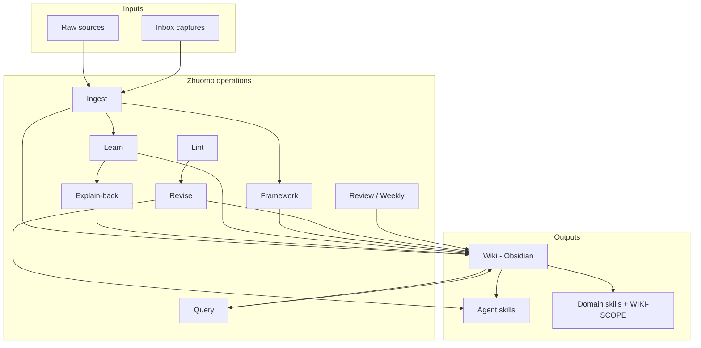
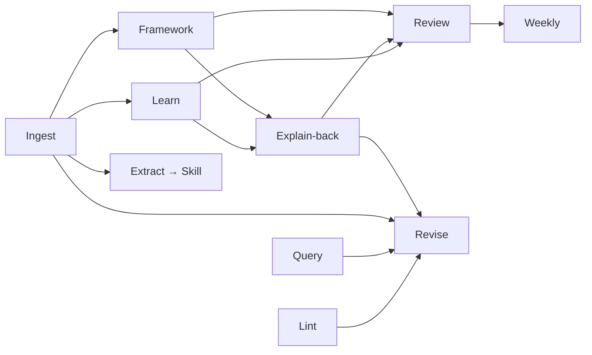
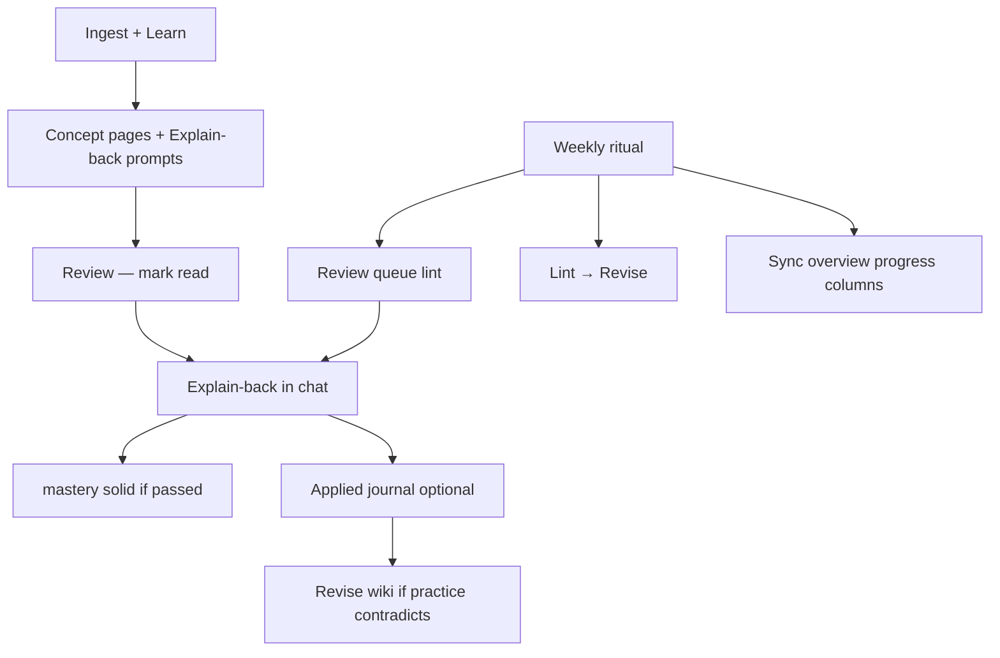

# Zhuomo Framework

Conceptual model for **琢磨 (Zhuomo)** — how the pieces fit, why they exist, and how knowledge compounds over time.

> **Human daily use:** Obsidian `wiki/help.md` + repo [SIMPLE.md](SIMPLE.md). This file is **architecture reference** for power users — not required reading.

For step-by-step usage, see [USER-GUIDE.md](USER-GUIDE.md). For agent workflows, see [SKILL.md](SKILL.md).

---

## 1. North star

**Turn raw sources into durable knowledge you can learn from and agents can act on.**

| You get | How |
|---------|-----|
| Learn faster | Digests, Explain-back prompts, frameworks — not just storage |
| See the big picture | Domain frameworks (pillars, gaps, progress) across many subjects |
| Correct over time | Revise supersedes wrong claims; nothing is write-once |
| Agent leverage | Skills = triggers + workflows; wiki = facts + synthesis |

**Skills are not book summaries.** They are proven techniques with clear triggers: *when* to act, *what* to do, *how* to decide, *what mistakes* to avoid.

---

## 2. System architecture



### Three layers (Karpathy LLM Wiki pattern)

| Layer | Location | Role |
|-------|----------|------|
| **Raw** | `~/zhuomo-data/raw/` | Immutable snapshots — EPUB, clips, transcripts. Never edited by the agent. |
| **Wiki** | Obsidian vault `wiki/` | Compiled synthesis — concepts, sources, frameworks, learning artifacts. |
| **Schema** | `AGENTS.md` in vault root | Conventions: ingest, query, lint, revise, learn. Co-evolves with you. |

**RAG rediscovers on every question. A wiki accumulates.** Ingest compiles once; query and revise keep it current.

### Two compounding outputs

| Output | Holds | Your use | Agent use |
|--------|-------|----------|-----------|
| **Wiki** | Entities, synthesis, links, contradictions, frameworks | Read in Obsidian; study; graph | Query, cite, domain-skill backend |
| **Skill** | Triggers, workflows, discipline rules | Optional — you invoke via Cursor | Auto-invoke under symptoms |

Often: **wiki first → extraction card → skill** when an idea is actionable and non-obvious.

---

## 3. Core loop (4 + 1) + full operations

**Daily use:** Bootstrap → Ingest → Query → Revise; optional **Weekly**. See Obsidian `wiki/help.md`.

All eight operations (for power users):

Operations are the **verbs** of Zhuomo. Each has a trigger, output, and typical prompt shape.

| Operation | When | Primary output | Filed to |
|-----------|------|----------------|----------|
| **Ingest** | New source landed in `raw/` | Concept pages, source summary, index updates | `wiki/` |
| **Learn** | You are studying (not archive-only) | Digest, `## Explain-back` on concepts | `wiki/learn/` |
| **Review** | Explain-back or read session | Rubric score, `learn/reviews/` | [REVIEW.md](REVIEW.md) |
| **Framework** | After ingest or on request | Updated pillars, progress, gaps | `wiki/domains/*/overview.md` |
| **Weekly** | ~15 min ritual | Review queue + Explain-back + lint + progress sync | `wiki/log.md` |
| **Query** | You have a question | Answer (+ file back if valuable) | wiki + chat |
| **Revise** | Wrong, stale, duplicate, contradicted | Corrected pages; skill merge | wiki, skills, `log.md` |
| **Lint** | Periodic health | Issue list → Revise tasks | `log.md` |

Full Run spec (deprecated): [docs/archive/RUN.md](docs/archive/RUN.md). Use [REVIEW.md](REVIEW.md) Explain-back instead.

### Operation dependencies



**Default after chapter ingest** (unless you say *archive only*): Ingest → Learn (digest + `## Explain-back` on concepts) → Framework update.

---

## 4. Knowledge framework (L0 → L3)

How structured understanding scales inside the wiki.

| Level | Artifact | Question it answers |
|-------|----------|---------------------|
| **L0** | `wiki/domain-map.md` | What domains do I care about? |
| **L1** | `wiki/domains/[domain]/overview.md` | What are the pillars and how far along am I? |
| **L2** | `wiki/domains/[domain]/guide.md` or `wiki/concepts/*.md` | Technical digest or concept depth |
| **L3** | `wiki/sources/*.md` | Where did this claim come from? |

**Learning artifacts** (digests, per-concept `## Explain-back`) sit between L2 and reading raw — optimized for *your* memory, not the agent's.

### Domain overview anatomy

Each domain `overview.md` should include:

1. **North star** — one sentence: what this domain is for in your life/work
2. **Pillars** — 3–7 big ideas, each wikilinked
3. **Mental model** — diagram, analogy, or bullets for how pieces fit
4. **Progress table** — concept, mastery (`learning` → `solid`), **Review** (`reviewed` date), **Explain-back** (`explain_back` status), gaps — sync with `scripts/sync-overview-review.py` on Weekly
5. **Cross-domain links** — bridges to other `domains/`
6. **Study path** (optional) — ordered gaps → next reads

Rebuild when: new ingest touches the domain; you ask; lint finds orphans.

### Epistemic strength

Concept pages use frontmatter where helpful:

| Tag | Meaning |
|-----|---------|
| `tentative` | Early or single-source |
| `established` | Multiple sources, you can teach it |
| `contested` | Sources disagree — wiki shows both |
| `deprecated` | Superseded — link to replacement |

Domain **progress** strength (`learning` / `solid`) is separate — see [RETENTION.md](RETENTION.md).

---

## 5. Wiki vs skill decision framework

Use this table when deciding where new material goes.

| Put in **wiki** | Distill into **skill** |
|-----------------|------------------------|
| Entity pages, themes, synthesis | Named technique with clear trigger |
| Cross-source contradictions | Iron law / discipline rule |
| Research thesis evolving over weeks | "When symptom X, do Y" |
| Comparison tables, cited answers | Agent must comply under pressure |
| BGP facts, API details, definitions | Expert *workflow* (domain skill), not fact dump |

### Extraction pipeline (wiki → skill)

```
Source → Ingest (wiki) → Extraction card → Filter → Classify → RED → GREEN → REFACTOR
```

| Step | Gate |
|------|------|
| **Filter** | Actionable **and** non-default for the agent |
| **Classify** | technique / pattern / reference / discipline |
| **RED** | Baseline behavior **without** draft skill (TDD) |
| **GREEN** | Minimal `SKILL.md` |
| **REFACTOR** | Counters, anti-patterns, re-test |

**No `SKILL.md` until RED completes.**

### Extraction card fields

| Field | Capture |
|-------|---------|
| Trigger | Situation/symptoms (not chapter title) |
| Core move | One non-obvious action |
| Steps | Workflow or decision tree |
| Anti-pattern | Common failure |
| Example | One adapted before/after |
| Type | technique / pattern / reference / discipline |

---

## 6. Two skill types

| Type | Example | Wiki relationship |
|------|---------|-------------------|
| **Technique skill** | Condition-based waiting, TDD loop | Optional link to concept |
| **Domain skill** | `network-expert` | **Primary backend** — `WIKI-SCOPE.md` manifest |

**Domain skill rule:** facts live in wiki; skill holds persona, triggers, workflow, and *what to read* from the vault. Revise wiki → backend updates without redeploying skill (unless discipline changed).

See [WIKI-BACKED-SKILLS.md](WIKI-BACKED-SKILLS.md).

---

## 7. Multi-domain model

**One vault, many domains.** Domains are folders under `wiki/domains/`; concepts may appear in more than one.

```
wiki/
├── domain-map.md
├── domains/
│   ├── networking/
│   │   ├── overview.md
│   │   ├── guide.md       # optional
│   │   └── index.md
│   └── psychology/
│       └── overview.md
├── concepts/          # optional shared/global concepts
├── sources/
├── synthesis/
└── learn/
```

**Topic discovery:** you do not need to name topics upfront. One book → topic map → many concept pages across domains. Your topic = **priority lens**, not the only topic.

---

## 8. Retention loop

Human memory needs **retrieval practice** (Explain-back) and optional **real-world use** (applied journal).



| Mechanism | Owner |
|-----------|--------|
| `## Explain-back` on concepts | Zhuomo on ingest/deepen; you teach back in chat |
| Review queue | `wiki_revised > reviewed` — [REVIEW.md](REVIEW.md) |
| Weekly (~15 min) | You + agent checklist — [RETENTION.md](RETENTION.md) |
| Mastery → `solid` | `explain_back: passed` required — [RETENTION.md](RETENTION.md) |

---

## 9. Lifecycle: correct, don't append forever

Knowledge is **never write-once**.

| Trigger | Action |
|---------|--------|
| You correct an error | Revise + propagate + log |
| New source contradicts | Revise affected pages; don't keep both as true |
| Lint finds duplicate | Merge → one canonical page |
| Old view wrong | Supersede with `status: superseded` + forward link |

**Never:** silent delete of history; fix only in chat; duplicate concept pages.

Revision card (before editing): what was wrong, evidence, new claim — see [REFERENCE.md](REFERENCE.md).

---

## 10. Physical deployment model

| Component | Typical path | Sync |
|-----------|--------------|------|
| Skill docs | This repo / `~/.cursor/skills/zhuomo` | Git |
| Raw | `~/zhuomo-data/raw/` | iCloud/Dropbox/Syncthing; `inbox/` for phone |
| Wiki vault | `~/Library/Mobile Documents/iCloud~md~obsidian/Documents/Dylan Chen/` | iCloud Obsidian + Git optional |
| Technique skills | `~/.cursor/skills/[name]/` | Git per skill |
| Domain skills | `~/.cursor/skills/[domain-expert]/` + `WIKI-SCOPE.md` | Git |

**Device roles:**

- **Phone:** capture → `raw/inbox/`; read wiki; optional Explain-back in Cursor mobile/web
- **Laptop:** ingest, learn, framework, revise, skill authoring

---

## 11. Design principles (summary)

1. **Compile once, maintain forever** — wiki over RAG-only
2. **Triggers, not chapters** — skills for agent behavior under pressure
3. **Wiki owns facts; skills own behavior** — domain skills use WIKI-SCOPE
4. **Learn and store separately** — digests for you; skills for agents
5. **Revise propagates** — one correction updates all dependents
6. **Multi-topic is normal** — topic map before deep ingest
7. **Test skills before writing** — RED/GREEN/REFACTOR
8. **File answers back** — chat does not compound; wiki does
9. **Laptop owns wiki edits** — phone read + capture
10. **Short artifacts, deep links** — one screen digest → concept pages
11. **Teach to know** — Explain-back tests whether you can teach the Claim/mechanism; answers must match wiki Evidence — [REVIEW.md](REVIEW.md)

---

## 12. Document map

| Doc | Audience | Content |
|-----|----------|---------|
| [USER-GUIDE.md](USER-GUIDE.md) | You | Setup, prompts, rituals, troubleshooting |
| [FRAMEWORK.md](FRAMEWORK.md) | You + architects | This file — conceptual model |
| [SKILL.md](SKILL.md) | Agents | Operations checklist, mistakes |
| [KNOWLEDGE-BASE.md](KNOWLEDGE-BASE.md) | Agents + you | Wiki schema, ingest/query/lint/revise |
| [LEARNING.md](LEARNING.md) | Agents + you | Learn modes, framework templates |
| [REVIEW.md](REVIEW.md) | Agents + you | Per-concept Review, Explain-back, review queue |
| [RETENTION.md](RETENTION.md) | You | Epistemic tags, applied (optional), mastery |
| [docs/archive/RUN.md](docs/archive/RUN.md) | Archive | Deprecated Roguelike runs |
| [WIKI-BACKED-SKILLS.md](WIKI-BACKED-SKILLS.md) | Agents + you | Domain skill pattern |
| [REFERENCE.md](REFERENCE.md) | Agents + you | EPUB, video, Readwise, revision cards |
