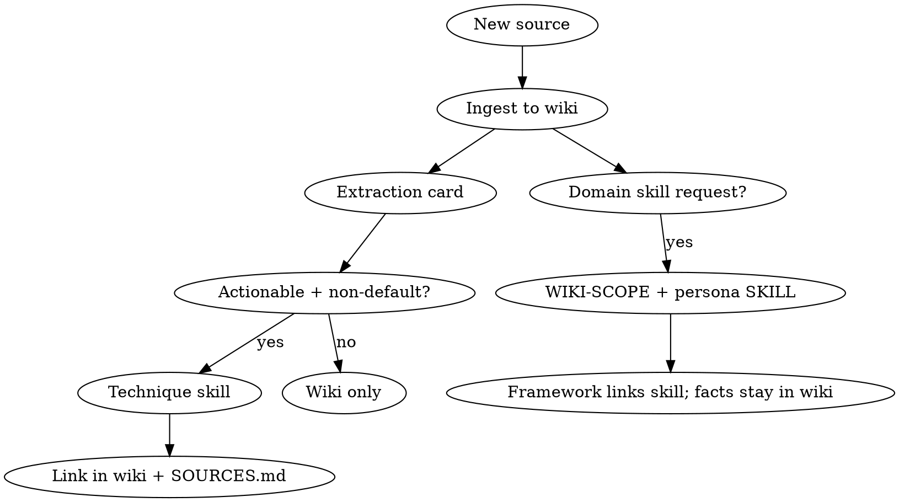

# Personal Knowledge Base (LLM Wiki)

Based on [Karpathy's LLM Wiki pattern](https://gist.github.com/karpathy/442a6bf555914893e9891c11519de94f). Use with **zhuomo**: the wiki compounds understanding; skills capture agent behaviors refined from it.

## Core idea

**RAG rediscovers on every question. A wiki accumulates.**

Instead of only retrieving raw chunks at query time, the LLM **incrementally builds and maintains** a persistent markdown wiki between you and immutable sources. Each new source is read, integrated, cross-linked, and checked against existing claims. Synthesis is compiled once and kept current.

Human job: curate sources, ask questions, direct emphasis, **learn and connect ideas across domains**.  
LLM job: summarize, cross-reference, file, update, flag contradictions, **build learning artifacts and domain frameworks**.

## Three layers

```
raw/          → immutable sources (articles, PDFs, clips, transcripts)
wiki/         → LLM-written markdown (entities, concepts, synthesis)
AGENTS.md     → schema: structure, conventions, workflows (co-evolve with user)
```

**Obsidian (recommended):** open the vault for **wiki output only** — frameworks, concepts, digests. Keep **raw** on local disk outside the vault (or in a sibling folder you don't browse daily). Raw sources are never modified by the LLM. Version the Obsidian vault with git.

## Obsidian split layout (recommended)

**You read in Obsidian; raw stays local storage.**

```
~/zhuomo-data/raw/              # local only — clips, EPUBs, transcripts
├── inbox/                      # phone captures — laptop processes first
├── web/
├── video/
├── books/                      # large — laptop-only or selective cloud sync
├── assets/
└── processed/                  # optional — archived after ingest

~/Library/Mobile Documents/iCloud~md~obsidian/Documents/Dylan Chen/  # Obsidian vault (iCloud)
├── wiki/
│   ├── domain-map.md
│   ├── index.md
│   ├── log.md
│   ├── domains/
│   ├── sources/                # synthesized source pages (not raw files)
│   ├── concepts/
│   ├── synthesis/
│   └── learn/
└── AGENTS.md
```

Record both paths in `AGENTS.md`:

```markdown
## Knowledge base

Raw (read-only, local): `~/zhuomo-data/raw/`
Wiki (Obsidian vault): `~/Library/Mobile Documents/iCloud~md~obsidian/Documents/Dylan Chen/wiki/`

Ingest reads from Raw; writes only under Wiki. Source pages cite raw paths for provenance.

Multi-device: phone → `raw/inbox/`; laptop processes inbox. See [Multi-device sync](#multi-device-sync-laptop--iphone).
```

| Location | Holds | You in Obsidian |
|----------|-------|-----------------|
| **Raw** | EPUB, PDF, clips, transcripts, O'Reilly notes | Optional — usually don't open |
| **Wiki** | Concepts, frameworks, digests, synthesis | **Yes** — daily driver |

Wiki `sources/` pages are **agent-written summaries** with links to `[[concepts]]` and a `raw:` path — not copies of raw files.

## Directory bootstrap (single folder)

If you prefer one tree on disk, same split mentally — only `wiki/` is the Obsidian vault root:

```
Dylan Chen/                     # Obsidian vault root (iCloud)
├── wiki/                       # ← everything you browse
│   ├── domain-map.md
│   ├── index.md
│   …
└── AGENTS.md

~/zhuomo-data/raw/              # sibling — outside vault
```

Single-domain wikis can omit `domain-map.md` and use flat `wiki/concepts/`. Add domains as subjects diversify. See [LEARNING.md](LEARNING.md).

## Multi-device sync (laptop + iPhone)

**Sync wiki and raw differently.** Obsidian wiki is markdown-heavy and phone-friendly; raw holds clips, EPUBs, and ingest inputs — mostly laptop-owned.

| Layer | Sync to phone? | Method | Phone role |
|-------|----------------|--------|------------|
| **Wiki** (Obsidian vault) | Yes | Obsidian Sync, iCloud vault, Git + Working Copy | Read frameworks, digests, explain-back |
| **Raw** | Partial | iCloud Drive, Dropbox, Syncthing on `~/zhuomo-data/raw/` | Capture → `inbox/` only |
| **Raw/books/** | Usually no | Laptop-only or cloud “online-only” | Skip — process on laptop |

### Raw layout for multi-device

```
~/zhuomo-data/raw/              # in iCloud Drive / Dropbox / Syncthing
├── inbox/                      # iPhone writes here; laptop ingests & clears
├── web/
├── video/
├── books/                      # EPUB/PDF — keep off phone when possible
├── assets/
└── processed/                  # moved here after successful ingest
```

**Policy:**

```
Phone  → raw/inbox/          (capture only)
Laptop → raw/* ingest        (process + move to processed/ or typed folder)
Both   → Obsidian wiki       (read everywhere; edit mainly on laptop)
Books  → raw/books/          (laptop; optional selective sync)
```

### Per device

**Laptop (home base):** EPUB/PDF, transcripts, pandoc, batch ingest. Process `inbox/` first:

```
/zhuomo Process everything in ~/zhuomo-data/raw/inbox/ — ingest to wiki, then move to processed/.
```

**iPhone (capture + read):** Read wiki in Obsidian mobile. Save URLs and quick notes to `raw/inbox/` (Files app, Share sheet, Shortcuts). Do not expect full ingest or paywalled fetches on phone.

**Inbox capture template** (frontmatter on phone-saved `.md`):

```markdown
---
url:
title:
captured: 2026-05-30
device: iphone
status: inbox
---

One line: why I saved this.
```

After ingest, agent sets `status: ingested` on the wiki source page and moves raw file out of `inbox/`.

### Sync options for raw

| Method | Best for |
|--------|----------|
| **iCloud Drive** | Mac + iPhone native; put `zhuomo-data` in Mobile Documents |
| **Dropbox / Google Drive** | Selective sync on desktop; easy inbox on phone |
| **Syncthing** | Self-hosted, no vendor cloud |
| **No raw on phone** | Bookmarks on phone; weekly laptop export → `raw/web/` |

Do not git large binaries in `raw/books/` unless using Git LFS. Version the Obsidian wiki with git separately.

### Conflict avoidance

| Risk | Mitigation |
|------|------------|
| Wiki edited on two devices | **Laptop owns wiki edits**; phone read-only for wiki |
| Same inbox file edited twice | Timestamp filenames: `2026-05-30-1430-topic.md` |
| Duplicate ingest | Check URL/raw path in `wiki/sources/` before ingest |
| Concurrent ingest | One ingest session at a time when possible |

### Zero raw on phone (minimal)

Phone: Obsidian wiki only + bookmark list. Laptop: weekly batch — export bookmarks → clips in `raw/web/` → ingest. Simplest; delayed capture.

At moderate scale (~100 sources, hundreds of pages), **index.md + wikilinks** often beats embedding RAG. Add search CLI/MCP only when the wiki outgrows the index.

## Schema (AGENTS.md section)

On **Bootstrap**, write this file to the vault root (customize paths). **Default ingest depth = reference depth (deepen all)** — not stub-only lite.

```markdown
# Zhuomo vault — agent conventions

Bootstrapped: [YYYY-MM-DD]

## Ingest depth (default)

**Default:** `reference depth` — topic map → EPUB/PDF md corpus → **deepen all** topic-map concepts with `## Evidence` → domain `overview.md` (+ optional `guide.md`).

**Opt-out:** User says `overview only`, `lite`, or `bootstrap lite` → stub-only pass; deepen later on demand.

User says `archive only` → ingest wiki pages only; skip learn artifacts.

## Reference depth workflow

1. **Topic map** on `wiki/sources/[slug].md`
2. **EPUB/PDF** → `wiki/sources/[slug]/md/` via `scripts/epub-to-wiki-md.py` (images to `md/assets/`)
3. **Deepen all** — expand every topic-map concept; no stub left behind unless user opted out
4. **Framework** — `domains/<slug>/overview.md` pillars, progress, gaps; optional `guide.md`
5. **Learn** (unless archive only) — digest; `## Explain-back` on concepts; fable optional — [REVIEW.md](REVIEW.md)

## Human entry point

`wiki/overview.md` (Obsidian Homepage) — **vault hub only; keep short.**

**Per domain — two pages only:**
- `domains/<domain>/overview.md` — why learn, pillars, progress, glossary (entry)
- `domains/<domain>/guide.md` — optional one-page technical digest

**Vault overview rule:** New domain → add row to `wiki/overview.md` + `domain-map.md` only — never append domain prose to vault `overview.md`.

**Architect framing (network/IT):** Query leads business → constraint → technical object.

**New source layout:** `wiki/sources/<slug>.md` + flat `wiki/concepts/` (`domain:` frontmatter). No `wiki/<book-name>/` top-level folders.

## Knowledge base

Raw path: `[raw path]` (local, read only, never edit).
Wiki path: Obsidian vault `wiki/` — all agent output goes here.

**Multi-device:** Phone captures → `raw/inbox/` only. Laptop processes inbox before other ingest; move done files to `raw/processed/` or typed folder. Laptop owns wiki edits.

**Ingest:** Process `raw/inbox/` when non-empty → read source → topic map → reference depth (above) → update `wiki/index.md` → append `wiki/log.md`.

**Query — brain-first:** overview → domain-map → domain overview/guide → index → concepts; then raw/web.

**Query modes:** `search` = page list; `think` (default) = synthesis + Sources + **Gaps**; file back to synthesis/ or concepts.

**Lint (doctor-lite):** broken links, orphans, stub gaps, progress/Evidence mismatch, contradictions, duplicates. Log + Revise/deepen. Auto-stub missing pillar links.

**Weekly:** Review queue + Explain-back + Lint + overview progress — [REVIEW.md](REVIEW.md).

**Revise:** Correct or update wiki pages and linked skills when wrong, stale,
contradicted, or duplicated. Propagate fixes to all pages citing old claims.
Log every revision. Prefer supersede/archive over delete.

**Learn:** After ingest (unless archive only), digest + `## Explain-back` on concepts under `wiki/learn/`; **fable** optional. See [LEARNING.md](LEARNING.md), [REVIEW.md](REVIEW.md).

**Review / Explain-back:** Per-concept teach-back; `wiki/learn/reviews/` for session logs — [REVIEW.md](REVIEW.md).

**Applied (optional):** `wiki/learn/applied/` — not required for ingest or Weekly.

**Weekly:** Review queue + explain-back + lint — [REVIEW.md](REVIEW.md).

**Domain overview:** Maintain `wiki/domains/*/overview.md` and `domain-map.md` —
architect lens, pillars, progress, gaps, glossary. Update on each domain-touching ingest.

**Log format:** `## [YYYY-MM-DD] ingest | Title` or `revise | learn | review | weekly | framework | bootstrap | …`

**Page conventions:** wikilinks `[[concept-name]]`; YAML frontmatter optional
(tags, source_count, epistemic, prereqs, status: active | stale | superseded | archived).
**Figures:** when text cites Figure N, embed inline at the mention (or thematic `##` if Evidence-only) — source asset from `sources/*/md/assets/` or mermaid schematic ([REFERENCE.md](REFERENCE.md#figure-visuals-on-wiki-pages)).

## User-facing UX

Human cheatsheet: `wiki/help.md` (copy from repo `templates/wiki/help.md` on bootstrap).

**Before large book ingest:** confirm once unless user said `overview only` / `lite`.

**After major ops:** 3-line closing — ✓ 完成 / → 下一步 / ⚙ 可选 (see SKILL.md).

**Ambiguous request:** menu before running long ingest.
```

On **Bootstrap**, also copy `templates/wiki/help.md` → `wiki/help.md` and link from `wiki/overview.md`.

Co-evolve this schema as you learn what works for your domain.

## Operations

### Ingest

1. If `raw/inbox/` has files, process those first (multi-device captures).
2. User saves snapshot to local `raw/` (Web Clipper → export elsewhere, or clip to `raw/web/`; URL alone is not enough).
3. **EPUB/PDF books:** convert full text to `wiki/sources/[slug]/md/` first (see [REFERENCE.md](REFERENCE.md#epub-epub)); concept pages must include `## Evidence` with `[[md/part#anchor]]` links — never summary-only without provenance corpus.
4. LLM reads source **and** MD corpus; **discover topics** (TOC/headings/skim) unless user gave a narrow lens.
5. Present **topic map** if multi-topic or overlap with existing wiki is likely; confirm when ambiguous.
6. **Search existing wiki** for related pages before writing new ones.
7. LLM writes/updates:
   - Summary in `wiki/sources/`
   - Entity and concept pages touched (often 10–15 pages per rich source)
   - **Revise** any existing pages the new source contradicts or supersedes
   - `wiki/index.md`
   - Entry in `wiki/log.md`
8. If source was in `raw/inbox/`, move to `raw/processed/` or typed folder (`web/`, `video/`, `books/`).
9. **Then** run zhuomo extraction card on actionable techniques (per topic, not per book).
10. **Learn + framework** — digest, `## Explain-back`, update domain overview (see LEARNING.md, REVIEW.md).

Prefer one source at a time with user in the loop; batch ingest possible with less supervision.

### Query

**Brain-first order:** `overview.md` → `domain-map.md` → `domains/<slug>/overview.md` / `guide.md` → `index.md` → `concepts/` / `sources/` → only then raw or web.

| Mode | When | Output |
|------|------|--------|
| **search** | User wants pages to read | Ranked list + one-line relevance |
| **think** | Default for questions | `## Answer` + `## Sources` + `## Gaps` |

**Think — Gaps table** must flag: stub-only concepts, missing Evidence, overview vs page mismatch, contradictions, stale source version, topics needing deepen.

**File back:** durable synthesis → `wiki/synthesis/` or extend concept pages; log substantial updates.

Output forms: markdown page, comparison table, slides (Marp), chart — user choice.

### Lint

Doctor-lite health check — on request, after major ingest, or in **Weekly**:

| Check | Fix |
|-------|-----|
| Broken `[[wikilinks]]` | Correct path or stub page |
| Orphan concepts | Link from overview / guide / peers |
| Mentioned concept, no page | Stub or merge duplicate |
| Overview progress ≠ concept depth | Revise one side |
| Deepened concept, no `## Evidence` | Add Evidence or note in overview |
| Contradictions | Revise + supersede |
| Stale source | Gap note + overview flag |
| Duplicate topics | Merge to canonical page |

**Auto-stub:** pillar/guide links to missing `[[concept]]` → minimal page with `domain:` frontmatter.

Append `## [date] lint | …` to `log.md`. Each row → **Revise** or deepen follow-up.

### Revise (correct & update)

Run when: user reports an error; lint finds contradiction/stale/duplicate; new ingest supersedes old claims; skill no longer matches wiki or practice.

1. **Locate** — target page(s), backlinks, related skills (`index.md`, grep wiki).
2. **Revision card** — fill before editing (see REFERENCE.md).
3. **Choose action:**

| Action | When |
|--------|------|
| **Edit in place** | Minor fix, same claim refined |
| **Supersede** | Old view wrong; new page replaces; old gets `status: superseded` + link forward |
| **Merge** | Duplicate entity/concept pages → one canonical page |
| **Retract** | Claim no longer valid → archive, note why |
| **Split** | Page mixed two concepts that should diverge |

4. **Propagate** — update every page and skill that cited the old claim.
5. **Skills** — if wiki correction changes a technique, update linked skill; RED if discipline rule changed.
6. **Log** — `## [YYYY-MM-DD] revise | [[page]] | reason` (+ source if applicable).

Never silently delete pages with history. Git preserves diffs; `log.md` preserves intent.

## index.md vs log.md

| File | Role |
|------|------|
| **index.md** | Content catalog by category; updated every ingest; query entry point |
| **log.md** | Chronological append-only audit; parseable prefixes for `grep` |

## Bridge to skills

Two paths from wiki:

| Path | Output | When |
|------|--------|------|
| **Technique** | `SKILL.md` with triggers + workflow | One actionable, non-default method |
| **Domain** | Skill + `WIKI-SCOPE.md` manifest | Expert persona; wiki is backend (e.g. BGP) |



**Domain skills:** agent reads WIKI-SCOPE at invoke → loads concept pages → reasons with citations. Revise wiki updates backend without skill redeploy. Full guide: [WIKI-BACKED-SKILLS.md](WIKI-BACKED-SKILLS.md).

On wiki concept pages, link to related skills: `Related skill: [[~/.cursor/skills/foo]]` or note in page body.

When enhancing a skill from a new source, ingest to wiki first so synthesis and contradictions stay in the KB; skill gets only the behavioral delta.

## Tips

- **Obsidian vault = wiki only** — graph, daily notes, frameworks; raw stays in `~/zhuomo-data/raw/`
- **Multi-device** — phone → `raw/inbox/`; laptop ingests; Obsidian wiki syncs for reading on phone
- **Spaced repetition** — per-concept **Explain-back** — see [REVIEW.md](REVIEW.md)
- **Web Clipper** — save articles to `raw/web/` (export/move from Obsidian if clipped into vault by mistake)
- **Download images locally** — store under `raw/assets/`; wiki pages embed or link as needed
- **Graph view** — see hubs, orphans, connection shape
- **Git** — wiki is a repo; free history and collaboration
- **Dataview** (optional) — query frontmatter if LLM adds YAML tags/dates

## Scale pitfalls (from community)

Watch for as the wiki grows:

| Problem | Mitigation |
|---------|------------|
| Duplicate entity names | Search vault before creating; merge pass on lint |
| Flat importance (theme = tactic) | Hierarchy in index categories or frontmatter `level` |
| Untyped "related" links | Prefer typed relations in prose: contradicts, contains, supersedes |
| Ingestion-order bias | Lint in random/batch order, not only ingestion order |
| Concurrent writes | One ingest at a time or per-file locking |

## Optional tooling

Only when index.md isn't enough:

- Local markdown search (e.g. qmd: BM25 + vector + rerank, CLI or MCP)
- MCP servers that expose wiki search/read to agents

Don't build infrastructure before the wiki outgrows the index.

## Reference

- Pattern: [Karpathy llm-wiki.md](https://gist.github.com/karpathy/442a6bf555914893e9891c11519de94f)
- Zhuomo workflow: [SKILL.md](SKILL.md), [REFERENCE.md](REFERENCE.md), [LEARNING.md](LEARNING.md), [RETENTION.md](RETENTION.md), [WIKI-BACKED-SKILLS.md](WIKI-BACKED-SKILLS.md)
