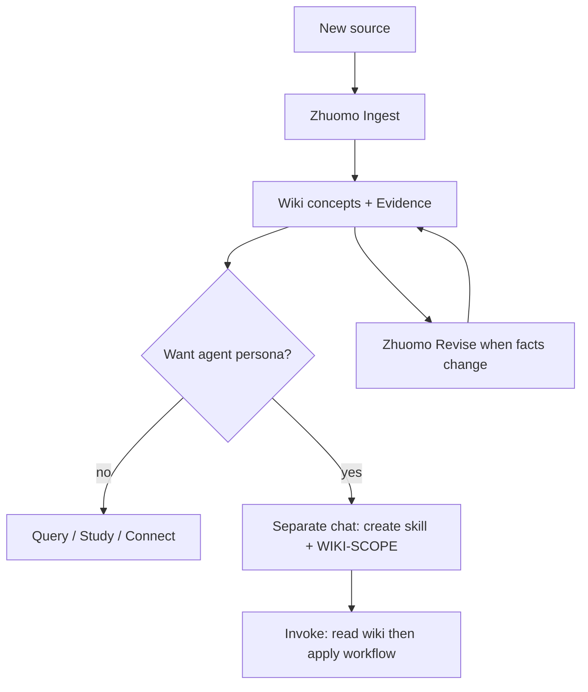

# Personal Knowledge Base (LLM Wiki)

Based on [Karpathy's LLM Wiki pattern](https://gist.github.com/karpathy/442a6bf555914893e9891c11519de94f). Use with **zhuomo** to compile an Obsidian wiki. Optional Cursor skills (created in a **separate chat**, not a zhuomo verb) can read that wiki at invoke time — [WIKI-BACKED-SKILLS.md](WIKI-BACKED-SKILLS.md).

## Core idea

**RAG rediscovers on every question. A wiki accumulates.**

Instead of only retrieving raw chunks at query time, the LLM **incrementally builds and maintains** a persistent markdown wiki between you and immutable sources. Each new source is read, integrated, cross-linked, and checked against existing claims. Synthesis is compiled once and kept current.

Human job: curate sources, ask questions, direct emphasis, **learn and connect ideas across domains**.  
LLM job: summarize, cross-reference, file, update, flag contradictions, **author Explain-back prompts and domain overviews**.

## Three layers

```
raw/          → immutable sources (articles, PDFs, clips, transcripts)
wiki/         → LLM-written markdown (entities, concepts, synthesis)
AGENTS.md     → schema: structure, conventions, workflows (co-evolve with user)
```

**Obsidian (recommended):** open the vault for **wiki output only** — frameworks, concepts, digests. Keep **raw** on local disk outside the vault (or in a sibling folder you don't browse daily). Raw sources are never modified by the LLM. Version the Obsidian vault with git.

## Obsidian split layout (recommended)

**You read in Obsidian; raw stays local storage.**

```
~/zhuomo-data/raw/              # local only — clips, EPUBs, transcripts
├── inbox/
├── web/
├── video/
├── books/
├── assets/
└── processed/

~/zhuomo-data/corpus/           # source MD images (outside iCloud vault)
└── <slug>/assets/              # EPUB/PDF figures; linked as /corpus/<slug>/assets/…

~/Library/Mobile Documents/iCloud~md~obsidian/Documents/Dylan Chen/  # Obsidian vault root
├── corpus → ~/zhuomo-data/corpus   # /corpus/… image paths resolve here
├── wiki/
│   ├── domain-map.md
│   ├── index.md
│   ├── log.md
│   ├── domains/
│   ├── sources/                # synthesized source pages (not raw files)
│   ├── concepts/               # zhuomo compiled (origin: zhuomo)
│   ├── synthesis/              # cross-book compiled themes
│   ├── notes/                  # personal only (origin: personal)
│   │   ├── inbox/
│   │   ├── on-concept/
│   │   ├── by-domain/
│   │   └── synthesis/
│   └── learn/
└── AGENTS.md
```

Record both paths in `AGENTS.md`:

```markdown
## Knowledge base

Raw (read-only, local): `~/zhuomo-data/raw/`
Wiki (Obsidian vault): `~/Library/Mobile Documents/iCloud~md~obsidian/Documents/Dylan Chen/wiki/`

Ingest reads from Raw; writes only under Wiki. Source pages cite raw paths for provenance.

Multi-device: phone → `raw/inbox/`; laptop processes inbox. See [Multi-device sync](#multi-device-sync-laptop--iphone).
```

| Location | Holds | You in Obsidian |
|----------|-------|-----------------|
| **Raw** | EPUB, PDF, clips, transcripts, O'Reilly notes | Optional — usually don't open |
| **Corpus assets** | `~/zhuomo-data/corpus/<slug>/assets/` | Via `/corpus/…` in Obsidian (Mac); not on phone iCloud |
| **Wiki** | Concepts, frameworks, synthesis (compiled) + `notes/` (personal) | **Yes** — daily driver |

Wiki `sources/` pages are **agent-written summaries** with links to `[[concepts]]` and a `raw:` path — not copies of raw files.

## Directory bootstrap (single folder)

If you prefer one tree on disk, same split mentally — only `wiki/` is the Obsidian vault root:

```
Dylan Chen/                     # Obsidian vault root (iCloud)
├── wiki/                       # ← everything you browse
│   ├── domain-map.md
│   ├── index.md
│   …
└── AGENTS.md

~/zhuomo-data/raw/              # sibling — outside vault
```

Single-domain wikis can omit `domain-map.md` and use flat `wiki/concepts/`. Add domains as subjects diversify. See [LEARNING.md](LEARNING.md).

## Multi-device sync (laptop + iPhone)

**Sync wiki and raw differently.** Obsidian wiki is markdown-heavy and phone-friendly; raw holds clips, EPUBs, and ingest inputs — mostly laptop-owned.

| Layer | Sync to phone? | Method | Phone role |
|-------|----------------|--------|------------|
| **Wiki** (Obsidian vault) | Yes | Obsidian Sync, iCloud vault, Git + Working Copy | Read concepts, Explain-back, domain overviews |
| **Raw** | Partial | iCloud Drive, Dropbox, Syncthing on `~/zhuomo-data/raw/` | Capture → `inbox/` only |
| **Raw/books/** | Usually no | Laptop-only or cloud “online-only” | Skip — process on laptop |

### Raw layout for multi-device

```
~/zhuomo-data/raw/              # in iCloud Drive / Dropbox / Syncthing
├── inbox/                      # iPhone writes here; laptop ingests & clears
├── web/
├── video/
├── books/                      # EPUB/PDF — keep off phone when possible
├── assets/
└── processed/                  # moved here after successful ingest
```

**Policy:**

```
Phone  → raw/inbox/          (capture only)
Laptop → raw/* ingest        (process + move to processed/ or typed folder)
Both   → Obsidian wiki       (read everywhere; edit mainly on laptop)
Books  → raw/books/          (laptop; optional selective sync)
```

### Per device

**Laptop (home base):** EPUB/PDF, transcripts, pandoc, batch ingest. Process `inbox/` first:

```
/zhuomo Process everything in ~/zhuomo-data/raw/inbox/ — ingest to wiki, then move to processed/.
```

**iPhone (capture + read):** Read wiki in Obsidian mobile. Save URLs and quick notes to `raw/inbox/` (Files app, Share sheet, Shortcuts). Do not expect full ingest or paywalled fetches on phone.

**Inbox capture template** (frontmatter on phone-saved `.md`):

```markdown
---
url:
title:
captured: 2026-05-30
device: iphone
status: inbox
---

One line: why I saved this.
```

After ingest, agent sets `status: ingested` on the wiki source page and moves raw file out of `inbox/`.

### Sync options for raw

| Method | Best for |
|--------|----------|
| **iCloud Drive** | Mac + iPhone native; put `zhuomo-data` in Mobile Documents |
| **Dropbox / Google Drive** | Selective sync on desktop; easy inbox on phone |
| **Syncthing** | Self-hosted, no vendor cloud |
| **No raw on phone** | Bookmarks on phone; weekly laptop export → `raw/web/` |

Do not git large binaries in `raw/books/` unless using Git LFS. Version the Obsidian wiki with git separately.

### Conflict avoidance

| Risk | Mitigation |
|------|------------|
| Wiki edited on two devices | **Laptop owns wiki edits**; phone read-only for wiki |
| Same inbox file edited twice | Timestamp filenames: `2026-05-30-1430-topic.md` |
| Duplicate ingest | Check URL/raw path in `wiki/sources/` before ingest |
| Concurrent ingest | One ingest session at a time when possible |

### Zero raw on phone (minimal)

Phone: Obsidian wiki only + bookmark list. Laptop: weekly batch — export bookmarks → clips in `raw/web/` → ingest. Simplest; delayed capture.

At moderate scale (~100 sources, hundreds of pages), **index.md + wikilinks** often beats embedding RAG. Add search CLI/MCP only when the wiki outgrows the index.

## Schema (AGENTS.md)

On **Bootstrap**, **copy** the repo template — do not write AGENTS.md from scratch:

```
cp ~/zhuomo/templates/AGENTS.md → <vault>/AGENTS.md
```

Replace placeholders only:

| Placeholder | Example |
|-------------|---------|
| `{{RAW_PATH}}` | `~/zhuomo-data/raw/` |
| `{{VAULT_PATH}}` | `~/Library/Mobile Documents/iCloud~md~obsidian/Documents/Dylan Chen/` |
| `{{BOOTSTRAP_DATE}}` | `2026-06-01` |

**Canonical template:** [templates/AGENTS.md](templates/AGENTS.md) — ingest depth, concept contract, six verbs, lint scripts, UX rules.

Also copy `templates/wiki/help.md` → `wiki/help.md` and link from `wiki/overview.md`.

When repo conventions change, diff vault `AGENTS.md` against the template and merge. Co-evolve vault-specific rules (domain notes) in AGENTS.md; propose upstream changes to the repo template when they apply to all vaults.

## Operations

### Ingest

1. If `raw/inbox/` has files, process those first (multi-device captures).
2. User saves snapshot to local `raw/` (Web Clipper → export elsewhere, or clip to `raw/web/`; URL alone is not enough).
3. **EPUB/PDF books:** convert full text to `wiki/sources/[slug]/md/` first (see [REFERENCE.md](REFERENCE.md#epub-epub)); concept pages must include `## Evidence` with `[[md/part#anchor]]` links — never summary-only without provenance corpus.
4. LLM reads source **and** MD corpus; **discover topics** (TOC/headings/skim) unless user gave a narrow lens.
5. Present **topic map** if multi-topic or overlap with existing wiki is likely; confirm when ambiguous.
6. **Search existing wiki** for related pages before writing new ones.
7. LLM writes/updates:
   - Summary in `wiki/sources/`
   - Entity and concept pages touched (often 10–15 pages per rich source)
   - **Revise** any existing pages the new source contradicts or supersedes
   - `wiki/index.md`
   - Entry in `wiki/log.md`
8. If source was in `raw/inbox/`, move to `raw/processed/` or typed folder (`web/`, `video/`, `books/`).
9. Optional: `lint-review-queue.py`, `sync-domain-study-paths.py` (see [SKILL.md](SKILL.md)).
10. **Study** — Tier A **Explain-back**; domain overview Dataview stays current (see [REVIEW.md](REVIEW.md), [LEARNING.md](LEARNING.md)).

Prefer one source at a time with user in the loop; batch ingest possible with less supervision.

### Query

**Brain-first order:** `overview.md` → `domain-map.md` → `domains/<slug>/overview.md` / `guide.md` → `index.md` → `concepts/` / `sources/` → only then raw or web.

| Mode | When | Output |
|------|------|--------|
| **search** | User wants pages to read | Ranked list + one-line relevance |
| **think** | Default for questions | `## Answer` + `## Sources` + `## Gaps` |

**Think — Gaps table** must flag: stub-only concepts, missing Evidence, overview vs page mismatch, contradictions, stale source version, topics needing deepen.

**File back:** durable synthesis → `wiki/synthesis/` or extend concept pages; log substantial updates.

Output forms: markdown page, comparison table, slides (Marp), chart — user choice.

### Lint

Doctor-lite health check — on request or after major ingest:

| Check | Fix |
|-------|-----|
| Broken `[[wikilinks]]` | Correct path or stub page |
| Orphan concepts | Link from overview / guide / peers |
| Mentioned concept, no page | Stub or merge duplicate |
| Overview progress ≠ concept depth | Revise one side |
| Deepened concept, no `## Evidence` | Add Evidence or note in overview |
| Contradictions | Revise + supersede |
| Stale source | Gap note + overview flag |
| Duplicate topics | Merge to canonical page |

**Auto-stub:** pillar/guide links to missing `[[concept]]` → minimal page with `domain:` frontmatter.

Append `## [date] lint | …` to `log.md`. Each row → **Revise** or deepen follow-up.

### Revise (correct & update)

Run when: user reports an error; lint finds contradiction/stale/duplicate; new ingest supersedes old claims.

1. **Locate** — target page(s), backlinks (`index.md`, grep wiki).
2. **Revision card** — fill before editing (see [REFERENCE.md](REFERENCE.md)).
3. **Choose action:**

| Action | When |
|--------|------|
| **Edit in place** | Minor fix, same claim refined |
| **Supersede** | Old view wrong; new page replaces; old gets `status: superseded` + link forward |
| **Merge** | Duplicate entity/concept pages → one canonical page |
| **Retract** | Claim no longer valid → archive, note why |
| **Split** | Page mixed two concepts that should diverge |

4. **Propagate** — update every wiki page that cited the old claim.
5. **Log** — `## [YYYY-MM-DD] revise | [[page]] | reason` (+ source if applicable).

Never silently delete pages with history. Git preserves diffs; `log.md` preserves intent.

## index.md vs log.md

| File | Role |
|------|------|
| **index.md** | Content catalog by category; updated every ingest; query entry point |
| **log.md** | Chronological append-only audit; parseable prefixes for `grep` |

## Optional Cursor skills (not zhuomo verbs)

Zhuomo **Ingest / Revise / Query / Study / Lint / Connect** compile **wiki** only. Repeatable agent behavior lives in `~/.cursor/skills/` — create or edit those files in a **separate Cursor chat** after wiki exists.

| Step | Surface | What |
|------|---------|------|
| 1 | Zhuomo `Ingest` | Concepts + `## Evidence` + `## Explain-back` |
| 2 | Cursor chat | Cite `[[concepts]]` or domain overview; ask for triggers + `WIKI-SCOPE.md` |
| 3 | Zhuomo `Revise` | Fix facts in wiki when wrong |
| 4 | Edit skill files | Only when triggers or workflow changed — not on every wiki Revise |


```mermaid
flowchart TD
  A[New source] --> B[Zhuomo Ingest]
  B --> C[Wiki concepts + Evidence]
  C --> D{Want agent persona?}
  D -->|no| E[Query / Study / Connect]
  D -->|yes| F[Separate chat: create skill + WIKI-SCOPE]
  F --> G[Invoke: read wiki then apply workflow]
  C --> H[Zhuomo Revise when facts change]
  H --> C
```

**Domain skills:** agent reads `WIKI-SCOPE.md` → loads concept pages → cites wiki. Wiki **Revise** updates facts without redeploying the skill unless workflow changed. Layout: [WIKI-BACKED-SKILLS.md](WIKI-BACKED-SKILLS.md).

Optional backlink on a concept page: `Related skill (optional): ~/.cursor/skills/network-expert`

## Tips

- **Obsidian vault = wiki only** — graph, daily notes, frameworks; raw stays in `~/zhuomo-data/raw/`
- **Multi-device** — phone → `raw/inbox/`; laptop ingests; Obsidian wiki syncs for reading on phone
- **Spaced repetition** — per-concept **Explain-back** — see [REVIEW.md](REVIEW.md)
- **Web Clipper** — save articles to `raw/web/` (export/move from Obsidian if clipped into vault by mistake)
- **Download images locally** — store under `raw/assets/`; wiki pages embed or link as needed
- **Graph view** — see hubs, orphans, connection shape
- **Git** — wiki is a repo; free history and collaboration
- **Dataview** (optional) — query frontmatter if LLM adds YAML tags/dates

## Scale pitfalls (from community)

Watch for as the wiki grows:

| Problem | Mitigation |
|---------|------------|
| Duplicate entity names | Search vault before creating; merge pass on lint |
| Flat importance (theme = tactic) | Hierarchy in index categories or frontmatter `level` |
| Untyped "related" links | Prefer typed relations in prose: contradicts, contains, supersedes |
| Ingestion-order bias | Lint in random/batch order, not only ingestion order |
| Concurrent writes | One ingest at a time or per-file locking |

## Optional tooling

Only when index.md isn't enough:

- Local markdown search (e.g. qmd: BM25 + vector + rerank, CLI or MCP)
- MCP servers that expose wiki search/read to agents

Don't build infrastructure before the wiki outgrows the index.

## Reference

- Pattern: [Karpathy llm-wiki.md](https://gist.github.com/karpathy/442a6bf555914893e9891c11519de94f)
- Zhuomo workflow: [SKILL.md](SKILL.md), [REFERENCE.md](REFERENCE.md), [LEARNING.md](LEARNING.md), [REVIEW.md](REVIEW.md) · optional skills: [WIKI-BACKED-SKILLS.md](WIKI-BACKED-SKILLS.md)
