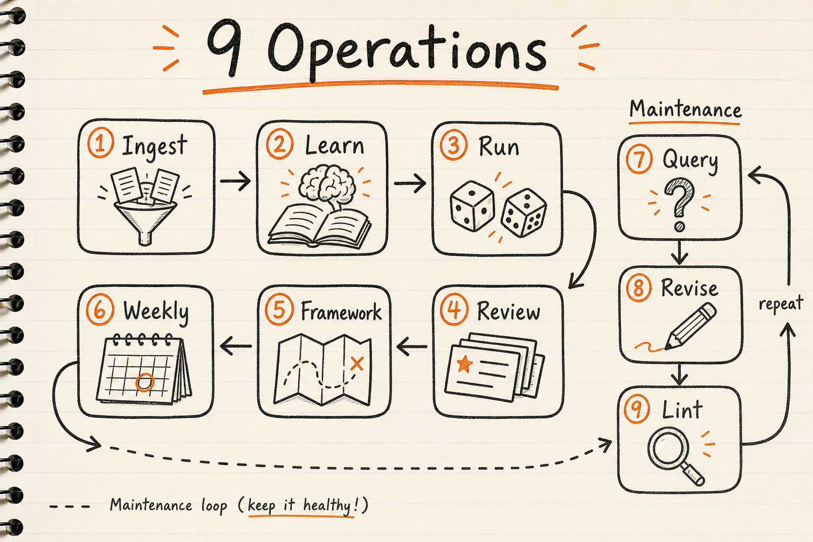
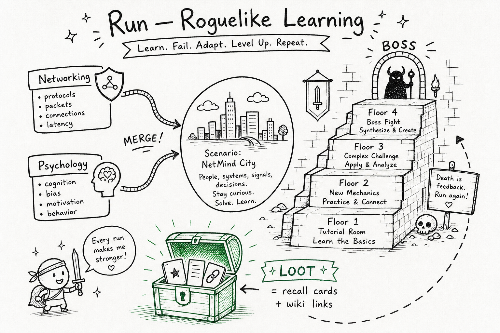

# 琢磨 (Zhuomo)

[中文](README.zh-CN.md)

**Turn books, articles, and notes into knowledge you actually remember — and skills your AI agent can use.**

Drop a source in. Get an Obsidian wiki, flashcards, domain frameworks, and (when ready) Cursor skills. Learning can even feel like a **roguelike game** when you fuse multiple subjects into one scenario.

> **琢磨** — to polish and chew over material until it is clear and usable.

---

## Start here

| If you want to… | Open |
|-----------------|------|
| **Set up and use Zhuomo day to day** | [USER-GUIDE.md](USER-GUIDE.md) |
| **Understand the big picture** | [FRAMEWORK.md](FRAMEWORK.md) |
| **Tell the agent what to do** | [SKILL.md](SKILL.md) |

---

## Quick start (5 minutes)

**1. Install the skill** — symlink this repo where Cursor finds skills:

```bash
ln -sf /path/to/zhuomo ~/.cursor/skills/zhuomo
```

**2. Bootstrap your folders** — in Cursor chat:

```
/zhuomo Bootstrap: raw ~/zhuomo-data/raw/, Obsidian vault ~/Obsidian/zhuomo-vault
```

**3. Ingest your first source:**

```
/zhuomo Ingest: ~/zhuomo-data/raw/inbox/my-book.epub
```

The agent creates wiki pages in Obsidian. You read, learn, review — and revise when something was wrong.

Full setup: [USER-GUIDE § First-time setup](USER-GUIDE.md#3-first-time-setup)

---

## How it fits together

Raw sources stay untouched. Zhuomo **compiles** them into a wiki you study from, and skills the agent can invoke when patterns match.


| Layer | Where | What lives there |
|-------|-------|------------------|
| **Raw** | `~/zhuomo-data/raw/` | EPUBs, clips, transcripts — never edited |
| **Wiki** | Obsidian `wiki/` | Concepts, frameworks, digests, recall cards |
| **Skills** | `~/.cursor/skills/` | Triggers + workflows (optional domain experts) |

**Wiki = facts and synthesis. Skills = when to act.** Often: wiki first, skill later when a technique is proven.

---

## Nine operations

Everything you do with Zhuomo is one of these verbs. You don't need to memorize them — the agent routes from natural language — but they help you know what's possible.



| Operation | You say something like… | You get |
|-----------|-------------------------|---------|
| **Ingest** | "Ingest this EPUB" | Wiki concept pages |
| **Learn** | "Learn from this chapter" | Digest, quiz, recall cards |
| **Run** | "Run: fuse networking + psychology" | Roguelike scenario + debrief |
| **Review** | "Review due cards" | Spaced repetition session |
| **Framework** | "Update my networking framework" | Pillars, gaps, progress |
| **Weekly** | "Weekly ritual" | 15 min review + connect |
| **Query** | "How does X relate to Y?" | Answer (+ optional wiki update) |
| **Revise** | "This page is wrong" | Corrected pages, no silent overwrite |
| **Lint** | "Lint the wiki" | Health check → fix list |

Details: [FRAMEWORK § Nine operations](FRAMEWORK.md#3-nine-operations) · Run spec: [RUN.md](RUN.md)

---

## Roguelike learning (Run)

When flat quizzes feel boring, **Run** fuses 2+ domains into a fictional scenario. You climb floors of harder questions; wrong explain-backs end the run. Fiction is fine — **answers must cite your wiki**.



```
/zhuomo Run: fuse networking + psychology — 5 floors, medium
```

Artifacts land in `wiki/learn/runs/`. Full guide: [USER-GUIDE § Roguelike runs](USER-GUIDE.md#16-roguelike-runs)

---

## Project layout

| Path | Role |
|------|------|
| **This repo** (your clone) | Skill docs + optional config |
| `~/.cursor/skills/zhuomo` | Symlink → clone (Cursor discovers the skill) |
| `~/zhuomo-data/raw/` | Sources + `inbox/` *(created on bootstrap)* |
| `~/Obsidian/zhuomo-vault/wiki/` | Your wiki *(path is yours to choose)* |

---

## Documentation map

**For you**

| Doc | Purpose |
|-----|---------|
| [USER-GUIDE.md](USER-GUIDE.md) | Setup, habits, prompt cookbook, troubleshooting |
| [FRAMEWORK.md](FRAMEWORK.md) | Conceptual model — layers, operations, wiki vs skill |
| [RUN.md](RUN.md) | Roguelike multi-domain runs |
| [RETENTION.md](RETENTION.md) | Spaced repetition, weekly ritual |

**For you + the agent**

| Doc | Purpose |
|-----|---------|
| [SKILL.md](SKILL.md) | Agent entry point — workflows and rules |
| [KNOWLEDGE-BASE.md](KNOWLEDGE-BASE.md) | Wiki pattern, Obsidian, multi-device |
| [LEARNING.md](LEARNING.md) | Learn modes, frameworks, multi-domain |
| [WIKI-BACKED-SKILLS.md](WIKI-BACKED-SKILLS.md) | Domain experts backed by your wiki |
| [REFERENCE.md](REFERENCE.md) | EPUB, web, video, Readwise |

---

## Principles (short)

1. **Knowledge is never write-once** — wrong? **Revise**, don't silently overwrite.
2. **Skills are not book summaries** — they are triggers: *when X, do Y*.
3. **Learn, don't just archive** — digests, cards, runs beat wall-of-text dumps.
4. **Many domains, one vault** — frameworks per domain, synthesis across them.

---

## Example prompts

```
/zhuomo Ingest: ~/zhuomo-data/raw/inbox/article.md
/zhuomo Learn: digest + 10 recall cards for [[TCP congestion]]
/zhuomo Framework: update domains/networking after ingest
/zhuomo Run: random fuse, 3 floors, easy
/zhuomo Revise: [[old-page]] contradicts new source — merge and supersede
/zhuomo Weekly
```

More: [USER-GUIDE § Prompt cookbook](USER-GUIDE.md#6-prompt-cookbook)

---

## License & credits

Design informed by personal wiki patterns (Karpathy LLM Wiki), spaced repetition, and agent skills (Cursor). See [SOURCES.md](SOURCES.md).
