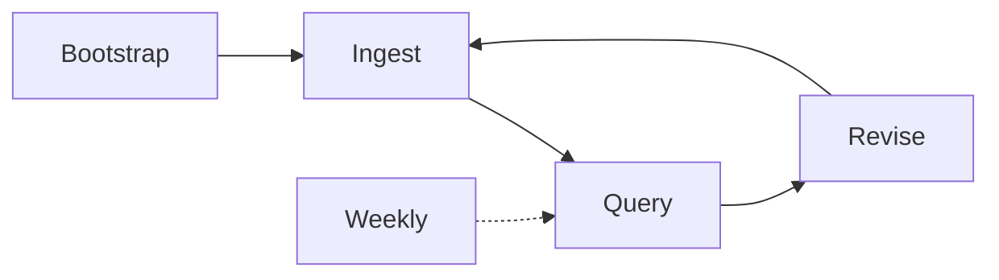
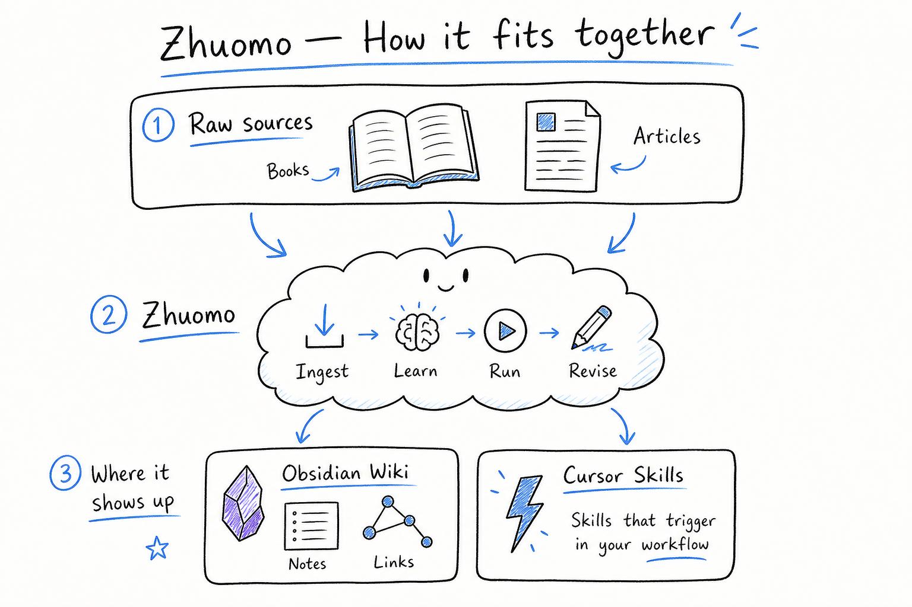

# 琢磨 (Zhuomo)

[中文](README.zh-CN.md)

**Turn books, articles, and notes into knowledge you actually remember — and skills your AI agent can use.**

> **琢磨** — to polish and chew over material until it is clear and usable.

---

## Start here

| If you want to… | Open |
|-----------------|------|
| **Daily cheatsheet (in Obsidian)** | `wiki/help.md` in your vault |
| **5-minute repo guide** | [SIMPLE.md](SIMPLE.md) |
| **Full manual** | [USER-GUIDE.md](USER-GUIDE.md) |
| **Agent rules** | [SKILL.md](SKILL.md) |

---

## Core loop

**Six verbs:** Bootstrap · Ingest · Query · Revise · Study · Lint. **Weekly** is optional (bundled Lint + Explain-back nudge).



| Step | You say | You get |
|------|---------|---------|
| **Bootstrap** | `Bootstrap + ingest: book.epub` | Folders, `AGENTS.md`, first wiki |
| **Ingest** | `Ingest: path/to/source` | Concepts + Evidence (default: deepen all) |
| **Query** | `Query: your question` | Answer + Gaps; cites your wiki |
| **Revise** | `Revise [[page]] — what's wrong` | Fixed pages, no silent overwrite |
| **Lint** | `Lint` | Health + review queue |
| **Weekly** *(optional)* | `Weekly` | Same as Lint + suggest one Explain-back |

**Quick start:**

```bash
ln -sf /path/to/zhuomo ~/.cursor/skills/zhuomo
```

```
/zhuomo Bootstrap + ingest: ~/zhuomo-data/raw/inbox/my-book.epub
/zhuomo Query: how does X relate to Y?
/zhuomo Weekly
```

Lite mode: add `overview only` on ingest. Full setup: [USER-GUIDE § First-time setup](USER-GUIDE.md#3-first-time-setup)

---

## How it fits together

| Layer | Where | What lives there |
|-------|-------|------------------|
| **Raw** | `~/zhuomo-data/raw/` | EPUBs, clips — never edited |
| **Wiki** | Obsidian `wiki/` | Concepts, overviews, digests |
| **Skills** | `~/.cursor/skills/` | Triggers + workflows *(optional)* |



**Wiki = facts. Skills = when to act.** Start with wiki; extract skills when a technique is proven.

---

## Advanced (when you want more)

| Feature | You say | Notes |
|---------|---------|-------|
| **Learn** | `Learn fable: [[concept]]` | Fables, digests |
| **Review** | `Explain-back [[concept]]` | Mastery tracking — [REVIEW.md](REVIEW.md) |
| **Lint** | `Lint` | Wiki health check *(included in Weekly)* |
| **Skill extract** | `Extract skill from [[concept]]` | Cursor agent workflows |
| **Domain skill** | `Domain skill: network-expert` | Wiki-backed expert — [WIKI-BACKED-SKILLS.md](WIKI-BACKED-SKILLS.md) |

---

## Project layout

| Path | Role |
|------|------|
| This repo | Skill docs + `templates/wiki/help.md` |
| `~/.cursor/skills/zhuomo` | Symlink → clone |
| `~/zhuomo-data/raw/` | Sources + `inbox/` |
| Obsidian vault `wiki/` | Your knowledge base |
| Obsidian `wiki/help.md` | **Your daily command cheatsheet** |

---

## Documentation map

| Read this | When |
|-----------|------|
| **`wiki/help.md`** | Every day in Obsidian |
| [SIMPLE.md](SIMPLE.md) | First hour with Zhuomo |
| [USER-GUIDE.md](USER-GUIDE.md) | Setup, habits, troubleshooting |
| [SKILL.md](SKILL.md) | Customizing agent behavior |
| [FRAMEWORK.md](FRAMEWORK.md) | Architecture deep dive *(optional)* |
| [KNOWLEDGE-BASE.md](KNOWLEDGE-BASE.md) | Wiki schema, multi-device |
| [REVIEW.md](REVIEW.md) | Study, Explain-back, Dataview progress |
| [LEARNING.md](LEARNING.md) | Fable mode, framework |
| [REFERENCE.md](REFERENCE.md) | EPUB, Readwise, sources |

---

## Principles

1. **Knowledge is never write-once** — wrong? **Revise**.
2. **Wiki first, skills later** — triggers come from proven patterns.
3. **Brain-first Query** — read your wiki before the web.
4. **One vault, many domains** — `domains/*/overview.md` per subject.

---

## License & credits

Design informed by personal wiki patterns (Karpathy LLM Wiki) and agent skills (Cursor). See [SOURCES.md](SOURCES.md).
