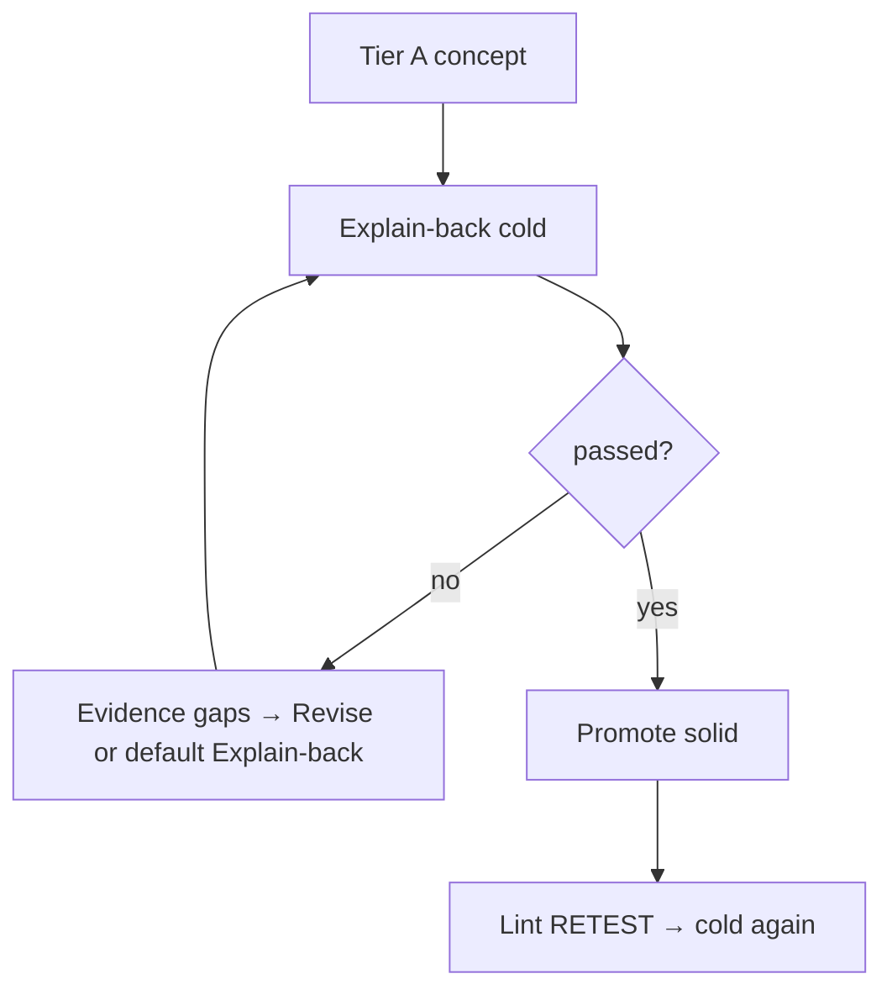

# 琢磨 (Zhuomo)

**Turn books, articles, and notes into a personal Obsidian wiki you can study from — not just search.**

> **琢磨** — polish raw material until it is clear, linked, and teachable.

Zhuomo is a [Cursor agent skill](https://cursor.com/docs/context/skills) plus conventions for an Obsidian vault: ingest sources into **concept pages** (Claim + Evidence + Explain-back), query brain-first, and learn with **retrieval practice** (`cold` → Explain-back → `solid`).

---

## Start here

| If you want… | Open |
|--------------|------|
| **Daily commands (in Obsidian)** | `wiki/help.md` in your vault |
| **5-minute overview** | [SIMPLE.md](SIMPLE.md) |
| **Setup & workflows** | [USER-GUIDE.md](USER-GUIDE.md) |
| **Study spec** | [REVIEW.md](REVIEW.md) |
| **Agent behavior** | [SKILL.md](SKILL.md) |

---

## Install

```bash
git clone git@github.com:dylanchen1925/zhuomo.git ~/zhuomo
ln -sf ~/zhuomo ~/.cursor/skills/zhuomo
```

First run (paths are defaults in `SKILL.md`; override in chat if needed):

```
/zhuomo Bootstrap + ingest: ~/zhuomo-data/raw/inbox/my-book.epub
```

---

## What it does

| Layer | Path | Role |
|-------|------|------|
| **Raw** | `~/zhuomo-data/raw/` | EPUB/PDF/clips — immutable |
| **Wiki (corpus)** | Obsidian `wiki/` | `concepts/`, `sources/`, `domains/`, compiled `synthesis/` |
| **Personal** | `wiki/notes/` | Your takes — `Connect`, on-concept notes |

**RAG rediscovers every question. A wiki accumulates.** Ingest compiles once; Query and Revise keep it current.

---

## Verbs (six + Connect)

| Verb | You say | Output |
|------|---------|--------|
| **Bootstrap** | `Bootstrap + ingest: book.epub` | Folders, vault `AGENTS.md`, optional first ingest |
| **Ingest** | `Ingest: …` | Topic map, md corpus, concept pages + `## Explain-back` + Evidence |
| **Query** | `Query: …` / `Query think: …` | Answer + Gaps + Next step (brain-first over wiki) |
| **Revise** | `Revise [[page]] — …` | Fixed corpus; `updated:`; log |
| **Study** | See below | `explain_back` / `mastery` frontmatter |
| **Lint** | `Lint` | Health scan + review queue (incl. **RETEST**) |
| **Connect** | `Connect: … — 记入 synthesis` | Personal cross-concept note → `wiki/notes/synthesis/` |

**Ingest depth (opt-in):** `overview only` · `archive only` · `selective deepen` · `精读`

**Cursor skills from wiki:** Not a zhuomo verb — chat with the agent and cite `[[concepts]]`. Optional layout: [WIKI-BACKED-SKILLS.md](WIKI-BACKED-SKILLS.md).

---

## Study loop

Designed for **retrieval practice**, not read-then-quiz fluency.


```mermaid
flowchart TD
  A[Tier A concept] --> B["Explain-back cold"]
  B --> C{passed?}
  C -->|no| D[Evidence gaps → Revise or default Explain-back]
  D --> B
  C -->|yes| E[Promote solid]
  E --> F["Lint RETEST → cold again"]
```

| Mode | Command | When |
|------|---------|------|
| **Cold** | `Explain-back [[x]] cold` | First learn — no Claim until you answer |
| **Default** | `Explain-back [[x]]` | Revision — one prompt per turn |
| **Promote** | `Promote [[x]] to solid` | Only if `explain_back: passed` |

**Advanced opt-in:** `Explain-back [[x]] feynman` — free teach-back + probes (see REVIEW.md; not default).

Progress: `domains/<domain>/study.md` (Dataview **下一步**: `① Promote` → `② Explain-back` → `③ Cold`).

`reviewed` is set by Explain-back sessions — no separate “mark as read” verb.

---

## Example session

```
/zhuomo Query think: native routing vs VXLAN overlay for this fabric?
/zhuomo Explain-back [[cilium-datapath-modes]] cold
/zhuomo Promote [[cilium-datapath-modes]] to solid
/zhuomo Connect: overlay vs native mental model — 记入 synthesis
/zhuomo Lint
```

---

## Repo layout

| Path | Purpose |
|------|---------|
| [SKILL.md](SKILL.md) | Agent entry point (intent router, protocols) |
| [templates/AGENTS.md](templates/AGENTS.md) | Vault conventions template |
| [templates/wiki/help.md](templates/wiki/help.md) | Human daily reference → copied to vault |
| [scripts/](scripts/) | Generic converters + vault maintenance (see below) |
| `~/zhuomo-data/raw/` | Your sources (outside repo) |
| Obsidian `wiki/` | Your knowledge base (outside repo) |

### Scripts in this repo

Only **generic** tools are tracked here. One-off ingest helpers for a specific book, site, or corpus (e.g. zartbot, Cisco EOT HTML) stay **local** outside the repo.

| Category | Script | Purpose |
|----------|--------|---------|
| **Ingest** | `epub-to-wiki-md.py` | EPUB → `wiki/sources/<slug>/md/` |
| | `pdf-to-wiki-md.py` | Text PDF → per-chapter md (chapter map in script) |
| | `pdf-ocr-to-wiki-md.py` | Scanned PDF → OCR md |
| | `markitdown-to-wiki-md.py` | PPTX / DOCX / YouTube → per-part md |
| | `rst-to-wiki-md.py` | Sphinx/RST book repo → md |
| **Study & lint** | `lint-review-queue.py` | Review queue: `SOLID_CANDIDATE` · `RETEST` · `READ_UNTESTED` · `STALE` · … |
| | `sync-domain-study-paths.py` | Sync `domains/*/overview.md` study paths + tiers |
| | `domain_study_tiers.py` | Tier data (imported by sync script) |
| | `lint-figure-visuals.py` | Flag concepts missing inline Figure images |
| **Assets** | `corpus_assets.py` | Shared paths for corpus images outside vault |
| | `embed-figure-visuals.py` | Inline Figure N images in concept pages |
| | `clean-orphan-assets.py` | Remove unreferenced corpus images |
| | `migrate-corpus-assets-out.py` | Move `sources/*/md/assets/` → `~/zhuomo-data/corpus/` |
| **Wiki repair** | `fix-table-wikilink-pipes.py` | Fix `[[wikilink\|alias]]` inside table cells |
| | `recover-table-wikilink-damage.py` | Undo over-aggressive table wikilink fixes |
| **One-shot migration** | `simplify-vault.py` | Legacy vault layout → current conventions |
| | `add-evidence-sections.py` | Batch-add `## Evidence` tables (migration helper) |

**Common commands:**

```bash
python3 ~/zhuomo/scripts/lint-review-queue.py <vault>/wiki
python3 ~/zhuomo/scripts/sync-domain-study-paths.py <vault>/wiki
python3 ~/zhuomo/scripts/epub-to-wiki-md.py <book.epub> <vault>/wiki <slug>
python3 ~/zhuomo/scripts/markitdown-to-wiki-md.py deck.pptx --out <vault>/wiki/sources/<slug>/md --slug <slug>
```

**MarkItDown ingest** (PPTX, DOCX, YouTube):

```bash
python3 -m pip install 'markitdown[pptx,docx]' youtube-transcript-api

python3 ~/zhuomo/scripts/markitdown-to-wiki-md.py ~/zhuomo-data/raw/ppt/training.pptx \
  --out ~/Library/Mobile\ Documents/iCloud~md~obsidian/Documents/Dylan\ Chen/wiki/sources/training-deck/md \
  --slug training-deck

python3 ~/zhuomo/scripts/markitdown-to-wiki-md.py 'https://www.youtube.com/watch?v=VIDEO_ID' \
  --out .../wiki/sources/my-talk/md --slug my-talk --youtube-chunk-sec 300
```

Requires: `markitdown[pptx,docx]`; `youtube-transcript-api` optional but recommended for timestamped transcript parts.

---

## Documentation map

| Doc | Use when |
|-----|----------|
| [SIMPLE.md](SIMPLE.md) | Minimum viable path |
| [REVIEW.md](REVIEW.md) | Explain-back rubric, cold/default, Dataview |
| [LEARNING.md](LEARNING.md) | Connect, ingest Explain-back quality, domain overviews |
| [USER-GUIDE.md](USER-GUIDE.md) | First-time setup, prompt cookbook |
| [KNOWLEDGE-BASE.md](KNOWLEDGE-BASE.md) | Wiki layout details (agents) |
| [WIKI-BACKED-SKILLS.md](WIKI-BACKED-SKILLS.md) | Optional domain skill file layout |

---

## License

Personal knowledge-workflow project. Use and adapt for your own vault and skill install.
