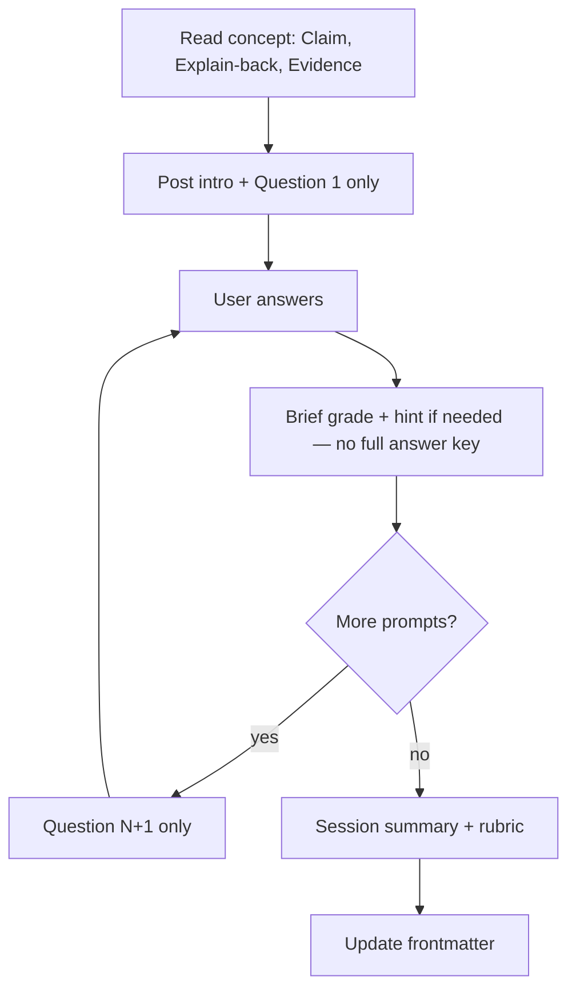

# Study — Review & Explain-back (Zhuomo)

**Study** = read a concept, teach it back, promote mastery. One human doc for learning + retention.

**Related:** [LEARNING.md](LEARNING.md) (fable only) · [SKILL.md](SKILL.md) (agent ops) · vault `[[help]]` (daily cheatsheet)

---

## Where to start (study order + consolidate)

**Open:** `domains/<domain>/overview.md` — blocks appear **near the top** in this order:

| Block | Purpose |
|-------|---------|
| **建议学习顺序** | Ordered path — start here for a new domain |
| **待巩固** | Dataview queues: Solid 候选 → 读过未测 → 待复习 |
| **掌握度分层** | Tier A/B = target solid; C/D = Query-only |

Vault index: `wiki/overview.md` · `wiki/domain-map.md`

### Consolidate priority (do in order)

| Priority | Queue | You do |
|----------|-------|--------|
| 1 | **Solid 候选** | `Promote [[slug]] to solid` |
| 2 | **读过未测** | `Explain-back [[slug]]` |
| 3 | **待复习** | Re-read concept → `Review [[slug]]` |
| 4 | **Tier A** not solid | Next slug on **建议学习顺序** |

Same buckets from `lint-review-queue.py` or `Review queue: <domain>`.

Full concept table lives in **学习进度** at the **bottom** of overview — for lookup, not daily triage.

---

## How to read a concept page

A concept page is a **compiled map**, not the textbook. Explain-back often tests **application** (connect sections, traps, prerequisites) — not a single bullet labeled “exam answer”.

### First learn (Tier A / new material)

1. Read **`## Explain-back`** first — use as self-test outline  
2. Read **Claim**, body, **`## Prerequisites`** chain  
3. Try to answer Explain-back bullets closed-book  
4. On miss → open **one** matching **Evidence** row (`sources/.../md/`)  
5. `Review [[slug]]` → `Explain-back [[slug]]` → `Promote` if passed  

### Review (already studied)

- **Claim + body** usually enough  
- Re-open Evidence only if Explain-back fails  

### Query-only (no study)

- `Query: …` — brain-first; follow **Next step: 够用** when appropriate  
- Do not force Explain-back for one-off facts  

### When answers seem “not on the page”

| Case | Action |
|------|--------|
| Answer requires linking 2+ sections on the concept | Normal — Explain-back tests synthesis |
| Answer only in Evidence source text | Click Evidence anchor |
| Neither concept nor Evidence supports the prompt | **Revise** — fix prompt or add Claim/Evidence |

**Do not** re-read raw EPUB for routine study. **Do not** solid every concept — Tier A on overview is enough.

### 15-minute block

1. Pick one row from overview **待巩固**  
2. Explain-back bullets → Claim/body (5–8 min)  
3. Closed-book attempt → one Evidence row if stuck  
4. `Explain-back [[slug]]` or `Review` first  

---

## User verbs (6 total)

| Verb | Includes | When |
|------|----------|------|
| Bootstrap | — | Once |
| Ingest | deepen + Evidence + Explain-back | New source |
| Query | search / think | Questions |
| Revise | fix pages | Errors |
| **Study** | Review, Explain-back, Promote, Review queue | Learning |
| Lint | health + review queue | After big ingest, or when something feels stale |

**Weekly** is optional — a bundled alias for `Lint` + one suggested Explain-back (~15 min). **Not required** if you Study ad hoc. Skip Weekly entirely when you already run `Review queue` and `Lint` when needed.

---

## Study operations

| You say | Agent does |
|---------|------------|
| `Review [[concept]]` | Set `reviewed:` today |
| `Explain-back [[concept]]` | **Interactive (default):** one `## Explain-back` prompt at a time → you answer → brief feedback → next — [§ Interactive explain-back](#interactive-explain-back-default) |
| `Review queue: cisco-aci` | List `updated > reviewed` and never reviewed |
| `Promote [[concept]] to solid` | Only if `explain_back: passed` |
| `Weekly` | Optional: lint + review queue + suggest one Explain-back → `log.md` |

---

## Concept frontmatter (4 fields + domain)

```yaml
---
domain: cisco-aci
mastery: learning              # learning | solid
reviewed:                      # YYYY-MM-DD — you read this version
explain_back: not_started      # not_started | attempted | passed
updated: 2026-06-14            # last agent or study edit (replaces wiki_revised)
---
```

| Field | Who sets | Meaning |
|-------|----------|---------|
| `reviewed` | You / Review | You've read this version |
| `explain_back` | Explain-back | Can you teach it back? |
| `mastery` | Promote / passed explain-back | `learning` vs `solid` |
| `updated` | Agent on Revise/Ingest; agent on Explain-back | Triggers re-read if `> reviewed` |

**Do not confuse:** `updated` (page changed) ≠ `reviewed` (you studied it).

Add `epistemic: contested` only when sources disagree — not on every page.

---

## `## Explain-back` on every concept page

Place **before** `## Evidence`. Ingest/deepen adds 3–4 prompts per concept.

```markdown
## Explain-back

1. *"…open question…"*
2. *"…trap or contrast…"*
3. *"…procedure or object model…"*

**Rubric:** Claim correct · mechanism OK · ≥1 constraint/trap · aligns with Evidence.
```

---

## Explain-back rubric

| Result | Criteria | Updates |
|--------|----------|---------|
| **passed** | Claim OK; mechanism OK; ≥1 trap; matches Evidence | `explain_back: passed`, `updated`, optional `mastery: solid` |
| **partial** | Framework OK, missing detail | `explain_back: attempted` |
| **fail** | Wrong or contradicts wiki | `explain_back: attempted`; suggest **Revise** |

**Promote to `solid`:** `explain_back: passed` required.

---

## Interactive explain-back (default)

When the user says `Explain-back [[concept]]` or `/zhuomo explain-back <concept>`, run **one prompt per turn** from the concept’s `## Explain-back` section. **Do not** dump all questions, model answers, or a score sheet in one message.

### Flow



| Step | Agent | User |
|------|-------|------|
| 1 | Read `wiki/concepts/<slug>.md` + Evidence as needed | `Explain-back [[slug]]` |
| 2 | Short intro (Claim one-liner); **only prompt 1** | — |
| 3 | Wait | Teach back in own words |
| 4 | ✅ / ⚠️ / ❌ for **this prompt only**; 1–3 sentence correction if partial/fail; optional one follow-up probe | — |
| 5 | **Only prompt 2** (no preview of 3–4) | Answer |
| 6 | Repeat until all `## Explain-back` items done | — |
| 7 | Session summary → `passed` \| `partial` \| `fail`; update frontmatter | `Promote [[slug]] to solid` if passed |

### Agent rules

| Rule | Detail |
|------|--------|
| **One at a time** | Never list all questions upfront; never publish answers for prompts not yet asked |
| **Prompt source** | Numbered bullets under `## Explain-back` on the concept page |
| **Feedback** | After each answer: what was right, what was missing, one trap if relevant — **not** a full wiki rewrite |
| **Partial answer** | One clarifying follow-up allowed, then move on; mark that prompt partial |
| **Evidence** | Grade against wiki + cited Evidence; flag contradictions |
| **End only** | Full rubric verdict and frontmatter update **after last prompt**, not mid-session |

### Per-prompt grade (inline)

| Mark | Meaning |
|------|---------|
| ✅ | Mechanism correct; aligns with Evidence |
| ⚠️ | Framework OK; missing detail or imprecise |
| ❌ | Wrong or contradicts wiki |

### Session → frontmatter

| Session result | Criteria | Updates |
|----------------|----------|---------|
| **passed** | All prompts ✅ or ⚠️ with no ❌ on core mechanism; ≥1 trap demonstrated across session | `explain_back: passed`, `reviewed: <today>`, `updated: <today>` |
| **partial** | Mix of ⚠️/❌ but Claim/framework salvageable | `explain_back: attempted`, `reviewed: <today>`, `updated: <today>` |
| **fail** | Wrong Claim or core mechanism on multiple prompts | `explain_back: attempted`; suggest re-read Evidence or **Revise** |

**Retake:** `Explain-back [[slug]]` again on missed prompts only, or full session.

### Optional log line

```markdown
## [YYYY-MM-DD] explain-back | [[concept-slug]] — passed (4/4)
```

### Batch mode (opt-in)

If user says `Explain-back [[concept]] batch` or `一次出题`, may publish all prompts without answers, then grade when they submit — same rubric. **Not default.**

---

## Progress in Obsidian (Dataview)

Domain `overview.md` embeds Dataview — **daily use §待巩固**; **§学习进度** = full inventory at page bottom.

**Requires:** Obsidian [Dataview](https://github.com/blacksmithgu/obsidian-dataview) plugin.

**How to use:**

1. Open `domains/<学科>/overview.md` → **建议学习顺序** → **待巩固** → **掌握度分层**.
2. **Solid 候选** / **读过未测** / **待复习** — in **待巩固** (auto-updated).
3. Scroll to **学习进度** only when you need the full concept list.
4. After **Explain-back** or **Revise**, refresh is automatic. Run `Promote [[slug]] to solid` when passed.

Example **待复习** query (also embedded on overview):

```dataview
TABLE mastery, reviewed, explain_back, updated
FROM "wiki/concepts"
WHERE domain = "cisco-aci" AND (reviewed = null OR updated > reviewed)
SORT updated DESC
```

**Solid 已达成:**

```dataview
LIST
FROM "wiki/concepts"
WHERE domain = "cisco-aci" AND mastery = "solid"
```

| mastery | Meaning |
|---------|---------|
| `learning` | Deepened; has Evidence |
| `solid` | Explain-back passed |

---

## Lint: review queue

```bash
python3 scripts/lint-review-queue.py <vault>/wiki
```

Or say `Lint` / optional `Weekly` — script prints buckets:

| Bucket | Meaning | Action |
|--------|---------|--------|
| `SOLID_CANDIDATE` | passed, not solid | `Promote [[slug]] to solid` |
| `READ_UNTESTED` | reviewed, not passed | `Explain-back [[slug]]` |
| `STALE` | updated > reviewed | Re-read |
| `NEVER_REVIEWED` | has Evidence, no reviewed | Review |
| `MISSING_EXPLAIN_BACK_SECTION` | deepened, no section | Add prompts |

---

## Optional Weekly (~15 min)

Only if you want a fixed ritual. Otherwise run **Lint** and **Study** when you feel like it.

```
- [ ] 1. Review queue — re-read where updated > reviewed
- [ ] 2. One Explain-back on a weak concept
- [ ] 3. Lint — links, Evidence, figures, review queue
```

Append `wiki/log.md`: `## [YYYY-MM-DD] weekly | …`

---

## Prerequisites (on concept pages when useful)

```markdown
## Prerequisites
- [[aci-fabric-underlay]]

## Enables
- [[aci-border-leaf-l3out]]
```

---

## Example prompts

```
Explain-back [[aci-border-leaf-l3out]]
/zhuomo explain-back eigrp

Review [[aci-spine-leaf-topology]]

Review queue: cisco-aci

Promote [[aci-spine-leaf-topology]] to solid

Lint

Weekly
```

---

## Progressive layers

| Layer | Location |
|-------|----------|
| L0 | `raw/` |
| L1 | `wiki/sources/` |
| L2 | `wiki/concepts/` + `## Explain-back` |
| L3 | `domains/<slug>/overview.md` (pillars + Dataview) |
| Optional | `wiki/learn/fables/` |

No `learn/digests/`, `learn/reviews/`, or `learn/applied/` by default.
