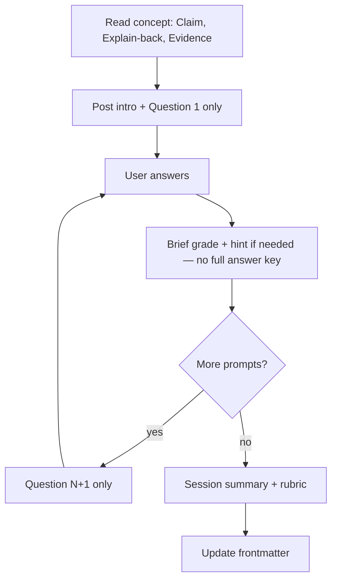

# Study — Review & Explain-back (Zhuomo)

**Study** = read a concept, teach it back, promote mastery. One human doc for learning + retention.

**Related:** [LEARNING.md](LEARNING.md) · [SKILL.md](SKILL.md) · [references/study-diagnosis.md](references/study-diagnosis.md) · vault `[[help]]`

---

## Study stuck? (diagnosis)

Explain-back **partial/fail** or「背了不会用」→ agent uses [references/study-diagnosis.md](references/study-diagnosis.md):

| 卡点 | 你说 / 做 |
|------|-----------|
| Claim 太薄 / 导读 | `Revise [[slug]]` |
| 术语不懂 | 读 Claim **正式层** + Evidence |
| 不会串机制 | Revise 补 `### vs` 或 `Connect` |
| 版本/CV E 过时 | `外搜 [[slug]]` 或 domain |
| 只会背不会选 | Revise 加 scenario + procedure |

**连续学习：** `Study continue: <domain>` — one lesson from `study.md` **下一步** column.

---

## Where to start (study order + progress)

**First visit to a domain:** `domains/<domain>/map.md` (~30 min whole picture) → then `study.md`.

**Daily Study:** `domains/<domain>/study.md` — **学习进度** per Tier A / B / rest.

`domains/<domain>/overview.md` — gaps、外搜、**建议学习顺序** (inline **A** / **B** markers).

| Column | Purpose |
|--------|---------|
| **下一步** | `① Promote` → `② Explain-back` → `③ Cold` → `—` |
| mastery / reviewed / explain_back | Status at a glance |

Rows sort by **下一步** priority — no separate consolidate section.

Vault index: `wiki/overview.md` · `wiki/domain-map.md`

### Action priority (read **下一步** column)

| Mark | You do |
|------|--------|
| `① Promote` | `Promote [[slug]] to solid` |
| `② Explain-back` | `Explain-back [[slug]]` or `cold` |
| `③ Cold` | `Explain-back [[slug]] cold` (never reviewed or `updated > reviewed`) |
| `—` | No action; continue **建议学习顺序** for next **A** |

Same buckets from `lint-review-queue.py` or `Review queue: <domain>`.

---

## How to read a concept page

A concept page is a **compiled map**, not the textbook. Explain-back often tests **application** (connect sections, traps, prerequisites) — not a single bullet labeled “exam answer”.

### First learn (Tier A / new material)

0. **`domains/<slug>/map.md`** — skim whole picture if first time in domain (optional if revisiting)
1. **`Explain-back [[slug]] cold`** (recommended) — answer from memory before seeing Claim  
2. After cold session: read gaps → **Evidence** rows for misses only  
3. If still weak → default **`Explain-back [[slug]]`** or **Revise** Claim (see [study-diagnosis](references/study-diagnosis.md))  
4. Pass → `Promote [[slug]] to solid`  

**Review-first path** (revision only): read Claim + body → default `Explain-back [[slug]]`.

### Review (already studied)

- **Claim + body** usually enough  
- Re-open Evidence only if Explain-back fails  

### Query-only (no study)

- `Query: …` — brain-first; follow **Next step: 够用** when appropriate  
- Do not force Explain-back for one-off facts  

### When answers seem “not on the page”

| Case | Action |
|------|--------|
| Answer requires linking 2+ sections on the concept | Normal — Explain-back tests synthesis |
| Answer only in Evidence source text | Click Evidence anchor |
| Neither concept nor Evidence supports the prompt | **Revise** — fix prompt or add Claim/Evidence |

**Do not** re-read raw EPUB for routine study. **Do not** solid every concept — Tier A on overview is enough.

### 15-minute block

1. Pick one row with **下一步** `①`/`②`/`③` on `study.md`  
2. **New material:** `Explain-back [[slug]] cold` (5–8 min)  
3. Fill gaps from Evidence; default Explain-back or Revise if needed  
4. Promote if passed  

---

## User verbs (6 total)

| Verb | Includes | When |
|------|----------|------|
| Bootstrap | — | Once |
| Ingest | deepen + Evidence + Explain-back | New source |
| Query | search / think | Questions |
| Revise | fix pages | Errors |
| **Study** | Explain-back (cold / default), Promote, Review queue | Learning |
| Lint | health + review queue | After big ingest |

---

## Study operations

| You say | Agent does |
|---------|------------|
| `Explain-back [[concept]]` | **Interactive (default):** one prompt at a time — [§ Interactive explain-back](#interactive-explain-back-default) |
| `Explain-back [[concept]] cold` / `先测后读` | [§ Cold explain-back](#cold-explain-back-first-learn) — no Claim/body until after you answer |
| `Explain-back [[concept]] feynman` | [§ Feynman explain-back](#feynman-explain-back-advanced-opt-in) — **advanced opt-in**; free teach-back + probes (not default) |
| `Review queue: cisco-aci` | List `updated > reviewed` and never reviewed |
| `Promote [[concept]] to solid` | Only if `explain_back: passed` |

`reviewed:` is set by Explain-back sessions (not a separate verb).

---

## Concept frontmatter (4 fields + domain)

```yaml
---
domain: cisco-aci
mastery: learning              # learning | solid
reviewed:                      # YYYY-MM-DD — you read this version
explain_back: not_started      # not_started | attempted | passed
updated: 2026-06-14            # last agent or study edit (replaces wiki_revised)
---
```

| Field | Who sets | Meaning |
|-------|----------|---------|
| `reviewed` | Explain-back end | You've engaged this version (set automatically) |
| `explain_back` | Explain-back | Can you teach it back? |
| `mastery` | Promote / passed explain-back | `learning` vs `solid` |
| `updated` | Agent on Revise/Ingest; agent on Explain-back | Triggers re-read if `> reviewed` |

**Do not confuse:** `updated` (page changed) ≠ `reviewed` (you studied it).

Add `epistemic: contested` only when sources disagree — not on every page.

---

## `## Explain-back` on every concept page

Place **before** `## Evidence`. Ingest/deepen adds 3–4 prompts per concept.

**Quality rules (ingest):** No pure-definition prompts. Each concept needs ≥1 contrast, scenario, remove-premise, or failure-mode question. Prefer synthesis across Claim sections.

```markdown
## Explain-back

1. *"…open question…"*
2. *"…trap or contrast…"*
3. *"…scenario or migration…"*

**Rubric:** Claim correct · mechanism OK · ≥1 constraint/trap · aligns with Evidence.
```

---

## Explain-back rubric

| Result | Criteria | Updates |
|--------|----------|---------|
| **passed** | Claim OK; mechanism OK; ≥1 trap; matches Evidence | `explain_back: passed`, `updated`, optional `mastery: solid` |
| **partial** | Framework OK, missing detail | `explain_back: attempted` |
| **fail** | Wrong or contradicts wiki | `explain_back: attempted`; suggest **Revise** |

**Promote to `solid`:** `explain_back: passed` required.

---

## Cold explain-back (first learn)

**Trigger:** `Explain-back [[concept]] cold` or `先测后读`.

**Tier A first pass:** use **cold** instead of reading Claim then default Explain-back.

| Phase | Agent | User |
|-------|-------|------|
| During session | Ask `## Explain-back` prompts one at a time; grade each | Answer from memory only |
| **Hidden** | Do **not** show Claim, body, or Evidence until session ends | — |
| After last prompt | Reveal Claim one-liner + gap list vs Evidence | Read missed Evidence; default Explain-back or Revise |

Same frontmatter rubric as default. **Retest:** Lint `RETEST` bucket → `Explain-back [[slug]] cold` for stale `solid`.

---

## Interactive explain-back (default)

When the user says `Explain-back [[concept]]` or `/zhuomo explain-back <concept>`, run **one prompt per turn** from the concept’s `## Explain-back` section. **Do not** dump all questions, model answers, or a score sheet in one message.

### Flow


```mermaid
flowchart TD
  A[Read concept: Claim, Explain-back, Evidence] --> B[Post intro + Question 1 only]
  B --> C[User answers]
  C --> D[Brief grade + hint if needed — no full answer key]
  D --> E{More prompts?}
  E -->|yes| F[Question N+1 only]
  F --> C
  E -->|no| G[Session summary + rubric]
  G --> H[Update frontmatter]
```

| Step | Agent | User |
|------|-------|------|
| 1 | Read `wiki/concepts/<slug>.md` + Evidence as needed | `Explain-back [[slug]]` |
| 2 | Short intro (Claim one-liner); **only prompt 1** | — |
| 3 | Wait | Teach back in own words |
| 4 | ✅ / ⚠️ / ❌ for **this prompt only**; 1–3 sentence correction if partial/fail; optional one follow-up probe | — |
| 5 | **Only prompt 2** (no preview of 3–4) | Answer |
| 6 | Repeat until all `## Explain-back` items done | — |
| 7 | Session summary → `passed` \| `partial` \| `fail`; update frontmatter | `Promote [[slug]] to solid` if passed |

### Agent rules

| Rule | Detail |
|------|--------|
| **One at a time** | Never list all questions upfront; never publish answers for prompts not yet asked |
| **Prompt source** | Numbered bullets under `## Explain-back` on the concept page |
| **Feedback** | After each answer: what was right, what was missing, one trap if relevant — **not** a full wiki rewrite |
| **Partial answer** | One clarifying follow-up allowed, then move on; mark that prompt partial |
| **Evidence** | Grade against wiki + cited Evidence; flag contradictions |
| **End only** | Full rubric verdict and frontmatter update **after last prompt**, not mid-session |

### Per-prompt grade (inline)

| Mark | Meaning |
|------|---------|
| ✅ | Mechanism correct; aligns with Evidence |
| ⚠️ | Framework OK; missing detail or imprecise |
| ❌ | Wrong or contradicts wiki |

### Session → frontmatter

| Session result | Criteria | Updates |
|----------------|----------|---------|
| **passed** | All prompts ✅ or ⚠️ with no ❌ on core mechanism; ≥1 trap demonstrated across session | `explain_back: passed`, `reviewed: <today>`, `updated: <today>` |
| **partial** | Mix of ⚠️/❌ but Claim/framework salvageable | `explain_back: attempted`, `reviewed: <today>`, `updated: <today>` |
| **fail** | Wrong Claim or core mechanism on multiple prompts | `explain_back: attempted`; suggest re-read Evidence or **Revise** |

**Retake:** `Explain-back [[slug]]` again on missed prompts only, or full session.

### Optional log line

```markdown
## [YYYY-MM-DD] explain-back | [[concept-slug]] — passed (4/4)
```

---

## Feynman explain-back (advanced opt-in)

**Rarely used.** Keep for explicit `Explain-back [[concept]] feynman` only — not in the default 15-minute block.

**Trigger:** `Explain-back [[concept]] feynman` or `feynman` on the same line.

Use when default/cold feels too quiz-like **and** Claim is already thick enough. Prefer **Revise** first if the page is thin. Same Promote gate: `explain_back: passed`.

**Persona:** Agent probes with「为什么？」「举个具体例子？」「如果去掉 X 会怎样？」— **not** required to use a child persona (网工向内容用场景追问更合适).

| Step | You | Agent |
|------|-----|-------|
| 1 | `Explain-back [[slug]] feynman` | Domain context only (not full Claim); ask you to teach back freely |
| 2 | Explain in your own words | ✅/⚠️/❌; gaps; child-style follow-ups on weak spots |
| 3 | Optional link | 「这和 [[prerequisite]] 怎么连？」when ## Prerequisite exists |
| 4 | Explain again, simpler | Repeat until core mechanism ✅ |
| 5 | `Promote [[slug]] to solid` if passed | — |

**Agent rules:** No long lecture before your first attempt. Grade against Claim + Evidence only. Optional clean summary → `notes/on-concept/<slug>.md` if you say `保存 feynman 笔记`.

**Log:** `## [YYYY-MM-DD] explain-back-feynman | [[slug]] — passed`

---

## Progress in Obsidian (Dataview)

Open `domains/<学科>/study.md` — **进度摘要** (fraction + **solid %** per tier) + **学习进度** tables.

`domains/<学科>/overview.md` — **建议学习顺序** only.

**Requires:** Obsidian [Dataview](https://github.com/blacksmithgu/obsidian-dataview) plugin.

**How to use:**

1. Open `study.md`; pick rows where **下一步** is `①` / `②` / `③`.
2. For new material, follow **建议学习顺序** on `overview.md` (Tier **A** / **B**).
3. After **Explain-back** or **Revise**, tables refresh automatically. Run `Promote [[slug]] to solid` when passed.

Example **待复习** condition (used in **下一步** `③`):

```dataview
TABLE mastery, reviewed, explain_back, updated
FROM "wiki/concepts"
WHERE domain = "cisco-aci" AND (reviewed = null OR updated > reviewed)
SORT updated DESC
```

**Solid 已达成:**

```dataview
LIST
FROM "wiki/concepts"
WHERE domain = "cisco-aci" AND mastery = "solid"
```

| mastery | Meaning |
|---------|---------|
| `learning` | Deepened; has Evidence |
| `solid` | Explain-back passed |

---

## Lint: review queue

```bash
python3 scripts/lint-review-queue.py <vault>/wiki
```

Or say `Lint` — script prints buckets:

| Bucket | Meaning | Action |
|--------|---------|--------|
| `SOLID_CANDIDATE` | passed, not solid | `Promote [[slug]] to solid` |
| `RETEST` | solid, `reviewed` >30d (default) | `Explain-back [[slug]] cold` |
| `READ_UNTESTED` | reviewed, not passed | `Explain-back [[slug]]` or `cold` |
| `STALE` | updated > reviewed | Re-read |
| `NEVER_REVIEWED` | has Evidence, no reviewed | `Explain-back [[slug]] cold` (Tier A) |
| `MISSING_EXPLAIN_BACK_SECTION` | deepened, no section | Add prompts |

---

## Prerequisites (on concept pages when useful)

```markdown
## Prerequisites
- [[aci-fabric-underlay]]

## Enables
- [[aci-border-leaf-l3out]]
```

---

## Example prompts

```
Explain-back [[aci-border-leaf-l3out]] cold
Explain-back [[aci-border-leaf-l3out]]
/zhuomo explain-back eigrp

Review queue: cisco-aci

Promote [[aci-spine-leaf-topology]] to solid

Lint
```

---

## Progressive layers

| Layer | Location |
|-------|----------|
| L0 | `raw/` |
| L1 | `wiki/sources/` |
| L2 | `wiki/concepts/` + `## Explain-back` |
| L3 | `domains/<slug>/overview.md` (pillars + Dataview) |

No `learn/digests/` or `learn/fables/` by default.
