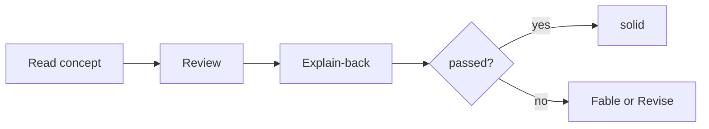

# Zhuomo User Guide

How to set up **琢磨 (Zhuomo)**, learn from sources **one concept at a time**, and keep a personal wiki + optional agent skills.

**You read this guide.** The agent reads [SKILL.md](SKILL.md).

**Quick links:** [REVIEW.md](REVIEW.md) · [LEARNING.md](LEARNING.md) · [FRAMEWORK.md](FRAMEWORK.md) · Obsidian `wiki/help.md`

---

## Table of contents

1. [What Zhuomo is](#1-what-zhuomo-is)
2. [Prerequisites](#2-prerequisites)
3. [First-time setup](#3-first-time-setup)
4. [Learn by concept (Review & Explain-back)](#4-learn-by-concept-review--explain-back)
5. [Lint vs Revise](#5-lint-vs-revise)
6. [Daily and weekly habits](#6-daily-and-weekly-habits)
7. [Operations reference](#7-operations-reference)
8. [Prompt cookbook](#8-prompt-cookbook)
9. [Learning from sources](#9-learning-from-sources)
10. [Domain frameworks and progress](#10-domain-frameworks-and-progress)
11. [Applied journal (optional)](#11-applied-journal-optional)
12. [Creating agent skills](#12-creating-agent-skills)
13. [Domain skills (wiki-backed experts)](#13-domain-skills-wiki-backed-experts)
14. [Multi-device workflow](#14-multi-device-workflow)
15. [Source types](#15-source-types)
16. [Troubleshooting](#16-troubleshooting)
17. [FAQ](#17-faq)

---

## 1. What Zhuomo is

**琢磨** — polish raw material until it is clear, linked, and usable.

| You provide | Zhuomo helps produce |
|-------------|----------------------|
| EPUB, PDF, articles, video notes, highlights | **Wiki** (Obsidian) — concepts, Evidence, frameworks |
| Repeatable agent behavior | **Skills** (Cursor) — triggers and workflows |
| Your study time | **Digests**, **Explain-back** prompts, optional **fables** |

**You do not need to name topics upfront.** Drop a source; the agent proposes a topic map and ingests into `wiki/concepts/`.

**Learning model (2026):** study **per concept** — read the page, **Review** (mark read), **Explain-back** (teach it aloud in chat). No flashcard decks, no Roguelike runs.

---

## 2. Prerequisites

| Tool | Purpose |
|------|---------|
| **Cursor** | Run Zhuomo (`/zhuomo` or natural language) |
| **Obsidian** | Read wiki, graph, optional Dataview for review queue |
| **Git** (optional) | Version wiki or skill repos |

Install the skill:

```bash
ln -sf /path/to/zhuomo ~/.cursor/skills/zhuomo
```

You do **not** need the Obsidian Spaced Repetition plugin.

---

## 3. First-time setup

### Step 1: Bootstrap

In Cursor:

```
/zhuomo Bootstrap: raw ~/zhuomo-data/raw/, Obsidian vault ~/Library/Mobile Documents/iCloud~md~obsidian/Documents/Dylan Chen
```

Or bootstrap and ingest the first book in one line:

```
/zhuomo Bootstrap + ingest: ~/zhuomo-data/raw/books/my-first-book.epub
```

**Default:** reference depth — topic map, EPUB md corpus, **all concepts deepened** with `## Explain-back` + `## Evidence`.

**Lite:** add `overview only` or `Bootstrap lite` for stubs first.

### Step 2: Folder layout

```
~/zhuomo-data/raw/
├── inbox/          # phone captures
├── web/ · video/ · books/ · assets/
└── processed/

vault/
├── AGENTS.md
└── wiki/
    ├── overview.md · index.md · log.md · domain-map.md · help.md
    ├── domains/<slug>/overview.md (+ optional guide.md)
    ├── concepts/*.md
    ├── sources/
    ├── synthesis/
    └── learn/
        ├── digests/
        ├── fables/
        ├── reviews/    # optional session logs
        └── applied/    # optional practice notes
```

### Step 3: Open Obsidian

Open the vault; start from `wiki/overview.md` or `wiki/help.md`.

### Step 4: First ingest

```
/zhuomo Ingest: ~/zhuomo-data/raw/books/my-first-book.epub
```

Map only:

```
/zhuomo Ingest overview only: raw/web/article.md
```

Browse `wiki/concepts/` — each deepened page should have **Explain-back** then **Evidence**.

---

## 4. Learn by concept (Review & Explain-back)

### The loop



| Step | You say | What happens |
|------|---------|----------------|
| **Read** | Open `wiki/concepts/…` | Claim, mechanics, figures inline |
| **Review** | `Review [[concept]]` | `reviewed: YYYY-MM-DD` on the page |
| **Explain-back** | `Explain-back [[concept]]` | Agent uses `## Explain-back` prompts, scores you |
| **Promote** | `Promote [[concept]] to solid` | After **passed** — updates mastery + domain overview |

Full spec: [REVIEW.md](REVIEW.md).

### Concept page shape

```markdown
## Claim
…

## Mechanics / …
…

## Explain-back
1. *"Walk me through …"*
2. *"What's the trap …"*

## Evidence
- [[sources/…]]
```

### Frontmatter (progress)

| Field | Meaning |
|-------|---------|
| `reviewed` | You read and accept this version |
| `explain_back` | `not_started` · `attempted` · `passed` |
| `mastery` | `learning` · `solid` |
| `wiki_revised` | Agent last edited — if **after** `reviewed`, read again |

**Agent revise ≠ you reviewed.** After you and the agent fix a page in chat, run `Review [[concept]]` when satisfied.

### Explain-back rubric (summary)

**Passed:** correct Claim, mechanism OK, at least one constraint/trap, aligns with Evidence, handles one follow-up.

**Partial / fail:** agent suggests re-read, **Learn fable**, or **Revise**.

### Review queue

```
Review queue: cisco-aci
```

Or run `python3 scripts/lint-review-queue.py <vault>/wiki` from the zhuomo repo.

Shows concepts where:

- `wiki_revised > reviewed` (agent changed page)
- never `reviewed`
- reviewed but `explain_back` not `passed`

---

## 5. Lint vs Revise

| | **Lint** | **Revise** |
|---|----------|------------|
| **Purpose** | Health scan — find problems | Fix a specific page |
| **Trigger** | `Lint`, `Weekly`, after big ingest | You spot error; Explain-back fail; Lint item |
| **Changes wiki?** | Usually lists issues only | **Yes** — edits content |
| **Log** | `lint | …` | `revise | [[concept]]` |
| **Side effect** | — | Sets `wiki_revised` → may need **Review** again |

**Typical flow:**

```
Lint  →  "aci-border-leaf missing inline Figure"
Revise →  Revise [[aci-border-leaf-l3out]] — add Figure 91 inline
Review →  Review [[aci-border-leaf-l3out]] — I've read the fix
Explain-back →  test mastery
```

---

## 6. Daily and weekly habits

### Light daily (5–10 min)

- Drop captures in `raw/inbox/`
- Read one concept or digest
- `Review [[concept]]` or `Explain-back [[concept]]` for what you studied

### After a chapter (15–30 min)

```
/zhuomo I finished ch.3 — recap digest + ensure Explain-back on new concepts
```

### Weekly (~15 min)

```
/zhuomo Weekly
```

1. **Review queue** — re-read `wiki_revised > reviewed`
2. **One Explain-back** on a weak concept
3. **Lint** — links, Evidence, figures, review queue
4. **Sync** `domains/*/overview.md` progress
5. **Applied** (optional) — scan `learn/applied/`

Agent appends `wiki/log.md`.

---

## 7. Operations reference

**Core loop:** Bootstrap → Ingest → Query → Revise; optional **Weekly**.

| Operation | Examples | Output |
|-----------|----------|--------|
| **Ingest** | `Ingest: book.epub` | Concepts + Explain-back + Evidence (default) |
| **Query** | `Query: …` / `Query search: …` | Synthesis + Gaps, or page list |
| **Review** | `Review [[concept]]` | `reviewed` date |
| **Explain-back** | `Explain-back [[concept]]` | Rubric score, optional `solid` |
| **Revise** | `Revise [[page]] — …` | Fixed pages + `wiki_revised` |
| **Lint** | `Lint` | Issue list (+ review queue) |
| **Weekly** | `Weekly` | Ritual above |
| **Learn** | `Learn fable: [[concept]]` | Digest, fable (optional) |
| **Framework** | *(usually on ingest)* | `domains/*/overview.md` |

**Archive only** (no learn artifacts):

```
/zhuomo Ingest raw/paper.pdf — archive only
```

**Overview only:**

```
/zhuomo Ingest overview only: book.epub
```

---

## 8. Prompt cookbook

### Bootstrap and maintenance

```
/zhuomo Bootstrap: raw ~/zhuomo-data/raw/, Obsidian vault ~/path/to/vault

/zhuomo Process everything in ~/zhuomo-data/raw/inbox/

/zhuomo Lint

/zhuomo Weekly
```

### Per-concept study

```
Review [[aci-spine-leaf-topology]]

Explain-back [[aci-border-leaf-l3out]]

Review queue: cisco-aci

Promote [[aci-spine-leaf-topology]] to solid — explain-back passed
```

### Ingest

```
/zhuomo Ingest raw/ddia.epub — discover topics, deepen all.

/zhuomo Ingest this blog — focus caching; list other topics at end.

/zhuomo Ingest overview only: huge-book.epub
```

### Learn

```
/zhuomo Learn mode: preview raw/new-book.epub ch.1

/zhuomo Learn fable: [[aci-tenant-epg-contract]] — reveal at end

/zhuomo Connect: how does [[aci-multi-pod]] relate to [[aci-multi-site]]?
```

### Skills

```
/zhuomo Extract skill from [[concept-page]] — RED first

/zhuomo Domain skill: network-expert — wiki backend wiki/domains/networking/
```

### Revise

```
/zhuomo Revise [[bgp]] — claim was wrong; evidence: [link]

/zhuomo Merge [[foo]] and [[foo-bar]]
```

### Applied (optional)

```
/zhuomo Applied: production incident — [[aci-border-leaf-l3out]] — static route asymmetry
```

---

## 9. Learning from sources

### Learn modes

| Mode | When | Output |
|------|------|--------|
| **Preview** | Before reading | Topic map, pretest, link to domain overview |
| **Companion** | While reading | Chunk digests tied to pillars |
| **Recap** | After ingest | Digest; `## Explain-back` on concepts |
| **Connect** | Any time | Cross-domain relations |
| **Fable** | Hard abstract concept | `wiki/learn/fables/` — Askell narrative |

### Artifacts

| Artifact | Path |
|----------|------|
| Study digest | `wiki/learn/digests/[source-slug].md` |
| Explain-back prompts | `wiki/concepts/*.md` → `## Explain-back` |
| Review session log | `wiki/learn/reviews/YYYY-MM-DD.md` |
| Fable | `wiki/learn/fables/[domain]/` |
| Applied | `wiki/learn/applied/` (optional) |
| Pretest | digest `## Pretest` |

**Rules:**

- Digests fit **one screen** — depth via wikilinks to concepts
- Learning artifacts teach **you**; skills teach **agents**
- Default after ingest: deepen concepts + optional digest (unless `archive only`)

Detail: [LEARNING.md](LEARNING.md).

---

## 10. Domain frameworks and progress

Each domain has **`wiki/domains/<slug>/overview.md`** — why learn, pillars, **progress table**, glossary. Optional **`guide.md`** = one-scroll technical digest.

### Progress (掌握度)

| Level | Meaning |
|-------|---------|
| **learning** | Deepened; has Evidence |
| **solid** | **Explain-back passed** |
| **gap** | Stub or not ingested yet |

Ingest usually updates overview automatically. After Explain-back:

```
/zhuomo Promote [[aci-spine-leaf-topology]] to solid
```

**Epistemic** (`tentative` / `established`) = how **trustworthy** the claim is (sources, applied). **Mastery** = how well **you** know it. They are separate.

Template: [LEARNING.md](LEARNING.md) · [FRAMEWORK.md](FRAMEWORK.md).

---

## 11. Applied journal (optional)

Record **real-world use** — not required for ingest, Weekly, or `solid`.

Path: `wiki/learn/applied/YYYY-MM-DD-slug.md`

```markdown
# Applied — L3Out change window

- **Concepts:** [[aci-border-leaf-l3out]], [[aci-l3out-static-routes]]
- **Context:** Change window on border pair
- **Decision:** …
- **Outcome:** …
- **Wiki revise?** no / yes
```

- Supports `epistemic: established` when you have multiple real uses
- **Cannot** replace Explain-back for `solid` — you still need to teach it back

Detail: [RETENTION.md](RETENTION.md).

---

## 12. Creating agent skills

Create a **technique skill** when:

- Clear **trigger** (symptom, situation)
- Action is **non-default** for the agent
- You want compliance under pressure

Do **not** skill-ify book summaries or wiki-only facts.

### Workflow (TDD)

1. Ingest to wiki first
2. Extraction card — trigger, move, steps, anti-pattern
3. RED → GREEN → REFACTOR on `SKILL.md`
4. Link wiki + `SOURCES.md`

```
/zhuomo Extract skill from [[concept]] — RED then GREEN
```

Requires Cursor skills: **writing-skills**, **write-a-skill**.

---

## 13. Domain skills (wiki-backed experts)

Expert persona + **WIKI-SCOPE.md** manifest. Facts stay in wiki.

```
/zhuomo Domain skill: network-expert — wiki backend wiki/domains/cisco-aci/
```

When facts change: **Revise wiki** — redeploy skill only if workflow changed.

[WIKI-BACKED-SKILLS.md](WIKI-BACKED-SKILLS.md).

---

## 14. Multi-device workflow

| Device | Do | Don't |
|--------|-----|--------|
| **Phone** | `raw/inbox/`; read wiki; Review/Explain-back in Cursor mobile if available | Heavy EPUB ingest |
| **Laptop** | Ingest, Revise, Learn, skills | — |

| Layer | Sync |
|-------|------|
| Wiki | iCloud / Obsidian Sync / Git |
| `raw/inbox/` | iCloud / Dropbox |

Phone capture template:

```markdown
---
url:
captured: 2026-06-14
status: inbox
---
Why I saved this.
```

Laptop:

```
/zhuomo Process raw/inbox/
```

---

## 15. Source types

| Source | Raw location | Notes |
|--------|--------------|-------|
| Web | `raw/web/` | Save content, not URL alone |
| EPUB / PDF | `raw/books/` | Default: full md corpus + deepen all |
| Video | `raw/video/` | Transcript or notes |
| Readwise | `raw/inbox/readwise-*.md` | Ingest to wiki |
| Phone note | `raw/inbox/` | Process on laptop |

EPUB detail: [REFERENCE.md](REFERENCE.md#epub-epub).

---

## 16. Troubleshooting

| Problem | Likely cause | Fix |
|---------|--------------|-----|
| Chat-only answers | Query not filed | File to `wiki/synthesis/` or deepen concept |
| Duplicate concepts | Skipped search | `Lint` + merge |
| Wiki vs skill disagree | Stale skill | `Revise` wiki; update skill if workflow changed |
| Page changed but I didn't notice | `wiki_revised` after chat Revise | `Review queue: <domain>` |
| No Explain-back section | Old stub or skipped deepen | `Revise` or re-run `migrate-concept-review.py` |
| `solid` too early | Ingest marked solid | Only **Promote** after Explain-back passed |
| Ingest shallow / no Evidence | `overview only` | Full `Ingest` or `Deepen all` |
| Broken wikilinks | Moved/deleted page | `Lint` |
| Phone can't read `raw/books/` | Laptop-only folder | Expected — use inbox on phone |

---

## 17. FAQ

**Do I have to name the topic?**  
No. Optional lens only.

**Wiki only or skill only?**  
Say explicitly. Default: wiki + learn + framework.

**One vault for many subjects?**  
Yes. Use `domain-map.md` and `domains/*/overview.md`.

**Is Obsidian required?**  
No, but best for reading and links.

**Where does the agent write?**  
Only `wiki/`. Raw is read-only for the agent.

**Flashcards / Run?**  
Removed. Use **Explain-back** per concept. Old Run spec: [docs/archive/RUN.md](docs/archive/RUN.md).

**Readwise vs Zhuomo ingest?**  
Readwise export is raw until ingest compiles concepts.

**How long per concept?**  
Read 5–15 min; Explain-back 5–10 min when ready.

---

## Document index

| File | Use when |
|------|----------|
| [USER-GUIDE.md](USER-GUIDE.md) | This guide |
| [REVIEW.md](REVIEW.md) | Explain-back, review fields, Weekly |
| [LEARNING.md](LEARNING.md) | Digests, fable, learn modes |
| [RETENTION.md](RETENTION.md) | Epistemic tags, applied (optional) |
| [FRAMEWORK.md](FRAMEWORK.md) | System model |
| [SKILL.md](SKILL.md) | Agent entry point |
| [KNOWLEDGE-BASE.md](KNOWLEDGE-BASE.md) | Wiki layout (agents) |
| [REFERENCE.md](REFERENCE.md) | EPUB, Readwise, revision cards |
| [WIKI-BACKED-SKILLS.md](WIKI-BACKED-SKILLS.md) | Domain expert skills |
| [SIMPLE.md](SIMPLE.md) | Minimal path |
| Obsidian `wiki/help.md` | Daily cheatsheet |
