# Zhuomo User Guide

How to set up **琢磨 (Zhuomo)**, learn from sources **one concept at a time**, and keep a personal wiki + optional agent skills.

**You read this guide.** The agent reads [SKILL.md](SKILL.md) and loads detail from `~/zhuomo/references/` when needed.

**Quick links:** [REVIEW.md](REVIEW.md) · [LEARNING.md](LEARNING.md) · Obsidian `wiki/help.md` · [SIMPLE.md](SIMPLE.md)

---

## 先说你想要什么（意图 → 指令）

| 你想… | 说… | 停在哪 |
|--------|-----|--------|
| 新建知识库 | `Bootstrap: raw …, vault …` | 文件夹 + AGENTS + config |
| **接入已有 Obsidian** | `Adopt vault: …` | 只补 help/AGENTS，**不改**你的 concepts |
| 导入一本书 | `Ingest: …/book.epub` | concepts + topic map |
| 书太大、分批 | `Ingest continue: <source-slug>` | partial → 续 deepen |
| 导入字幕/转写 | `Ingest: …/lecture.srt` | 默认只 md 语料；要概念加 `deepen` |
| 搞懂一个概念 | `Explain-back [[slug]] cold` | Promote solid |
| 用知识分析现场 | `Query think: 场景 …` | Answer + 可选 **Apply** |
| 查版本/CVE | `外搜 <domain>` | Evidence；Claim **需你确认** |
| 库健康 | `Lint` | 四级报告（阻断→维护） |
| 连续学一域 | `Study continue: kubernetes-cilium` | 一课 Explain-back |
| 记个人模型 | `Connect: … — 记入 synthesis` | `wiki/notes/synthesis/` |

---

## Table of contents

0. [功能地图（一张总图）](#0-功能地图一张总图)
1. [功能图式说明](#1-功能图式说明)
2. [What Zhuomo is](#2-what-zhuomo-is)
3. [Prerequisites](#3-prerequisites)
4. [First-time setup（Bootstrap / Adopt）](#4-first-time-setupbootstrap--adopt)
5. [Learn by concept (Study)](#5-learn-by-concept-study)
6. [Lint vs Revise vs 外搜](#6-lint-vs-revise-vs-外搜)
7. [Daily habits](#7-daily-habits)
8. [Operations reference](#8-operations-reference)
9. [Prompt cookbook](#9-prompt-cookbook)
10. [Domain frameworks and progress](#10-domain-frameworks-and-progress)
11. [Optional Cursor skills](#11-optional-cursor-skills)
12. [Multi-device workflow](#12-multi-device-workflow)
13. [Source types](#13-source-types)
14. [Troubleshooting](#14-troubleshooting)
15. [FAQ](#15-faq)

---

## 0. 功能地图（一张总图）

琢磨把 **原始资料** 编译成 **Obsidian wiki**，你用 **Claim 知识笔记 + Explain-back** 掌握，必要时 **外搜** 保鲜；**Query** 用来问已有知识、**Apply** 分析现场。

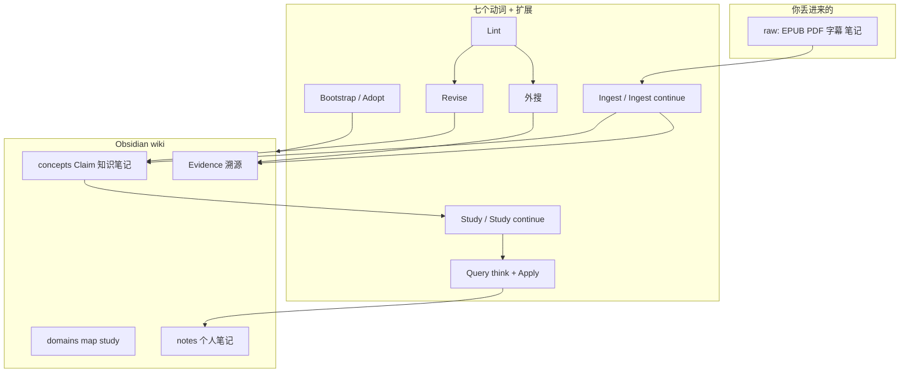
```mermaid
flowchart TD
  subgraph input [你丢进来的]
    R[raw: EPUB PDF 字幕 笔记]
  end

  subgraph verbs [七个动词 + 扩展]
    B[Bootstrap / Adopt]
    I[Ingest / Ingest continue]
    Q[Query think + Apply]
    W[外搜]
    S[Study / Study continue]
    V[Revise]
    L[Lint]
  end

  subgraph wiki [Obsidian wiki]
    C[concepts Claim 知识笔记]
    E[Evidence 溯源]
    D[domains map study]
    N[notes 个人笔记]
  end

  R --> I
  B --> wiki
  I --> C
  I --> E
  C --> S
  S --> Q
  W --> E
  L --> V
  L --> W
  Q --> N
  V --> C
```

**Corpus（编译层）** = `concepts/` · `sources/` · `domains/` · `wiki/synthesis/`  
**Personal（个人层）** = `wiki/notes/` — Connect / 「我的想法」写这里，Ingest **不会**自动写进去。

---

## 1. 功能图式说明

下面每张图对应一个功能：节点是「谁做什么」，箭头是「数据/动作往哪走」。细节规则在 [SKILL.md](SKILL.md) 与 `references/`。

---

### 1.1 Bootstrap — 从零建库

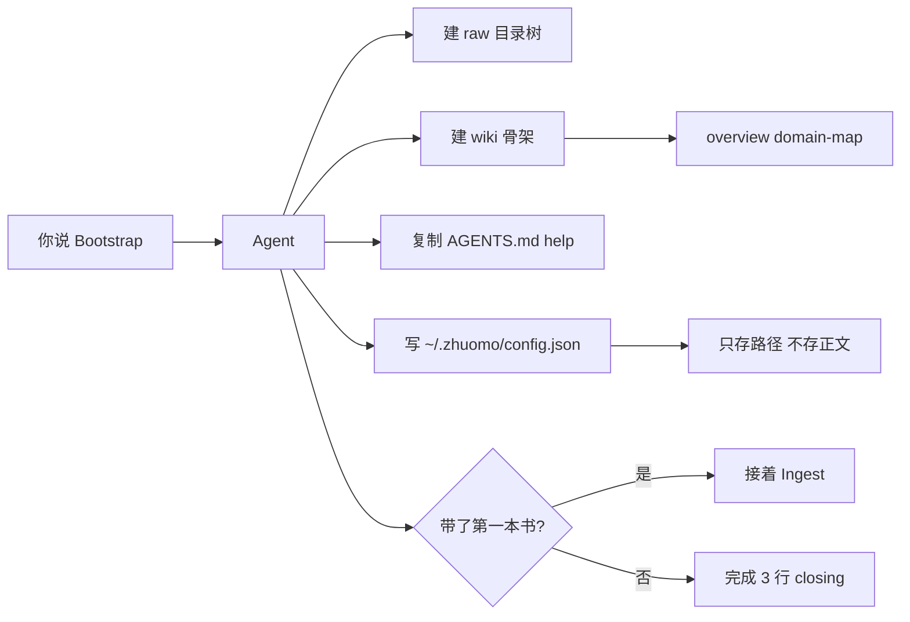
```mermaid
flowchart LR
  U[你说 Bootstrap] --> A[Agent]
  A --> F1[建 raw 目录树]
  A --> F2[建 wiki 骨架]
  A --> F3[复制 AGENTS.md help]
  A --> F4[写 ~/.zhuomo/config.json]
  F2 --> O[overview domain-map]
  F4 --> CFG[只存路径 不存正文]
  A --> I{带了第一本书?}
  I -->|是| IN[接着 Ingest]
  I -->|否| DONE[完成 3 行 closing]
```

```
  你                          Agent                    磁盘
  ───                         ─────                    ────
  Bootstrap: raw… vault…  →   建 inbox/ books/    →   ~/zhuomo-data/raw/
                              建 wiki/            →   vault/wiki/
                              zhuomo_config set   →   ~/.zhuomo/config.json
```

---

### 1.2 Adopt — 接入已有 Obsidian（不覆盖）

已有大量笔记时 **不要 Bootstrap 覆盖**，用 Adopt：

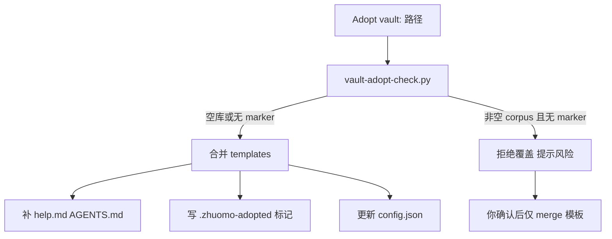
```mermaid
flowchart TD
  U[Adopt vault: 路径] --> CHK[vault-adopt-check.py]
  CHK -->|空库或无 marker| OK[合并 templates]
  CHK -->|非空 corpus 且无 marker| NO[拒绝覆盖 提示风险]
  OK --> H[补 help.md AGENTS.md]
  OK --> M[写 .zhuomo-adopted 标记]
  OK --> CFG[更新 config.json]
  NO --> U2[你确认后仅 merge 模板]
```

**原则：** 只加「琢磨约定文件」，**不批量改** 已有 `concepts/` Claim。

---

### 1.3 Ingest — 书 → 知识笔记

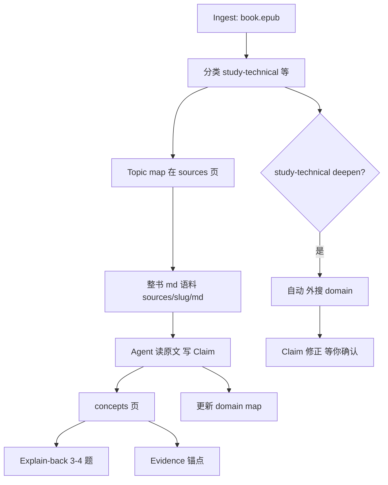
```mermaid
flowchart TD
  U[Ingest: book.epub] --> CL[分类 study-technical 等]
  CL --> TM[Topic map 在 sources 页]
  TM --> MD[整书 md 语料 sources/slug/md]
  MD --> DP[Agent 读原文 写 Claim]
  DP --> P[concepts 页]
  P --> EB[Explain-back 3-4 题]
  P --> EV[Evidence 锚点]
  DP --> MAP[更新 domain map]
  CL --> WS{study-technical deepen?}
  WS -->|是| WAI[自动 外搜 domain]
  WAI --> CONF[Claim 修正 等你确认]
```

**Claim 两层（技术书默认）：**

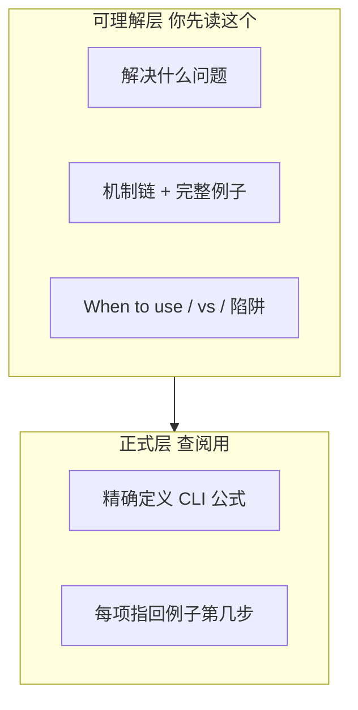
```mermaid
flowchart TD
  subgraph understandable [可理解层 你先读这个]
    A1[解决什么问题]
    A2[机制链 + 完整例子]
    A3[When to use / vs / 陷阱]
  end
  subgraph formal [正式层 查阅用]
    B1[精确定义 CLI 公式]
    B2[每项指回例子第几步]
  end
  understandable --> formal
```

**大书分批：**

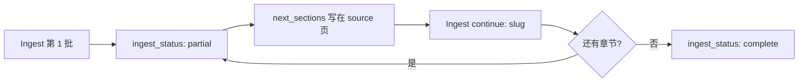
```mermaid
flowchart LR
  I1[Ingest 第 1 批] --> ST[ingest_status: partial]
  ST --> NS[next_sections 写在 source 页]
  NS --> I2[Ingest continue: slug]
  I2 --> ST2{还有章节?}
  ST2 -->|是| ST
  ST2 -->|否| DONE[ingest_status: complete]
```

---

### 1.4 Transcript — 字幕 / 转写（默认只存档）

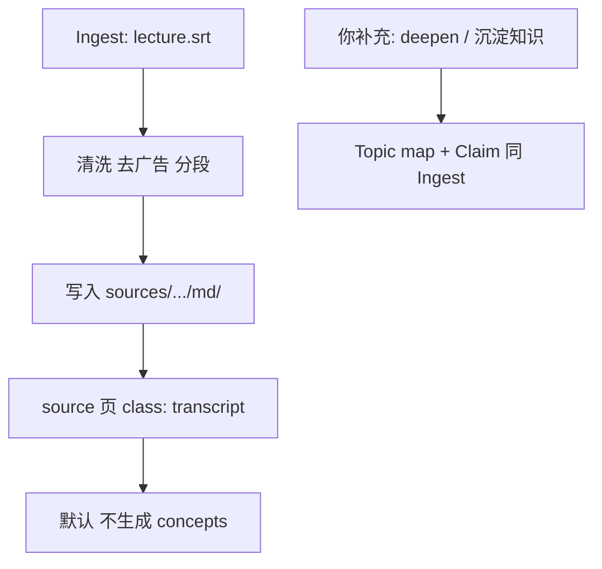
```mermaid
flowchart TD
  U[Ingest: lecture.srt] --> CL[清洗 去广告 分段]
  CL --> MD[写入 sources/.../md/]
  MD --> SRC[source 页 class: transcript]
  SRC --> DEF[默认 不生成 concepts]
  U2[你补充: deepen / 沉淀知识] --> TM[Topic map + Claim 同 Ingest]
```

可选脚本：`python3 ~/zhuomo/scripts/transcript-to-wiki-md.py input.srt out/md/`

---

### 1.5 Study — 学会一个概念

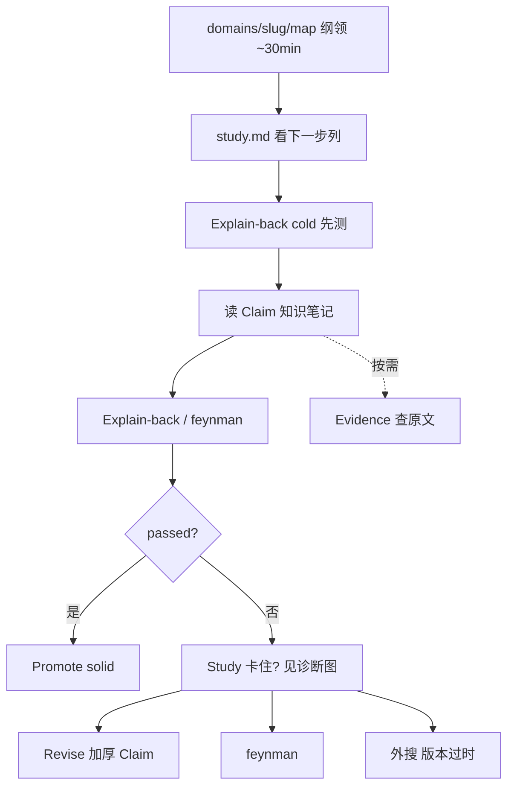
```mermaid
flowchart TD
  M[domains/slug/map 纲领 ~30min] --> ST[study.md 看下一步列]
  ST --> COLD[Explain-back cold 先测]
  COLD --> READ[读 Claim 知识笔记]
  READ --> EB[Explain-back / feynman]
  EB --> P{passed?}
  P -->|是| PR[Promote solid]
  P -->|否| DX[Study 卡住? 见诊断图]
  DX --> RV[Revise 加厚 Claim]
  DX --> FY[feynman]
  DX --> WS[外搜 版本过时]
  READ -.->|按需| EV[Evidence 查原文]
```

**Study continue（连续学一域）：**

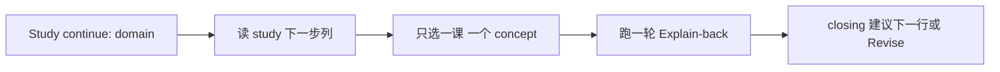
```mermaid
flowchart LR
  U[Study continue: domain] --> ST[读 study 下一步列]
  ST --> ONE[只选一课 一个 concept]
  ONE --> EB[跑一轮 Explain-back]
  EB --> NEXT[closing 建议下一行或 Revise]
```

**卡住诊断（不必死磕 feynman）：**

| 现象 | 图式上该走哪条边 |
|------|------------------|
| Claim 像目录、太短 | → **Revise**（Agent 重读 source） |
| 术语/公式不懂 | → 读 Claim **正式层** + Evidence |
| 会背不会选型 | → Revise 加 scenario + procedure |
| 和书/外搜矛盾 | → **外搜** 或 Revise |
| 15 分钟做不完 | → 缩到 study 表 **一行** |

---

### 1.6 Query think — 问 wiki + Apply 现场

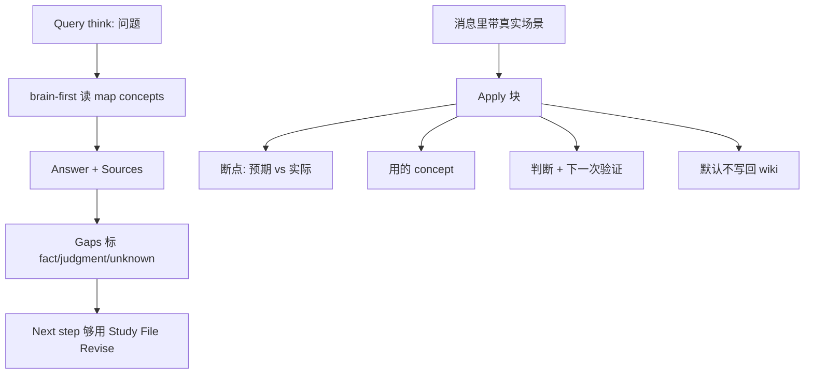
```mermaid
flowchart TD
  U[Query think: 问题] --> BF[brain-first 读 map concepts]
  BF --> AN[Answer + Sources]
  AN --> GP[Gaps 标 fact/judgment/unknown]
  GP --> NS[Next step 够用 Study File Revise]
  U2[消息里带真实场景] --> AP[Apply 块]
  AP --> AP1[断点: 预期 vs 实际]
  AP --> AP2[用的 concept]
  AP --> AP3[判断 + 下一次验证]
  AP --> AP4[默认不写回 wiki]
```

**Apply 示例说法：**

```
Query think: 生产里 BGP 经常 flap，wiki 里的 [[bgp-hold-timer]] 怎么用来排查？我的场景：双 ISP，只有一条路径在抖。
```

---

### 1.7 外搜 — 时效事实（Claim 需确认）

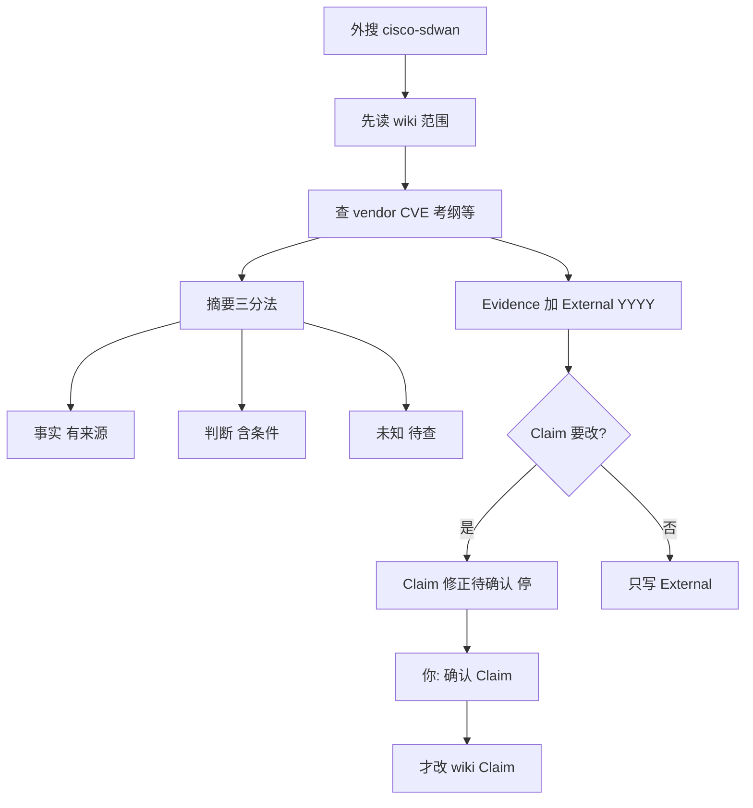
```mermaid
flowchart TD
  U[外搜 cisco-sdwan] --> RD[先读 wiki 范围]
  RD --> WEB[查 vendor CVE 考纲等]
  WEB --> SUM[摘要三分法]
  SUM --> F[事实 有来源]
  SUM --> J[判断 含条件]
  SUM --> U2[未知 待查]
  WEB --> EXT[Evidence 加 External YYYY]
  EXT --> GATE{Claim 要改?}
  GATE -->|是| WAIT[Claim 修正待确认 停]
  WAIT --> OK[你: 确认 Claim]
  OK --> EDIT[才改 wiki Claim]
  GATE -->|否| DONE[只写 External]
```

**自动外搜：** study-technical 深度 Ingest 后；Query/Study 引用 **>180 天** 未检查的 technical 概念（可说 `no 外搜` 跳过）。

---

### 1.8 Revise — 改错 / 加厚 Claim

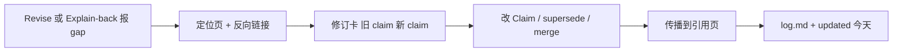
```mermaid
flowchart LR
  U[Revise 或 Explain-back 报 gap] --> LOC[定位页 + 反向链接]
  LOC --> CARD[修订卡 旧 claim 新 claim]
  CARD --> FIX[改 Claim / supersede / merge]
  FIX --> PROP[传播到引用页]
  PROP --> LOG[log.md + updated 今天]
```

**个人想法不进 corpus：**

```
Revise [[bgp]] — 我的想法：…   →   wiki/notes/on-concept/bgp.md
```

---

### 1.9 Lint — 库体检（脚本报候选，人/agent 判决）

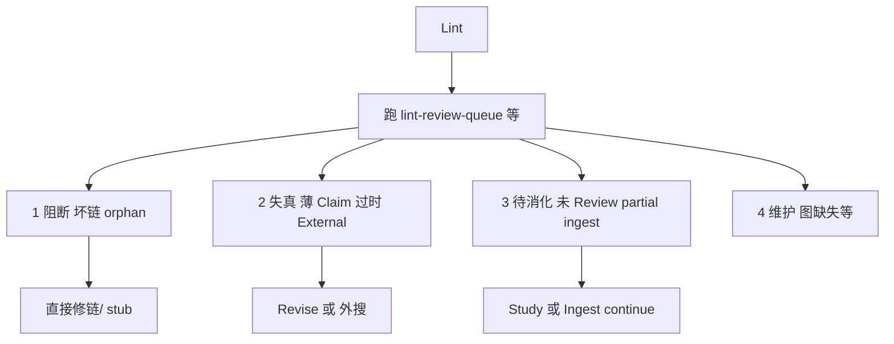
```mermaid
flowchart TD
  U[Lint] --> SCR[跑 lint-review-queue 等]
  SCR --> T1[1 阻断 坏链 orphan]
  SCR --> T2[2 失真 薄 Claim 过时 External]
  SCR --> T3[3 待消化 未 Review partial ingest]
  SCR --> T4[4 维护 图缺失等]
  T2 --> V[Revise 或 外搜]
  T3 --> S[Study 或 Ingest continue]
  T1 --> FIX[直接修链/ stub]
```

**记住：** 脚本列表 ≠ 自动删页；重复 concept 要 **打开两页** 再 merge。

---

### 1.10 Connect — 个人跨概念模型

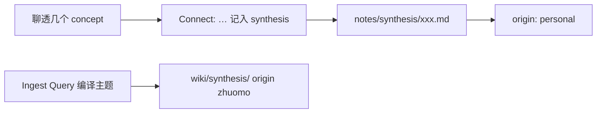
```mermaid
flowchart LR
  CHAT[聊透几个 concept] --> U[Connect: … 记入 synthesis]
  U --> N[notes/synthesis/xxx.md]
  N --> P[origin: personal]
  CORP[Ingest Query 编译主题] --> S[wiki/synthesis/ origin zhuomo]
```

| 写哪 | 谁写 | 内容 |
|------|------|------|
| `wiki/synthesis/` | Ingest / Query | 跨书 **编译** 主题 |
| `wiki/notes/synthesis/` | **Connect** | **你的** 对照/模型 |

---

### 1.11 Domain 四页 — 两种读法

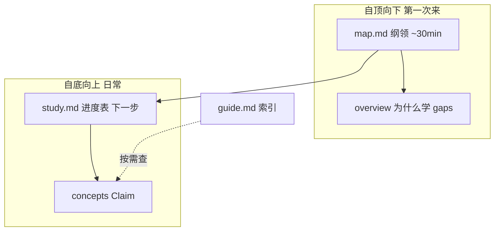
```mermaid
flowchart TD
  subgraph topdown [自顶向下 第一次来]
    MAP[map.md 纲领 ~30min]
    MAP --> OV[overview 为什么学 gaps]
  end
  subgraph bottomup [自底向上 日常]
    STUDY[study.md 进度表 下一步]
    STUDY --> CON[concepts Claim]
  end
  GUIDE[guide.md 索引] -.->|按需查| CON
  MAP --> STUDY
```

| 页 | 回答 |
|----|------|
| **map** | 整体怎么叠？Tier A 在哪层？ |
| **overview** | 为什么学？外搜？gaps？ |
| **guide** | 某概念在哪？ |
| **study** | 学到哪？下一步 Promote/cold？ |

---

## 2. What Zhuomo is

**琢磨** — polish raw material until it is clear, linked, and usable.

| You provide | Zhuomo helps produce |
|-------------|----------------------|
| EPUB, PDF, articles, **SRT/VTT**, notes | **Wiki** — concepts (Claim), Evidence, domains |
| Repeatable agent behavior (optional) | **Cursor skills** — separate chat; §11 |
| Your study time | **Explain-back** (cold / feynman) + **Study continue** |

**North star:** Ingest once → study from **Claim** → open book only when Claim thin or you want primary text.

**Agent 细节** 在 `~/zhuomo/references/`（Claim rubric、Apply、外搜、Lint 等）；**SKILL.md** 是路由入口。

---

## 3. Prerequisites

| Tool | Purpose |
|------|---------|
| **Cursor** | Run Zhuomo (`/zhuomo` or natural language) |
| **Obsidian** | Read wiki, graph, Dataview for study 进度 |
| **Git** (optional) | Version wiki or zhuomo repo |

```bash
ln -sf /path/to/zhuomo ~/.cursor/skills/zhuomo
```

Config（仅路径）：`python3 ~/zhuomo/scripts/zhuomo_config.py show`

---

## 4. First-time setup（Bootstrap / Adopt）

### 新建库 — Bootstrap

```
/zhuomo Bootstrap: raw ~/zhuomo-data/raw/, Obsidian vault ~/…/Dylan Chen
```

或一行带第一本书：

```
/zhuomo Bootstrap + ingest: ~/zhuomo-data/raw/books/my-first-book.epub
```

**Default:** reference depth — topic map, md corpus, concepts deepened + Explain-back + Evidence.

**Lite:** `overview only` / `Bootstrap lite`.

### 已有 Obsidian — Adopt

```
/zhuomo Adopt vault: ~/Library/Mobile Documents/iCloud~md~obsidian/Documents/Dylan Chen
```

Agent 跑 `vault-adopt-check.py`；**不会**覆盖已有 concepts。只补 `help.md`、`AGENTS.md`、`.zhuomo-adopted`。

### Folder layout

```
~/zhuomo-data/raw/
├── inbox/          # phone captures
├── web/ · video/ · books/ · assets/
└── processed/

vault/
├── AGENTS.md
├── .zhuomo-adopted   # Adopt 后可选标记
└── wiki/
    ├── overview.md · index.md · log.md · domain-map.md · help.md
    ├── domains/<slug>/map · overview · guide · study
    ├── concepts/*.md
    ├── sources/<slug>.md + md/    # 含 ingest_status / next_sections
    ├── synthesis/                 # 编译层
    └── notes/                     # 个人层
```

### First ingest

```
/zhuomo Ingest: ~/zhuomo-data/raw/books/my-first-book.epub
```

大书续作：

```
/zhuomo Ingest continue: my-book-slug
```

Map only：

```
/zhuomo Ingest overview only: raw/web/article.md
```

---

## 5. Learn by concept (Study)

**主教材 = `## Claim` 知识笔记**，不是整本书。见 §1.5 图。

| Step | You say |
|------|---------|
| **Cold** | `Explain-back [[concept]] cold` |
| **Read** | Open concept — Claim（可理解层 + 正式层） |
| **Explain-back** | `Explain-back [[concept]]` — 一轮一题 |
| **Feynman** | `Explain-back [[concept]] feynman` |
| **Promote** | `Promote [[concept]] to solid` — 仅 after **passed** |
| **Continue** | `Study continue: <domain>` |
| **Evidence** | 按需 — 核对原文 |

Full spec: [REVIEW.md](REVIEW.md) · 卡住: [references/study-diagnosis.md](references/study-diagnosis.md)

### Frontmatter

| Field | Meaning |
|-------|---------|
| `reviewed` | Explain-back 结束时自动写 |
| `explain_back` | `not_started` · `attempted` · `passed` |
| `mastery` | `learning` · `solid` |
| `updated` | 页被改 — 若 **>** `reviewed` → 建议 cold 重测 |
| `external_checked` | 外搜确认 External 的日期 |

### Review queue

```
Review queue: cisco-aci
```

或：`python3 ~/zhuomo/scripts/lint-review-queue.py <vault>/wiki`

---

## 6. Lint vs Revise vs 外搜

见 §1.7–1.9 图。

| | **Lint** | **外搜** | **Revise** |
|---|----------|----------|------------|
| **Purpose** | 分级体检 | 保鲜时效事实 | 改具体错/加厚 Claim |
| **Trigger** | `Lint` | 过时 domain/概念 | 你发现错；Study gap |
| **Claim** | 只建议 | **待确认** 才改 | 直接改 corpus |
| **Web** | No | Yes | 仅当你给新来源 |

```
Lint → MISSING_EXTERNAL → 外搜 cisco-sdwan → 确认 Claim → Explain-back cold
```

---

## 7. Daily habits

- `raw/inbox/` 丢 capture
- `domains/<slug>/study` 看 **下一步** — 一行 concept
- `Explain-back cold` 或 `Study continue: <domain>`
- 每周或 ingest 后：`Lint`

---

## 8. Operations reference

**Verbs:** Bootstrap · **Adopt** · Ingest · **Ingest continue** · Query · 外搜 · Revise · Study · **Study continue** · Lint · Connect

| Verb | Examples | Output |
|------|----------|--------|
| **Bootstrap** | `Bootstrap: raw …, vault …` | Skeleton + config |
| **Adopt** | `Adopt vault: …` | Non-destructive merge |
| **Ingest** | `Ingest: book.epub` | Concepts + source status |
| **Ingest continue** | `Ingest continue: slug` | Resume `next_sections` |
| **Query** | `Query think: …` | Answer + Gaps + optional Apply |
| **外搜** | `外搜 cisco-aci` | External + 确认 Claim |
| **Study** | cold / feynman / Promote / continue | Mastery |
| **Revise** | `Revise [[page]] — …` | Fixed corpus |
| **Lint** | `Lint` | Tiered report |
| **Connect** | `Connect: … — 记入 synthesis` | `notes/synthesis/` |

---

## 9. Prompt cookbook

### Bootstrap / Adopt / maintenance

```
/zhuomo Bootstrap: raw ~/zhuomo-data/raw/, Obsidian vault ~/path/to/vault
/zhuomo Adopt vault: ~/path/to/existing/vault
/zhuomo Process everything in ~/zhuomo-data/raw/inbox/
/zhuomo Lint
```

### Study

```
Explain-back [[aci-border-leaf-l3out]] cold
Explain-back [[aci-border-leaf-l3out]] feynman
Study continue: kubernetes-cilium
Promote [[aci-spine-leaf-topology]] to solid
Review queue: cisco-aci
```

### Ingest

```
/zhuomo Ingest raw/ddia.epub
/zhuomo Ingest continue: ddia
/zhuomo Ingest overview only: huge-book.epub
/zhuomo Ingest: ~/raw/video/lecture.srt
/zhuomo Ingest: lecture.srt — deepen 前 3 章主题
```

### Query + Apply

```
/zhuomo Query think: Multi-Pod vs Multi-Site?
/zhuomo Query think: 现场 vManage 和 OMP 对不上，wiki 里 [[sdwan-omp-routing]] 怎么用？双 ISP 只有一侧 flap。
```

### 外搜 / Connect / Revise

```
/zhuomo 外搜 cisco-sdwan
/zhuomo 外搜 [[sdwan-architecture-planes]]
/zhuomo Connect: Cilium overlay vs ACI — 记入 synthesis
/zhuomo Revise [[bgp]] — 我的想法：…
```

---

## 10. Domain frameworks and progress

四页模型见 §1.11。

**Grasped** = Tier A 全 `explain_back: passed`。进度在 `study.md` Dataview **下一步** 列 — 不要手改大表。

```
/zhuomo Promote [[aci-spine-leaf-topology]] to solid
```

Detail: [LEARNING.md](LEARNING.md) · [REVIEW.md](REVIEW.md#progress-in-obsidian-dataview)

---

## 11. Optional Cursor skills

**Not a zhuomo verb.** Wiki first; skill in separate chat:

```
根据 wiki/domains/cisco-aci/overview.md 建 network-expert skill，
WIKI-SCOPE 写读哪些页；事实留在 wiki。
```

[WIKI-BACKED-SKILLS.md](WIKI-BACKED-SKILLS.md)

---

## 12. Multi-device workflow

| Device | Do | Don't |
|--------|-----|--------|
| **Phone** | `raw/inbox/`; read wiki | Heavy ingest |
| **Laptop** | Ingest, Revise, Adopt, Lint | — |

```
/zhuomo Process raw/inbox/
```

---

## 13. Source types

| Source | Raw | Ingest 默认 |
|--------|-----|-------------|
| EPUB / PDF | `raw/books/` | md corpus + deepen concepts |
| Web / article | `raw/web/` | 按大小 reference 或 overview |
| **SRT / VTT** | `raw/video/` | **语料 only**；deepen 需明说 |
| Readwise | `raw/inbox/` | → concepts |
| 年鉴/手册 | `raw/books/` | `archive only` 常见 |

Classes: study-technical · study-analytic · craft-narrative · literary-appreciation · reference-lookup · **transcript** — 见 [references/ingest-depth-and-resume.md](references/ingest-depth-and-resume.md)

---

## 14. Troubleshooting

| Problem | Fix |
|---------|-----|
| Claim 像导读 | `Revise [[slug]]` — 可理解层+正式层 |
| Explain-back 反复不过 | [study-diagnosis](references/study-diagnosis.md) — 别只会 feynman |
| 外搜改了 Claim 但你没同意 | 应出现「待确认」— 回复 `确认 Claim` |
| Adopt 覆盖了笔记 | 应用 Adopt 而非 Bootstrap；检查 adopt-check |
| 大书一次做不完 | `Ingest continue: <slug>` + source 页 `next_sections` |
| 字幕变成 50 个 concept | 默认 transcript 只语料；deepen 需你指定 |
| Lint 叫删页 | **不要**自动删 — 读两页再 merge |
| `solid` too early | 仅 **Promote** after passed |

---

## 15. FAQ

**Bootstrap 和 Adopt 区别？**  
Bootstrap = 空库新建。Adopt = 已有 vault 只加琢磨模板与 config，不改 corpus。

**Ingest continue 怎么知道续哪？**  
看 `wiki/sources/<slug>.md` 的 `ingest_status` / `next_sections`；或 `Lint` / `lint-ingest-resume.py`。

**Query 和 Apply？**  
Query 答 wiki；消息里带 **真实场景** 时多一块 **Apply**（判断+验证），默认不写回 wiki。

**手绘图在哪？**  
本 guide §0–§1；Obsidian `help.md` 有精简学习链图。

**Agent 读哪份 spec？**  
[SKILL.md](SKILL.md) 路由 + `references/` 细节。

---

## Document index

| File | Use when |
|------|----------|
| [USER-GUIDE.md](USER-GUIDE.md) | **This guide** — 图式 + 全流程 |
| [REVIEW.md](REVIEW.md) | Study, Explain-back, Dataview |
| [LEARNING.md](LEARNING.md) | Connect, domain 四页 |
| [SKILL.md](SKILL.md) | Agent 路由 |
| [references/](references/) | Agent 专项方法 |
| [SIMPLE.md](SIMPLE.md) | 最小路径 |
| Obsidian `wiki/help.md` | 日常 cheatsheet |
