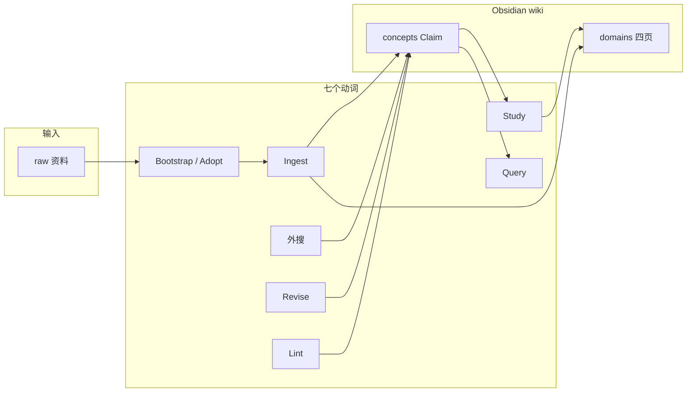
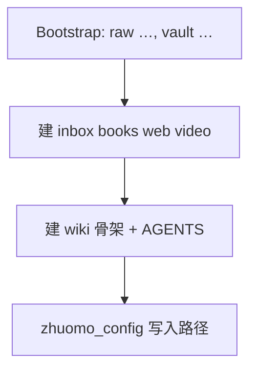
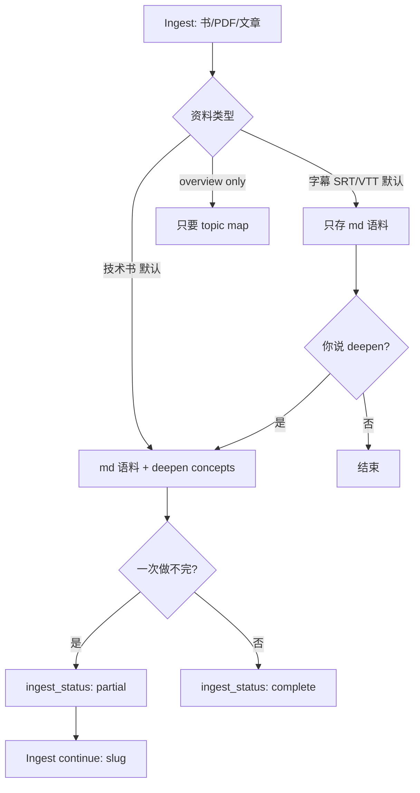
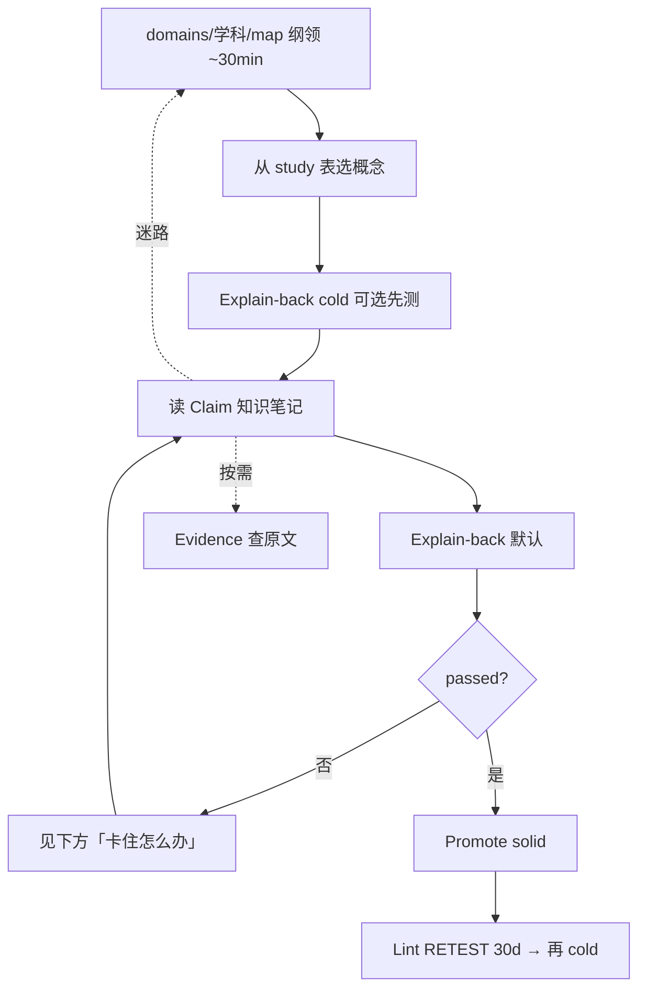
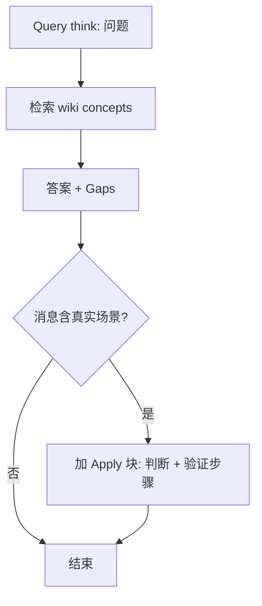
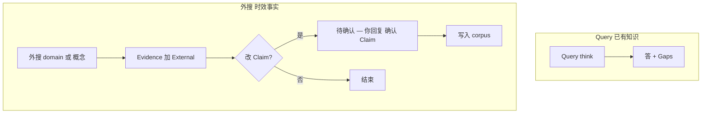
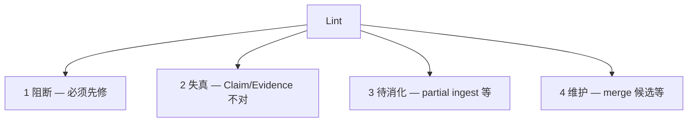
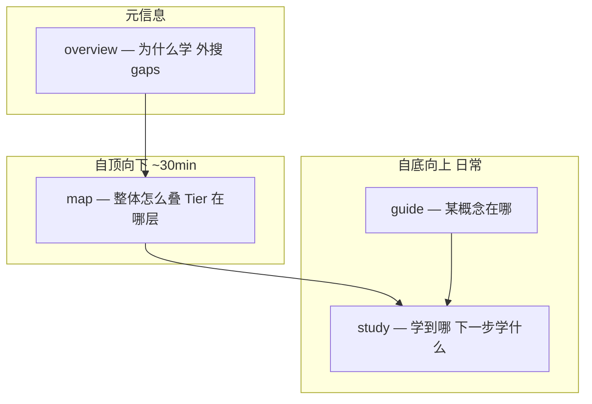

# Zhuomo 用户指南

琢磨帮你把**原始资料**编译成 **Obsidian 知识库**，再用 **Claim 知识笔记 + Explain-back** 真正学会；需要时用 **外搜** 核对时效事实。

- **你看这份文档** — 了解怎么用、说什么指令。
- **Agent 看** [SKILL.md](SKILL.md) — 细则在 `~/zhuomo/references/`。

**相关文档：** [REVIEW.md](REVIEW.md)（学习细则）· [LEARNING.md](LEARNING.md)（Domain 四页）· [SIMPLE.md](SIMPLE.md)（最小路径）· Obsidian `wiki/help.md`（日常速查）

---

## 阅读路径

| 你是谁 | 先看 | 再看 |
|--------|------|------|
| 第一次用 | [快速开始](#快速开始) → [意图表](#我想做什么--说什么) | [六大流程](#六大流程) |
| 日常学习 | Obsidian `wiki/help.md` | [Study 流程](#study--学会一个概念) |
| 维护知识库 | [Lint](#lint--库健康检查) · [外搜](#query--apply--外搜) | [常见问题](#常见问题) |

---

## 我想做什么 → 说什么

| 你想… | 对 Agent 说… | 结果 |
|--------|--------------|------|
| 从零建库 | `Bootstrap: raw …, vault …` | 目录骨架 + 配置 |
| 接入已有 Obsidian | `Adopt vault: …` | 只补 help/AGENTS，**不改**已有 concepts |
| 导入一本书 | `Ingest: …/book.epub` | concepts + 学科 map |
| 大书分批导入 | `Ingest continue: <source-slug>` | 从 `next_sections` 续做 |
| 导入字幕/转写 | `Ingest: …/lecture.srt` | 默认只存 md 语料；要概念需加 `deepen` |
| 搞懂一个概念 | `Explain-back [[slug]] cold` | 测 → 读 Claim → 再测 |
| 用知识分析现场 | `Query think: 场景 …` | 答案 + 可选 **Apply** 块 |
| 查版本/CVE 等时效 | `外搜 <domain>` 或 `外搜 [[概念]]` | 写 External；改 Claim **须你确认** |
| 检查库健康 | `Lint` | 四级报告（阻断 → 维护） |
| 连续学一域 | `Study continue: <domain>` | 从 study 表挑下一课 |
| 记个人对照/模型 | `Connect: … — 记入 synthesis` | 写入 `wiki/notes/synthesis/` |

**扩展动词（续作）：** Adopt · Ingest continue · Study continue — 见上表。

---

## 快速开始

**1. 装 Agent skill**

```bash
ln -sf /path/to/zhuomo ~/.cursor/skills/zhuomo
```

**2. 建库或接入**

```text
/zhuomo Bootstrap: raw ~/zhuomo-data/raw/, Obsidian vault ~/path/to/vault
# 已有 Obsidian 库：
/zhuomo Adopt vault: ~/path/to/existing/vault
```

**3. 导入 + 学第一个概念**

```text
/zhuomo Ingest: ~/zhuomo-data/raw/books/my-book.epub
Explain-back [[first-concept]] cold
```

配置路径：`python3 ~/zhuomo/scripts/zhuomo_config.py show`

---

## 琢磨是什么

| 你提供 | 琢磨产出 |
|--------|----------|
| EPUB、PDF、文章、SRT/VTT、笔记 | **Wiki** — concepts（Claim）、Evidence、domains |
| 学习时间 | **Explain-back**（cold / 默认）+ **Study continue** |
| （可选）可重复 Agent 行为 | **Cursor skills** — 独立对话，见 [可选 Cursor skills](#可选-cursor-skills) |

**北极星：** Ingest 一次 → 平时只读 **Claim** 学 → 只有 Claim 太薄或要对原文时才开书。

**两层存储（别混）：**

| 层 | 路径 | 谁写 |
|----|------|------|
| **Corpus（编译层）** | `concepts/` · `sources/` · `domains/` · `wiki/synthesis/` | Ingest / Query / Revise |
| **Personal（个人层）** | `wiki/notes/` | Connect、「我的想法」 |

---

## 功能总览


```mermaid
flowchart LR
  subgraph input [输入]
    R[raw 资料]
  end
  subgraph verbs [七个动词]
    B[Bootstrap / Adopt]
    I[Ingest]
    S[Study]
    Q[Query]
    W[外搜]
    V[Revise]
    L[Lint]
  end
  subgraph wiki [Obsidian wiki]
    C[concepts Claim]
    D[domains 四页]
  end
  R --> B --> I --> C
  C --> S
  C --> Q
  W --> C
  V --> C
  L --> C
  I --> D
  S --> D
```

**Connect**（个人笔记）从 Study / Query 对话中写入 `notes/`，不经过上图中 corpus 自动编译。

---

## 六大流程

### Bootstrap / Adopt — 建库

**Bootstrap** — 空库或新 vault：建 `raw/` 目录树、`wiki/` 骨架、`~/.zhuomo/config.json`。


```mermaid
flowchart TD
  A["Bootstrap: raw …, vault …"] --> B[建 inbox books web video]
  B --> C[建 wiki 骨架 + AGENTS]
  C --> D[zhuomo_config 写入路径]
```

**Adopt** — 已有 Obsidian：跑 `vault-adopt-check.py`，**只**补 `help.md`、`AGENTS.md`、`.zhuomo-adopted`，**不批量改**已有 concepts。

```text
/zhuomo Adopt vault: ~/Library/Mobile Documents/iCloud~md~obsidian/Documents/MyVault
```

**目录结构（Bootstrap 后）：**

```text
~/zhuomo-data/raw/
├── inbox/          # 手机随手丢
├── web/ · video/ · books/ · assets/
└── processed/

vault/
├── AGENTS.md · .zhuomo-adopted
└── wiki/
    ├── overview.md · index.md · log.md · domain-map.md · help.md
    ├── domains/<slug>/   # map · overview · guide · study
    ├── concepts/*.md
    ├── sources/<slug>.md + md/
    ├── synthesis/        # 编译层对照
    └── notes/            # 个人层
```

---

### Ingest — 资料 → 知识笔记


```mermaid
flowchart TD
  A[Ingest: 书/PDF/文章] --> B{资料类型}
  B -->|技术书 默认| C[md 语料 + deepen concepts]
  B -->|字幕 SRT/VTT 默认| D[只存 md 语料]
  B -->|overview only| E[只要 topic map]
  C --> F{一次做不完?}
  F -->|是| G["ingest_status: partial"]
  G --> H["Ingest continue: slug"]
  F -->|否| I[ingest_status: complete]
  D --> J{你说 deepen?}
  J -->|是| C
  J -->|否| K[结束]
```

**Claim 两层（技术书）：**

1. **可理解层** — 问题、例子、机制（Explain-back 主读）
2. **正式层** — 定义、CLI、公式（指回例子）

**大书续作：** 看 `wiki/sources/<slug>.md` 的 `ingest_status` 和 `next_sections`，再说 `Ingest continue: <slug>`。

**字幕：** 默认不生成 concepts；要说 `deepen` 或 `沉淀知识` 才走 deepen。可选脚本：

```bash
python3 ~/zhuomo/scripts/transcript-to-wiki-md.py input.srt out/md/
```

---

### Study — 学会一个概念

**主教材是 `## Claim`，不是整本书。**


```mermaid
flowchart TD
  M["domains/学科/map 纲领 ~30min"] --> A[从 study 表选概念]
  A --> B["Explain-back cold 可选先测"]
  B --> C[读 Claim 知识笔记]
  C --> D[Explain-back 默认]
  D --> E{passed?}
  E -->|否| F[见下方「卡住怎么办」]
  F --> C
  E -->|是| G[Promote solid]
  G --> H["Lint RETEST 30d → 再 cold"]
  C -.->|按需| I[Evidence 查原文]
  C -.->|迷路| M
```

**Study continue：** `Study continue: <domain>` — Agent 只从 `study.md` **下一步** 列挑一课。

**frontmatter 含义：**

| 字段 | 含义 |
|------|------|
| `reviewed` | Explain-back 结束时自动写 |
| `explain_back` | `not_started` · `attempted` · `passed` |
| `mastery` | `learning` · `solid` |
| `updated` | 页被改；若 **>** `reviewed` → 建议 cold 重测 |
| `external_checked` | 外搜确认 External 的日期 |

**15 分钟一块：** cold（可选）→ 读 Claim → Explain-back → Promote。

**卡住怎么办：**

| 现象 | 下一步 |
|------|--------|
| Claim 像目录、太短 | **Revise** 加厚 |
| 术语/公式不懂 | 读 Claim **正式层** + Evidence |
| 会背不会选型 | Revise 加 scenario |
| 和书/外搜矛盾 | **外搜** 或 Revise |
| 15 分钟做不完 | study 表只推进 **一行** |
| 会背术语、讲不清机制 | 先 **Revise** 加厚 Claim；仍卡住见 [study-diagnosis](references/study-diagnosis.md) |

**高级可选：** `Explain-back [[x]] feynman` — 自由复述 + 追问（不用「12 岁小孩」人设也可）；历史使用极少，非默认路径。

详规：[REVIEW.md](REVIEW.md) · [references/study-diagnosis.md](references/study-diagnosis.md)

---

### Query — 问已有知识


```mermaid
flowchart TD
  Q["Query think: 问题"] --> R[检索 wiki concepts]
  R --> S[答案 + Gaps]
  S --> T{消息含真实场景?}
  T -->|是| U[加 Apply 块: 判断 + 验证步骤]
  T -->|否| V[结束]
  U --> V
```

**Apply 示例：**

```text
Query think: 生产里 BGP 经常 flap，wiki 里的 [[bgp-hold-timer]] 怎么排查？
场景：双 ISP，一侧在抖。
```

Apply 默认**不写回** wiki；要沉淀用 Connect 或 Revise。

---

### Query + Apply + 外搜 — 保鲜与确认


```mermaid
flowchart TD
  subgraph query [Query 已有知识]
    Q1[Query think] --> Q2[答 + Gaps]
  end
  subgraph waishou [外搜 时效事实]
    W1[外搜 domain 或 概念] --> W2[Evidence 加 External]
    W2 --> W3{改 Claim?}
    W3 -->|是| W4[待确认 — 你回复 确认 Claim]
    W3 -->|否| W5[结束]
    W4 --> W6[写入 corpus]
  end
```

| | **Lint** | **外搜** | **Revise** |
|---|----------|----------|------------|
| **干什么** | 分级体检 | 核对版本/CVE 等 | 改错或加厚 Claim |
| **怎么说** | `Lint` | `外搜 cisco-aci` | `Revise [[页]] — …` |
| **改 Claim** | 只建议 | **须你确认** | 直接改 corpus |
| **上网** | 否 | 是 | 仅当你给新来源 |

**典型链：**

```text
Lint → MISSING_EXTERNAL → 外搜 cisco-sdwan → 确认 Claim → Explain-back cold
```

---

### Revise / Connect — 改 corpus vs 记个人想法

**Revise** — 定位问题 → 修订卡 → 改 Claim / merge → 写 `log.md`。

- 个人单概念想法：`Revise [[x]] — 我的想法：…` → `notes/on-concept/`

**Connect** — 跨概念的个人对照/模型：

```text
Connect: Cilium overlay 和 ACI L3Out 的相似点 — 记入 synthesis
```

→ `wiki/notes/synthesis/`（`origin: personal`），**不是** Ingest 写的 `wiki/synthesis/`。

---

### Lint — 库健康检查


```mermaid
flowchart TD
  L[Lint] --> T1[1 阻断 — 必须先修]
  L --> T2[2 失真 — Claim/Evidence 不对]
  L --> T3[3 待消化 — partial ingest 等]
  L --> T4[4 维护 — merge 候选等]
```

脚本只报**候选**；合并或删页前**必须读正文**，不要自动删。

**Review queue：**

```text
Review queue: cisco-aci
# 或
python3 ~/zhuomo/scripts/lint-review-queue.py <vault>/wiki
```

---

### Domain 四页 — 两种读法

每个学科 `domains/<slug>/` 下四页，用途不同：


```mermaid
flowchart TD
  subgraph topdown [自顶向下 ~30min]
    MAP[map — 整体怎么叠 Tier 在哪层]
  end
  subgraph bottomup [自底向上 日常]
    STUDY[study — 学到哪 下一步学什么]
    GUIDE[guide — 某概念在哪]
  end
  subgraph meta [元信息]
    OVER[overview — 为什么学 外搜 gaps]
  end
  MAP --> STUDY
  GUIDE --> STUDY
  OVER --> MAP
```

| 页 | 回答的问题 |
|----|------------|
| **map** | 整体架构？Tier A 在哪一层？ |
| **overview** | 为什么学这块？缺什么 External？ |
| **guide** | 某个概念对应哪条 Claim？ |
| **study** | 进度表：下一步 Promote / cold / Explain-back？ |

**Grasped** = Tier A 全部 `explain_back: passed`。进度看 `study.md` Dataview **下一步** 列，不要手改大表。

详规：[LEARNING.md](LEARNING.md) · [REVIEW.md](REVIEW.md#progress-in-obsidian-dataview)

---

## 日常习惯

1. 手机：`raw/inbox/` 丢 capture；笔记本再 `Process inbox` / Ingest。
2. 打开 `domains/<slug>/study` 看 **下一步** — 一行 concept。
3. `Explain-back cold` 或 `Study continue: <domain>`。
4. 每周或 ingest 后：`Lint`。

---

## 指令速查

### 建库 / 维护

```text
/zhuomo Bootstrap: raw ~/zhuomo-data/raw/, Obsidian vault ~/path/to/vault
/zhuomo Adopt vault: ~/path/to/existing/vault
/zhuomo Process everything in ~/zhuomo-data/raw/inbox/
/zhuomo Lint
```

### 学习

```text
Explain-back [[aci-border-leaf-l3out]] cold
Study continue: kubernetes-cilium
Promote [[aci-spine-leaf-topology]] to solid
Review queue: cisco-aci
```

### 导入

```text
/zhuomo Ingest raw/ddia.epub
/zhuomo Ingest continue: ddia
/zhuomo Ingest overview only: huge-book.epub
/zhuomo Ingest: ~/raw/video/lecture.srt
/zhuomo Ingest: lecture.srt — deepen 前 3 章主题
```

### 查询 / 外搜 / 个人笔记

```text
/zhuomo Query think: Multi-Pod vs Multi-Site?
/zhuomo Query think: 现场 vManage 和 OMP 对不上，wiki 里 [[sdwan-omp-routing]] 怎么用？
/zhuomo 外搜 cisco-sdwan
/zhuomo 外搜 [[sdwan-architecture-planes]]
/zhuomo Connect: Cilium overlay vs ACI — 记入 synthesis
/zhuomo Revise [[bgp]] — 我的想法：…
```

---

## 动词一览

| 动词 | 示例 | 产出 |
|------|------|------|
| **Bootstrap** | `Bootstrap: raw …, vault …` | 骨架 + config |
| **Adopt** | `Adopt vault: …` | 非破坏性接入 |
| **Ingest** | `Ingest: book.epub` | concepts + source 状态 |
| **Ingest continue** | `Ingest continue: slug` | 续 `next_sections` |
| **Query** | `Query think: …` | 答案 + Gaps + 可选 Apply |
| **外搜** | `外搜 cisco-aci` | External + 待确认 Claim |
| **Study** | cold / Explain-back / Promote / continue | 掌握度 |
| **Revise** | `Revise [[页]] — …` | 修正 corpus |
| **Lint** | `Lint` | 四级报告 |
| **Connect** | `Connect: … — 记入 synthesis` | `notes/synthesis/` |

---

## 源文件类型

| 来源 | 放哪 | Ingest 默认 |
|------|------|-------------|
| EPUB / PDF | `raw/books/` | md 语料 + deepen concepts |
| 网页 / 文章 | `raw/web/` | 按大小 reference 或 overview |
| SRT / VTT | `raw/video/` | **仅语料**；deepen 需明说 |
| Readwise | `raw/inbox/` | → concepts |
| 年鉴/手册 | `raw/books/` | 常 `archive only` |

资料分类：study-technical · study-analytic · craft-narrative · transcript 等 — 见 [references/ingest-depth-and-resume.md](references/ingest-depth-and-resume.md)

---

## 多设备

| 设备 | 适合 | 不适合 |
|------|------|--------|
| 手机 | `raw/inbox/`；读 wiki | 大批量 Ingest |
| 笔记本 | Ingest、Revise、Adopt、Lint | — |

---

## 可选 Cursor skills

**不是琢磨动词。** Wiki 优先；skill 在**单独对话**建：

```text
根据 wiki/domains/cisco-aci/overview.md 建 network-expert skill，
WIKI-SCOPE 写读哪些页；事实留在 wiki。
```

见 [WIKI-BACKED-SKILLS.md](WIKI-BACKED-SKILLS.md)

---

## 前置条件

| 工具 | 用途 |
|------|------|
| **Cursor** | 跑琢磨（`/zhuomo` 或自然语言） |
| **Obsidian** | 读 wiki、图谱、Dataview 进度 |
| **Git**（可选） | 版本管理 wiki 或 zhuomo 仓库 |

---

## 常见问题

**Bootstrap 和 Adopt 区别？**  
Bootstrap = 空库新建全套。Adopt = 已有 vault 只加模板与 config，**不改** corpus。

**Ingest continue 怎么知道续哪？**  
看 `wiki/sources/<slug>.md` 的 `ingest_status` / `next_sections`；或跑 `Lint` / `lint-ingest-resume.py`。

**Query 和 Apply？**  
Query 答 wiki 里已有知识；消息里带**真实场景**时多一块 **Apply**（判断 + 验证步骤），默认不写回 wiki。

**Claim 像导读怎么办？**  
`Revise [[slug]]` — 补可理解层 + 正式层。

**Explain-back 反复不过？**  
看 [study-diagnosis](references/study-diagnosis.md) — 先 Revise 加厚 Claim，再重测。

**外搜改了 Claim 但我没同意？**  
应出现「待确认」— 回复 `确认 Claim` 后才写入。

**字幕变成几十个 concept？**  
默认 transcript 只存语料；deepen 需你明确说。

**Lint 建议删页？**  
**不要**自动删 — 读两页正文再决定是否 merge。

**solid 给太早？**  
只有 Explain-back **passed** 后才能 `Promote [[x]] to solid`。

**Agent 读哪份 spec？**  
[SKILL.md](SKILL.md) 路由 + `references/` 专项方法。

---

## 文档索引

| 文件 | 什么时候看 |
|------|------------|
| **USER-GUIDE.md**（本文） | 全流程 + 流程图 |
| **wiki/help.md** | 日常速查 |
| [REVIEW.md](REVIEW.md) | Study、Explain-back、Dataview |
| [LEARNING.md](LEARNING.md) | Connect、Domain 四页 |
| [SIMPLE.md](SIMPLE.md) | 最小路径 |
| [SKILL.md](SKILL.md) | Agent 路由 |
| [references/](references/) | Agent 专项方法 |
