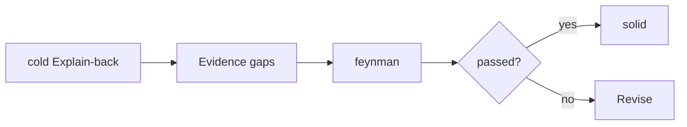

# Zhuomo User Guide

How to set up **琢磨 (Zhuomo)**, learn from sources **one concept at a time**, and keep a personal wiki + optional agent skills.

**You read this guide.** The agent reads [SKILL.md](SKILL.md).

**Quick links:** [REVIEW.md](REVIEW.md) · [LEARNING.md](LEARNING.md) · Obsidian `wiki/help.md`

---

## Table of contents

1. [What Zhuomo is](#1-what-zhuomo-is)
2. [Prerequisites](#2-prerequisites)
3. [First-time setup](#3-first-time-setup)
4. [Learn by concept (Review & Explain-back)](#4-learn-by-concept-review--explain-back)
5. [Lint vs Revise](#5-lint-vs-revise)
6. [Daily and weekly habits](#6-daily-and-weekly-habits)
7. [Operations reference](#7-operations-reference)
8. [Prompt cookbook](#8-prompt-cookbook)
9. [Learning from sources](#9-learning-from-sources)
10. [Domain frameworks and progress](#10-domain-frameworks-and-progress)
11. [Optional Cursor skills](#11-optional-cursor-skills)
12. [Multi-device workflow](#12-multi-device-workflow)
13. [Source types](#13-source-types)
14. [Troubleshooting](#14-troubleshooting)
15. [FAQ](#15-faq)

---

## 1. What Zhuomo is

**琢磨** — polish raw material until it is clear, linked, and usable.

| You provide | Zhuomo helps produce |
|-------------|----------------------|
| EPUB, PDF, articles, video notes, highlights | **Wiki** (Obsidian) — concepts, Evidence, frameworks |
| Repeatable agent behavior (optional) | **Cursor skills** — separate chat step; see §11 |
| Your study time | **Explain-back** prompts (cold / feynman) |

**You do not need to name topics upfront.** Drop a source; the agent proposes a topic map and ingests into `wiki/concepts/`.

**Learning model (2026):** study **per concept** — read the page, **Review** (mark read), **Explain-back** (teach it aloud in chat). No flashcard decks, no Roguelike runs.

---

## 2. Prerequisites

| Tool | Purpose |
|------|---------|
| **Cursor** | Run Zhuomo (`/zhuomo` or natural language) |
| **Obsidian** | Read wiki, graph, optional Dataview for review queue |
| **Git** (optional) | Version wiki or skill repos |

Install the skill:

```bash
ln -sf /path/to/zhuomo ~/.cursor/skills/zhuomo
```

You do **not** need the Obsidian Spaced Repetition plugin.

---

## 3. First-time setup

### Step 1: Bootstrap

In Cursor:

```
/zhuomo Bootstrap: raw ~/zhuomo-data/raw/, Obsidian vault ~/Library/Mobile Documents/iCloud~md~obsidian/Documents/Dylan Chen
```

Or bootstrap and ingest the first book in one line:

```
/zhuomo Bootstrap + ingest: ~/zhuomo-data/raw/books/my-first-book.epub
```

**Default:** reference depth — topic map, EPUB md corpus, **all concepts deepened** with `## Explain-back` + `## Evidence`.

**Lite:** add `overview only` or `Bootstrap lite` for stubs first.

### Step 2: Folder layout

```
~/zhuomo-data/raw/
├── inbox/          # phone captures
├── web/ · video/ · books/ · assets/
└── processed/

vault/
├── AGENTS.md
└── wiki/
    ├── overview.md · index.md · log.md · domain-map.md · help.md
    ├── domains/<slug>/overview.md (+ optional guide.md)
    ├── concepts/*.md
    ├── sources/
    ├── synthesis/
    └── notes/
```

### Step 3: Open Obsidian

Open the vault; start from `wiki/overview.md` or `wiki/help.md`.

### Step 4: First ingest

```
/zhuomo Ingest: ~/zhuomo-data/raw/books/my-first-book.epub
```

Map only:

```
/zhuomo Ingest overview only: raw/web/article.md
```

Browse `wiki/concepts/` — each deepened page should have **Explain-back** then **Evidence**.

---

## 4. Learn by concept (Review & Explain-back)

### The loop


```mermaid
flowchart LR
  C[cold Explain-back] --> E[Evidence gaps]
  E --> F[feynman]
  F --> P{passed?}
  P -->|yes| S[solid]
  P -->|no| R[Revise]
```

| Step | You say | What happens |
|------|---------|----------------|
| **Cold** | `Explain-back [[concept]] cold` | Test before Claim — [REVIEW.md](REVIEW.md#cold-explain-back-first-learn) |
| **Explain-back** | `Explain-back [[concept]]` | Revision path; one prompt per turn |
| **Feynman** | `Explain-back [[concept]] feynman` | Teach-back with child-style probes |
| **Promote** | `Promote [[concept]] to solid` | After **passed** |

`reviewed` is set automatically by Explain-back sessions.

Full spec: [REVIEW.md](REVIEW.md).

### Concept page shape

```markdown
## Claim
…

## Mechanics / …
…

## Explain-back
1. *"Walk me through …"*
2. *"What's the trap …"*

## Evidence
- [[sources/…]]
```

### Frontmatter (progress)

| Field | Meaning |
|-------|---------|
| `reviewed` | You read and accept this version |
| `explain_back` | `not_started` · `attempted` · `passed` |
| `mastery` | `learning` · `solid` |
| `updated` | Agent last edited — if **after** `reviewed`, read again |

**After Revise:** run `Explain-back [[concept]] cold` if the page changed materially (`updated > reviewed`).

### Explain-back rubric (summary)

**Default mode:** interactive — one explain-back prompt per turn; agent grades each answer before the next. Full spec: [REVIEW.md § Interactive explain-back](REVIEW.md#interactive-explain-back-default).

**Passed:** correct Claim, mechanism OK, at least one constraint/trap, aligns with Evidence, handles one follow-up.

**Partial / fail:** re-read Evidence, try **feynman**, or **Revise**.

### Review queue

```
Review queue: cisco-aci
```

Or run `python3 scripts/lint-review-queue.py <vault>/wiki` from the zhuomo repo.

Shows concepts where:

- `updated > reviewed` (agent changed page)
- never `reviewed`
- reviewed but `explain_back` not `passed`

---

## 5. Lint vs Revise

| | **Lint** | **Revise** |
|---|----------|------------|
| **Purpose** | Health scan — find problems | Fix a specific page |
| **Trigger** | `Lint`, after big ingest | You spot error; Explain-back fail; Lint item |
| **Changes wiki?** | Usually lists issues only | **Yes** — edits content |
| **Log** | `lint | …` | `revise | [[concept]]` |
| **Side effect** | — | Sets `updated` → run `Explain-back [[concept]] cold` again |

**Typical flow:**

```
Lint  →  "aci-border-leaf missing inline Figure"
Revise →  Revise [[aci-border-leaf-l3out]] — add Figure 91 inline
Explain-back cold →  test mastery after fix
```

---

## 6. Daily habits

- Drop captures in `raw/inbox/`
- One **Explain-back cold** on next Tier A from `domains/<slug>/study`
- **`Lint`** when something feels stale

```
/zhuomo Lint
/zhuomo Review queue: kubernetes-cilium
```

---

## 7. Operations reference

**Six verbs:** Bootstrap · Ingest · Query · Revise · Study · Lint. **Connect** for personal cross-concept notes.

| Verb | Examples | Output |
|------|----------|--------|
| **Ingest** | `Ingest: book.epub` | Concepts + Explain-back + Evidence |
| **Query** | `Query: …` | Synthesis + Gaps |
| **Study** | `Explain-back cold` / `feynman` / `Promote` | Frontmatter mastery |
| **Revise** | `Revise [[page]] — …` | Fixed pages + `updated` |
| **Lint** | `Lint` | Issues + review queue |
| **Connect** | `Connect: … — 记入 synthesis` | `wiki/notes/synthesis/` |

**Archive only** (no learn artifacts):

```
/zhuomo Ingest raw/paper.pdf — archive only
```

**Overview only:**

```
/zhuomo Ingest overview only: book.epub
```

---

## 8. Prompt cookbook

### Bootstrap and maintenance

```
/zhuomo Bootstrap: raw ~/zhuomo-data/raw/, Obsidian vault ~/path/to/vault

/zhuomo Process everything in ~/zhuomo-data/raw/inbox/

/zhuomo Lint
```

### Per-concept study

```
Explain-back [[aci-border-leaf-l3out]] cold
Explain-back [[aci-border-leaf-l3out]] feynman
Review queue: cisco-aci
Promote [[aci-spine-leaf-topology]] to solid
```

### Ingest

```
/zhuomo Ingest raw/ddia.epub — discover topics, deepen all.

/zhuomo Ingest this blog — focus caching; list other topics at end.

/zhuomo Ingest overview only: huge-book.epub
```

### Connect

```
/zhuomo Connect: how does [[aci-multi-pod]] relate to [[aci-multi-site]]? — 记入 synthesis
```

### Revise

```
/zhuomo Revise [[bgp]] — claim was wrong; evidence: [link]

/zhuomo Merge [[foo]] and [[foo-bar]]
```

### Applied (optional)

```
/zhuomo Applied: production incident — [[aci-border-leaf-l3out]] — static route asymmetry
```

---

## 9. Learning from sources

Default ingest: **concepts only** — no `learn/digests/`.

| On demand | Output |
|-----------|--------|
| **Connect** | `Connect: … — 记入 synthesis` → `wiki/notes/synthesis/` |

Explain-back prompts live on each concept page. Detail: [LEARNING.md](LEARNING.md).

---

## 10. Domain frameworks and progress

Each domain: **`wiki/domains/<slug>/overview.md`** — pillars, glossary, **Dataview progress**. **`guide.md`** = concept index only (concept-first).

### Progress (Dataview)

Install Obsidian **Dataview**. Open domain overview → **学习进度** table reads concept frontmatter automatically.

| Field | Meaning |
|-------|---------|
| `mastery: learning` | Has Evidence |
| `mastery: solid` | Explain-back passed |
| `reviewed` | You read this version |
| `explain_back` | Teach-back status |
| `updated` | Last page change |

How to use queries: [REVIEW.md](REVIEW.md#progress-in-obsidian-dataview).

```
/zhuomo Promote [[aci-spine-leaf-topology]] to solid
```

Template: [LEARNING.md](LEARNING.md).

---

## 11. Optional Cursor skills

**Not a zhuomo verb.** Zhuomo compiles wiki; skills are optional files under `~/.cursor/skills/`.

1. **Ingest** concepts to wiki first (`Claim` + `Evidence` + `Explain-back`).
2. In a **new Cursor chat**, cite wiki pages and ask for a skill:

```
根据 wiki 里的 [[cilium-datapath-modes]] 和 [[cilium-ebpf-dataplane]] 写一个 skill，
触发词用「选 Cilium 路由模式」；事实留在 wiki，skill 只写触发条件和阅读顺序。
```

**Domain expert** (persona + `WIKI-SCOPE.md` manifest, facts in wiki):

```
根据 wiki/domains/cisco-aci/overview.md 和其中链到的概念，
在 ~/.cursor/skills/ 建 network-expert：SKILL.md 写 persona/workflow，
WIKI-SCOPE.md 写要先读哪些页面；不要把 wiki 全文贴进 skill。
```

Layout reference: [WIKI-BACKED-SKILLS.md](WIKI-BACKED-SKILLS.md).

When facts change: **Revise wiki** first. Edit skill files only if triggers or workflow changed.

---

## 12. Multi-device workflow

| Device | Do | Don't |
|--------|-----|--------|
| **Phone** | `raw/inbox/`; read wiki; Review/Explain-back in Cursor mobile if available | Heavy EPUB ingest |
| **Laptop** | Ingest, Revise, Learn, skills | — |

| Layer | Sync |
|-------|------|
| Wiki | iCloud / Obsidian Sync / Git |
| `raw/inbox/` | iCloud / Dropbox |

Phone capture template:

```markdown
---
url:
captured: 2026-06-14
status: inbox
---
Why I saved this.
```

Laptop:

```
/zhuomo Process raw/inbox/
```

---

## 13. Source types

| Source | Raw location | Notes |
|--------|--------------|-------|
| Web | `raw/web/` | Save content, not URL alone |
| EPUB / PDF | `raw/books/` | Default: full md corpus + deepen all |
| Video | `raw/video/` | Transcript or notes |
| Readwise | `raw/inbox/readwise-*.md` | Ingest to wiki |
| Phone note | `raw/inbox/` | Process on laptop |

EPUB detail: [REFERENCE.md](REFERENCE.md#epub-epub).

---

## 14. Troubleshooting

| Problem | Likely cause | Fix |
|---------|--------------|-----|
| Chat-only answers | Query not filed | File to `wiki/synthesis/` or deepen concept |
| Duplicate concepts | Skipped search | `Lint` + merge |
| Wiki vs skill disagree | Stale skill | `Revise` wiki; update skill if workflow changed |
| Page changed but I didn't notice | `updated` after chat Revise | `Review queue: <domain>` |
| No Explain-back section | Old stub or skipped deepen | `Revise` or re-run `migrate-concept-review.py` |
| `solid` too early | Ingest marked solid | Only **Promote** after Explain-back passed |
| Ingest shallow / no Evidence | `overview only` | Full `Ingest` or `Deepen all` |
| Broken wikilinks | Moved/deleted page | `Lint` |
| Phone can't read `raw/books/` | Laptop-only folder | Expected — use inbox on phone |

---

## 15. FAQ

**Do I have to name the topic?**  
No. Optional lens only.

**Wiki only or also a Cursor skill?**  
Default zhuomo path is **wiki only**. Say in chat if you also want a skill file; that is not an Ingest side effect.

**One vault for many subjects?**  
Yes. Use `domain-map.md` and `domains/*/overview.md`.

**Is Obsidian required?**  
No, but best for reading and links.

**Where does the agent write?**  
Only `wiki/`. Raw is read-only for the agent.

**Flashcards / Run?**  
Removed. Use **Explain-back** per concept.

**Readwise vs Zhuomo ingest?**  
Readwise export is raw until ingest compiles concepts.

**How long per concept?**  
Read 5–15 min; Explain-back 5–10 min when ready.

---

## Document index

| File | Use when |
|------|----------|
| [USER-GUIDE.md](USER-GUIDE.md) | This guide |
| [REVIEW.md](REVIEW.md) | Study, Explain-back, Dataview |
| [LEARNING.md](LEARNING.md) | Connect, domain overviews |
| [SKILL.md](SKILL.md) | Agent entry point |
| [KNOWLEDGE-BASE.md](KNOWLEDGE-BASE.md) | Wiki layout (agents) |
| [REFERENCE.md](REFERENCE.md) | EPUB, Readwise, revision cards (wiki) |
| [WIKI-BACKED-SKILLS.md](WIKI-BACKED-SKILLS.md) | Optional skill file layout (chat-created) |
| [SIMPLE.md](SIMPLE.md) | Minimal path |
| Obsidian `wiki/help.md` | Daily cheatsheet |
