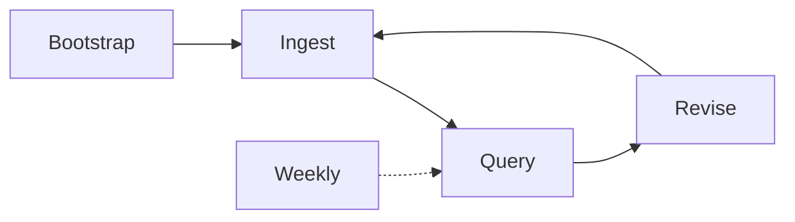

# Zhuomo 怎么用

**日常只看这一页。** 详细手册：zhuomo 仓库 `SIMPLE.md`、`USER-GUIDE.md`。

---

## 核心流程（4 + 1）

| 步骤 | 你想… | 在 Cursor 里说 |
|------|--------|----------------|
| **1 Bootstrap** | 第一次建库 | `Bootstrap + ingest: 书.epub` |
| **2 Ingest** | 新书入库 | `Ingest: ~/zhuomo-data/raw/inbox/书.epub` |
| **3 Query** | 问知识库 | `Query: 你的问题` |
| **4 Revise** | 改错 | `Revise [[页名]] — 哪里错了` |
| **+ Weekly** | 每周维护（可选） | `Weekly` |

**默认 Ingest：** 全书 deepen 全部概念 + Evidence。轻量：`Ingest overview only: …`

---

## 常用指令

| 我想… | 说 |
|-------|-----|
| 一步建库+第一本书 | `Bootstrap + ingest: path/to/book.epub` |
| 正常入库 | `Ingest: path/to/file` |
| 只要目录、先不深挖 | `Ingest overview only: …` |
| 问问题（合成答案） | `Query: …` |
| 找相关页面 | `Query search: …` |
| 改 wiki | `Revise [[概念]] — …` |
| 每周 15 分钟 | `Weekly` |
| 检查 wiki 健康 | `Lint` |
| 听不懂某概念 | `Learn fable: [[概念]]` |
| 复习闪卡 | Obsidian → Spaced Repetition 插件 |

---

## 进阶（需要时再开）

| 功能 | 说 | 产出 |
|------|-----|------|
| **Learn** | `Learn recap` / digest | `wiki/learn/digests/`、闪卡 |
| **Run** | `Run: fuse A + B, 3 floors` | 多域 Roguelike 场景 |
| **Skill** | `Extract skill from [[概念]]` | Cursor 技能 |
| **Domain skill** | `Domain skill: xxx` | 领域专家 + wiki 后端 |

---

## Obsidian 里看哪里

| 问题 | 打开 |
|------|------|
| 有哪些学科 | [[overview]] / [[domain-map]] |
| 某学科进度与术语 | `domains/<学科>/overview` |
| 技术一页通 | `domains/<学科>/guide` |
| 某个概念 | `concepts/` |
| 某本书摘要 | `sources/` |
| 活动记录 | [[log]] |

---

## 原始资料放哪

`~/zhuomo-data/raw/` — 手机先丢 `inbox/`，笔记本上 ingest。

---

## 自然语言也行

「把 inbox 那本书 ingest」「ACI contract 讲个寓言」「这页写错了」— agent 会路由到对应操作。
