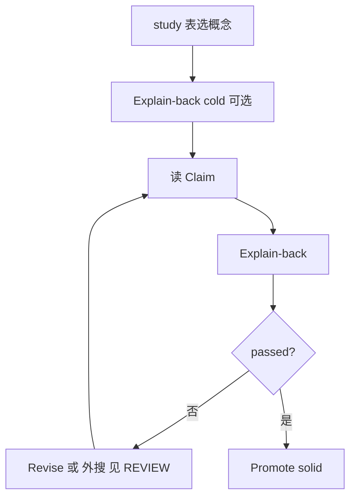

# Zhuomo 怎么用

**日常只看这一页。** 完整说明与流程图：仓库 `~/zhuomo/USER-GUIDE.md`。

**Agent 细则：** `~/zhuomo/references/` · 学习详规：`REVIEW.md`

---

## 我想做什么

| 你想… | 说… |
|--------|-----|
| 导入书/EPUB | `Ingest: …` |
| 大书分批 | `Ingest continue: <source-slug>` |
| 接入已有库 | `Adopt vault: …` |
| 字幕/转写 | `Ingest: ….srt`（默认只语料；要概念说 `deepen`） |
| 学一个概念 | `Explain-back [[概念]] cold` |
| 分析现场 | `Query think: 我的场景 …` |
| 查版本/CVE | `外搜 <学科>` 或 `外搜 [[概念]]` |
| 库健康 | `Lint` |
| 连续学 | `Study continue: <学科>` |
| 记个人模型 | `Connect: … — 记入 synthesis` |

---

## 学习链（15 分钟一块）

**主教材 = `concepts/` 里的 Claim**，不是整本书。`sources/md` 只在要核对原文时打开。


```mermaid
flowchart TD
  A[study 表选概念] --> B["Explain-back cold 可选"]
  B --> C[读 Claim]
  C --> D[Explain-back]
  D --> E{passed?}
  E -->|否| F[Revise 或 外搜 见 REVIEW]
  F --> C
  E -->|是| G[Promote solid]
```

| 步骤 | 说什么 |
|------|--------|
| 先测 | `Explain-back [[概念]] cold` |
| 复习 | `Explain-back [[概念]]` |
| 讲不清 | 先 **Revise** 加厚 Claim，再 `Explain-back [[概念]]` |
| 升掌握度 | `Promote [[概念]] to solid`（须 passed） |
| 下一项 | 打开 `domains/<学科>/study` **下一步** 列 |

**迷路？** 先看 `domains/<学科>/map` 纲领（~30 min）。

---

## study 表「下一步」列

| 标记 | 做什么 |
|------|--------|
| `① Promote` | `Promote [[概念]] to solid` |
| `② Explain-back` | `Explain-back [[概念]]` |
| `③ Cold` | 未读或 wiki 更新后 → `Explain-back [[概念]] cold` |
| `—` | 暂无需动作 |

`reviewed` 由 Explain-back 自动写入，不用单独「标记已读」。

---

## 七个动词 + Connect

| 动词 | 产出 |
|------|------|
| **Bootstrap** | 建库 + config |
| **Ingest** | concepts + Evidence |
| **Query** | 答案 + Gaps（带场景时有 Apply） |
| **外搜** | External；改 Claim **须确认** |
| **Revise** | 改 corpus；`我的想法` → `notes/on-concept/` |
| **Study** | cold / Explain-back / Promote |
| **Lint** | 健康 + Review 分桶 |
| **Connect** | 个人模型 → `notes/synthesis/` |

**两层别混：** `wiki/synthesis/` = Ingest 编译；`wiki/notes/` = 你个人。

---

## 常用指令

```text
Ingest: ~/zhuomo-data/raw/inbox/book.epub
Query think: Multi-Pod vs Multi-Site?
外搜 cisco-aci
Explain-back [[cilium-network-policy-identity]] cold
Promote [[k8s-network-visibility-gap]] to solid
Study continue: kubernetes-cilium
Review queue: kubernetes-cilium
Lint
Connect: overlay vs native 选型 — 记入 synthesis
```

---

## 打开哪里

| 问题 | 文件 |
|------|------|
| 学科列表 | [[domain-map]] · [[overview]] |
| 学习顺序 / 进度 | `domains/<学科>/map` · `study` |
| 知识笔记 | `concepts/` |
| 个人笔记 | `notes/` |
| 日志 | [[log]] |

---

## 原始资料

`~/zhuomo-data/raw/inbox/` — 手机丢 inbox，笔记本 Ingest。
