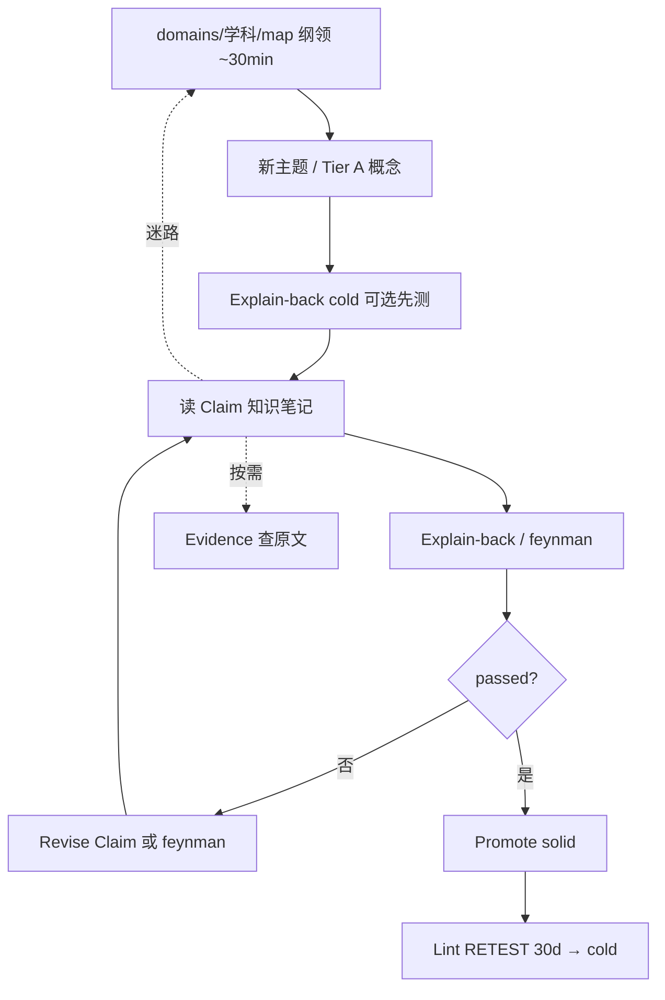

# Zhuomo 怎么用

**日常只看这一页。** 完整功能图（Bootstrap / Ingest / Study / 外搜 等）：仓库 `~/zhuomo/USER-GUIDE.md` §0–§1。

**Agent refs:** `~/zhuomo/references/` · 详规：`REVIEW.md`

---

## 先说你想要什么

| 你想… | 说… |
|--------|-----|
| 导入书/EPUB | `Ingest: …` |
| 分批续 ingest | `Ingest continue: <source-slug>` |
| 接入已有库 | `Adopt vault: …` |
| 字幕/转写 | `Ingest: ….srt`（默认语料；要概念说 deepen） |
| 学概念 | `Explain-back [[概念]] cold` |
| 分析现场 | `Query think: 我的场景 …` |
| 查时效 | `外搜 <学科>` |
| 卡住不会背 | 见 REVIEW「Study stuck」→ Revise / 外搜 |
| 连续学 | `Study continue: <学科>` |

---

## 学习链（concept 知识笔记 → Test）

**手绘功能图（完整）：** 仓库 `USER-GUIDE.md` §0–§1 · `assets/diagrams/*.svg`

**主路径：** 读 `concepts/` 的 **Claim**（Agent 已从书里编译好）→ Explain-back。`sources/md` 仅在你或 Agent 需要核对原文时打开。


```mermaid
flowchart TD
  M["domains/学科/map 纲领 ~30min"] --> A[新主题 / Tier A 概念]
  A --> B["Explain-back cold 可选先测"]
  B --> C["读 Claim 知识笔记"]
  C --> D["Explain-back / feynman"]
  D --> E{passed?}
  E -->|否| F["Revise Claim 或 feynman"]
  F --> C
  E -->|是| G[Promote solid]
  G --> H["Lint RETEST 30d → cold"]
  C -.->|按需| I[Evidence 查原文]
  C -.->|迷路| M
```

| 学习要素 | 琢磨动词 | 产出 |
|----------|----------|------|
| **Map（纲领）** | `domains/<学科>/map` | Whole picture — 自顶向下 ~30 min |
| **Path** | `domains/<学科>/study` | Tier A/B 自底向上 + 进度表 |
| **Read（主教材）** | 打开 `concepts/*.md` **Claim** | 知识笔记 — 不必先读书 |
| **Test（首次）** | `Explain-back [[概念]] cold` | 先测后读 Claim |
| **Test（复习）** | `Explain-back [[概念]]` | 对照 Claim 复述 |
| **深测** | `Explain-back [[概念]] feynman` | 小孩式追问 |
| **Repeat** | `Lint` · RETEST 桶 | solid 超 30 天 cold 复测 |
| **深挖（可选）** | Evidence 链接 | 原文 archive |

**15 分钟块：** cold（可选）→ 读 Claim → feynman → Promote。

---

## 今日 Study：顺序 + 进度

打开 `domains/<学科>/study` — **下一步** 列：

| 标记 | 你做什么 |
|------|----------|
| `① Promote` | `Promote [[概念]] to solid` |
| `② Explain-back` | `Explain-back [[概念]]` 或 `cold` |
| `③ Cold` | 未读或 wiki 更新后 → `Explain-back [[概念]] cold` |
| `—` | 暂无需动作 |

`reviewed` 由 Explain-back 会话自动写入，无需单独「标记已读」。

详规：`~/zhuomo/REVIEW.md`

---

## 七个动词

| 动词 | 说 | 产出 |
|------|-----|------|
| **Bootstrap** | `Bootstrap + ingest: 书.epub` | 建库 + 第一本书 |
| **Ingest** | `Ingest: …` | concepts + Evidence + Explain-back |
| **Query** | `Query: …` | 答案 + Gaps + Next step |
| **外搜** | `外搜 cisco-sdwan` / `外搜 [[概念]]` | Evidence 加 `External (YYYY)`；Claim 修正 **需确认** |
| **Revise** | `Revise [[页]] — …` | 改 corpus；`我的想法` → `notes/on-concept/` |
| **Study** | `cold` / `Explain-back` / `feynman` / `Promote` | 掌握度 |
| **Lint** | `Lint` | 健康 + Review 分桶 + External 扫描（默认一体） |

**Connect（个人模型）：** `Connect: … — 记入 synthesis` → `notes/synthesis/`（见下）

---

## Connect 是什么

聊透几个概念的关系后，把**你自己的**对照/模型记下来：

```
Connect: Cilium native routing 和 ACI L3Out 的相似点 — 记入 synthesis
```

→ Agent 写入 `wiki/notes/synthesis/<主题>.md`（`origin: personal`），链到相关 `[[concepts]]`。

**不是**改 corpus Claim；**不是** Ingest 自动写的 `wiki/synthesis/`（那是编译层）。

单概念想法用：`Revise [[概念]] — 我的想法：…` → `notes/on-concept/`。

---

## Study 指令速查

| 我想… | 说 |
|-------|-----|
| 第一次学（先测后读） | `Explain-back [[概念]] cold` |
| 复习已学概念 | `Explain-back [[概念]]` |
| 讲不清楚 | `Explain-back [[概念]] feynman` |
| 升掌握度 | `Promote [[概念]] to solid` |
| 下一项 | `domains/<学科>/study` **下一步** 列 |
| 跨概念个人模型 | `Connect: … — 记入 synthesis` |

---

## 常用指令

```
Ingest: ~/zhuomo-data/raw/inbox/book.epub
Query think: Multi-Pod vs Multi-Site?
外搜 cisco-aci
外搜 [[sdwan-architecture-planes]]
Explain-back [[cilium-network-policy-identity]] cold
Explain-back [[cilium-kube-proxy-replacement]] feynman
Promote [[k8s-network-visibility-gap]] to solid
Review queue: kubernetes-cilium
Lint
Connect: overlay vs native 选型 — 记入 synthesis
```

---

## 看哪里

| 问题 | 打开 |
|------|------|
| 学科列表 | [[domain-map]] · [[overview]] |
| 学习顺序 / 进度 | `domains/<学科>/map` · `study` |
| 编译概念 | `concepts/` |
| 个人笔记 | `notes/` |
| 日志 | [[log]] |

---

## 原始资料

`~/zhuomo-data/raw/inbox/` — 手机丢 inbox，笔记本 ingest。
