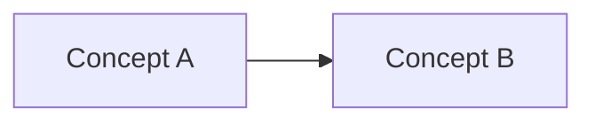

---
domain:
type: synthesis
epistemic: personal
updated: YYYY-MM-DD
---

# Title — synthesis

> **模型层 L1。** 跨概念判断或个人整合；与单页 `## Claim`（书/证据）分开。  
> 创建：`Connect: … — 记入 synthesis` 或 Revise 本页。

## Model

One paragraph or bullet model — how pieces fit together.

## Claims

| 判断 | 依据 | 相关概念 |
|------|------|----------|
| … | wiki Evidence / 你的经验 | [[concept-a]] |

## My take

> `epistemic: personal` — 你的取舍、检查清单、设计原则。与 Evidence 矛盾时标 contested 并 Revise。

- …

## Open questions

- …

## Sources

- [[concept-or-page]] — what this synthesis uses
- Chat / experience YYYY-MM-DD — optional
